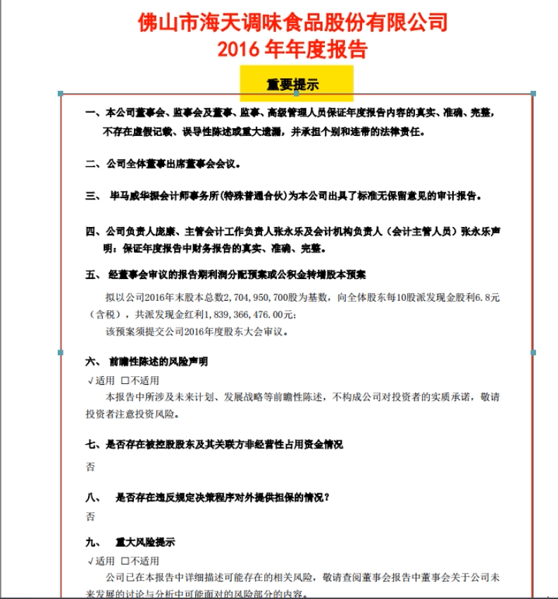
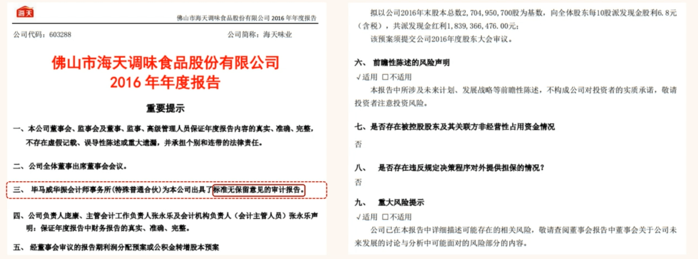
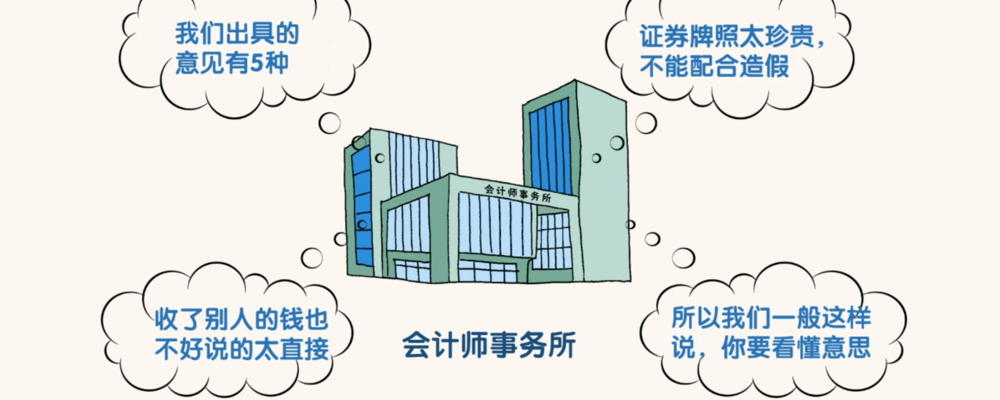
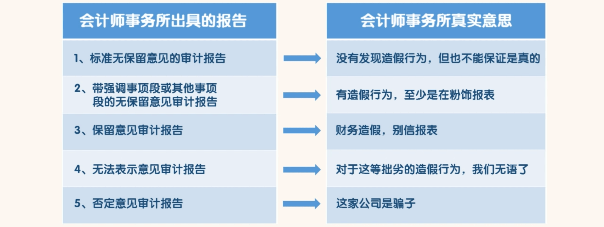
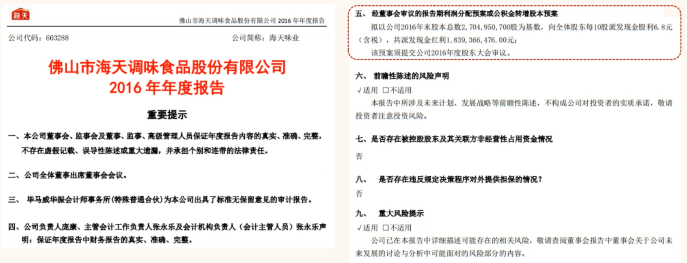
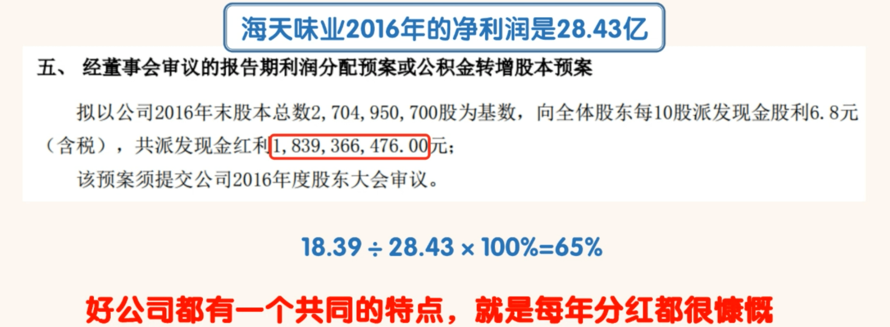

## 财务报表阅读简介

### 第一节

我们投资股票、股权、企业债、基金，实质投资的是企业。就连我们投资的房地产，甚至也可以看作一个简单的企业，房
租可以看作营业收入，各种税费可以看作营业成本。

通过财务报表去了解一家企业无疑是最快捷也是最有效的一种方法。

- 学习如何通过财务报表读懂 A 股中的上市公司？
  - 需要先下载海天味业以及所提到公司的年报。网址为：http://www.cninfo.com.cn
  -  对于上市 5 年以上的上市公司，至少要下载过去连续 5 年以上的年报进行分析，才能得出比较客观的结
    论。年报的时间跨度越长，得到的结论越准确。
  - 财报分为一季报、半年报、三季报、年报。其中年报需在年度结束后 4 个月内披露完毕，也就是最晚在
    下一年的 4 月 30 日之前披露完毕。而且年报必须要经过会计师事务所的审计。
  - 所以年报准备的时间最充分，信息披露最详细，可信度也最高。所以年报也是同学们分析一家企业的重
    点。其他报表可以作为辅助材料，解读方法和年报一样。

### 第二节

打开海天味业 2016 年的年报，看到的是“重要提示”。“重要提示”包含九条内容，既然是“重要提示”，就值得好好看一下。

看一下第一、四、六、七、八、九这几条内容。这几条内容可能是真话，也可能是假话，反正都是套话。看一眼就行，不必当真。这几条内容不重要。

第二条就是说明董事们出席董事会的情况，也没有什么价值。

凡是会计师事务所不愿意出具：标准无保留意见的审计报告的。我们就可以理解为会计师事务所认为上市公司财务有问题。

只有出具了标准无保留意见审计报告的年报才有看的价值。其他的表述就意味着公司财务有问题，直接淘汰掉。

重要提示重点关注三、五就行。

我们不需要去证明一家公司有问题！只要我们怀疑一家公司有问题，就直接淘汰掉！

### 第三节

看完“重要提示”之后，接下来是一份目录。目录共有十二节。不同公司的目录会有细小的差别，即使同一公司不同年度的目录也会有细小的差别。这些差别对于我们阅读年报没有影响。

海天味业 2016 年的目录包含十二节内容，最重要的是用红色横线标注的第三节公司业务概要、第四节经营情况讨论与分析、第五节重要事项、第十一节财务报告四节内容。其中第十一节**财务报告**是这四节中的核心，也是这节课的重点与难点。

其次比较重要的内容是用蓝色横线标注的第六节普通股股份变动”及股东情况、第八二节董事、监事、高级管理人员和员工情况内容。

再次比较重要的是用绿色横线标注的第七节优先股相关情况和第十节公司债券相关情况。这两部分内容涉及到公司的融资情况。这两部分内容也是对第十一节财务报告内容的补充说明。不需要单独看。海天味业既没有优先股也没有发行公司债券，这两节出现在目录里对于海天味业是多余的。
