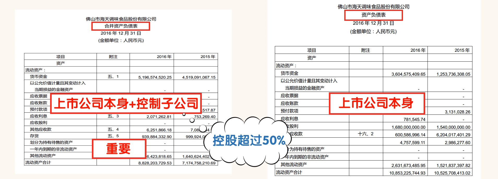
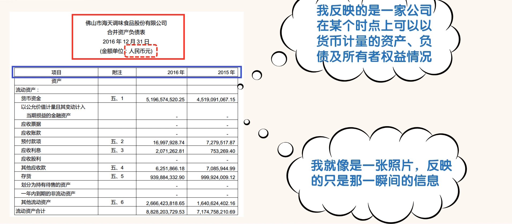
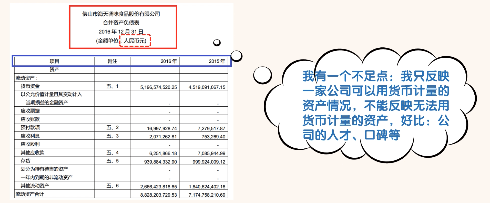
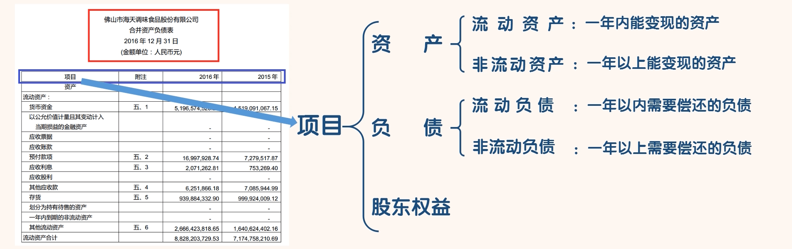
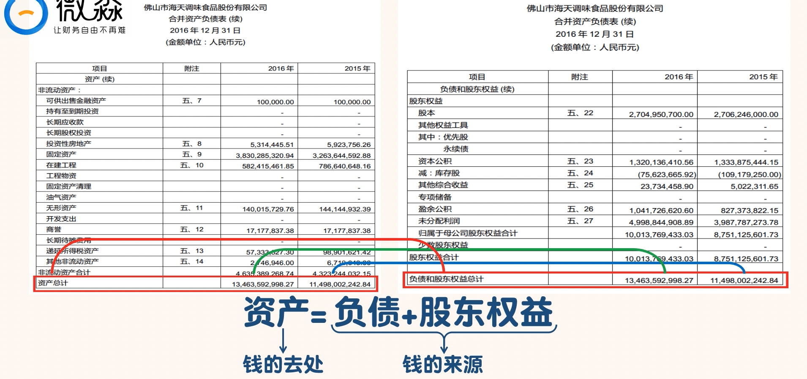
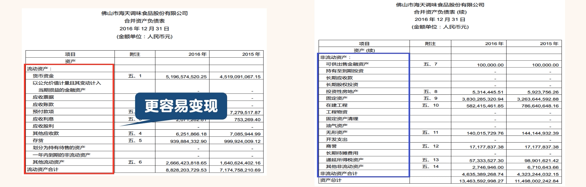

## 读懂资产负债表

### 第一节

首先学习第十一节财报报告，财务报告主要由 5 部分组成：**资产负债表**、**利润表**、**现金流量表**、**股东权益变动表**和**财务报表附注**。

> **小技巧**：通过 PDF 阅读器的搜索功能，快速定位想查看的内容。

- 合并资产负债表”与“资产负债表”的区别：
  - “合并资产负债表”是上市公司本身和其控制的子公司的资产负债表进行合并得出的资产负债表。控制的意思是控股超过 50%。
  - “合并资产负债表”反映的是一组公司的综合资产负债情况。由于子公司是企业经营的重要组成部分，所以我们应该重点看“合并资产负债表”。
  - “资产负债表”是上市公司本身的报表，它反映上市公司本身的资产负债情况。两张资产负债表结合看，能让我们更清楚的了解上市公司及其子公司的财务情况。同理，利润表、现金流量表和股东权益变动表也有合并和不合并两种。“合并报表”是我们阅读的重点。

红色框内为流动资产，蓝色框内为非流动资产。红色框内的东西是否比蓝色框内的东西更容易变现。

流动性最强的排在最上面，比如在“流动资产”里面流动性最强的肯定是现金，所以“货币资金”科目就排在了资产项的最上面。

在“流动负债”里面流动性最强的肯定是短期借款，所以“短期借款”科目就排在了负债项的最上面。

