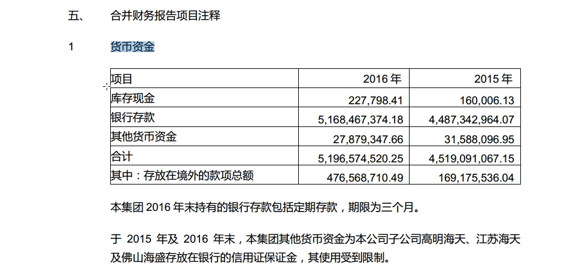
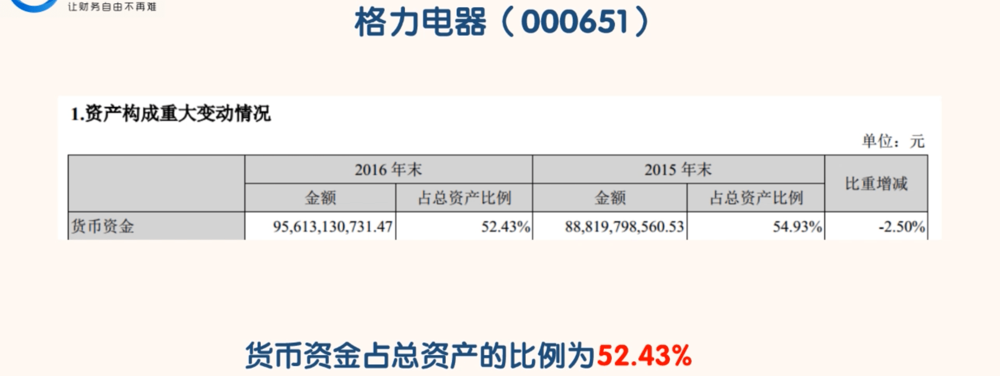

## 货币资金

### 认识货币资金

- 需要注意的是，重要的是“合并资产负债表”中的“货币资金”数据，“资产负债表”中的“货币资金”数据不重要。“合并资产负债表”中的“货币资金”数据表示上市公司和其子公司控制的货币资金总额。“资产负债表”中的“货币资金”数据显示的只是海天味业本公司的货币资金数额。
- 至于多少钱放在上市公司，多少钱放在子公司，这只是内部划拨行为。这就像是你家的钱，一部分放你账户里，一部分放你儿子账户里，但是都由你掌控一样。

- 上市公司可以通过“预付款项”或“其他应收款”等科目向子公司提供资金，也可以通过“预收款项”或决定让子公司分红等方式把钱从子公司拿走。

- 通过对报表里一些科目的对比，我们就可以知道母公司和子公司间的资金划拨情况。不过一般情况下，我们只需要了解“合并资产负债表”的货币资金的变化即可。“资产负债表”中货币资金的数额没有太大的观察价值。

### 货币资金的具体构成

- 搜索货币资金，查看构成

- 我们已经了解了货币资金的构成，关于这部分资金变化的详细情况，就涉及到现金流量表了。现金流量表就是对资产负债表中"货币资金"科目中的"现金及现金等价物"变化情况的具体说明。

### 现金及现金等价物

- 搜索“现金及现金等价物”

> 比如到期期限在 3 月内的国债、企业债、银行承兑票据、货币基金等。

- 根据“现金及现金等价物”的确定标准，我们可以知道海天味业的“现金及现金等价物”指的就是货币资金科目里的库存现金和银行存款。“其他货币资金”由于使用受到限制，所以不属于“现金及现金等价物”。总之，凡是不能随时支取的“货币资金”，都不是“现金及现金等价物”。

### "货币资金"是如何产生

- 筹资活动主要包括发行股票、发行债券、银行贷款。

- 第一条途径是公司产生资金的主要途径，这条途径具有可持续性。

- 第二条途径应该是第一条途径的辅助措施。不过现在很多创业公司，尤其是互联网行业的公司主要依靠第二条途径解决资金问题，这样的公司风险是很大的，绝大部分这样的公司会死掉。当一家公司通过前两条途径都弄不到钱的时候，无奈之下它就会走上第三条途径，这也意味着这家公司就离破产不远了。

- 货币资金对于企业的重要性就像是血液对于人的重要性一样。货币资金的多少不一定能决定公司的核心竞争力，但是货币资金的多少一定能决定公司能活多久。
- 一家公司可以长时间不盈利，就像京东一样。但是一家公司一定不能缺少“货币资金”。一旦“货币资金”耗尽，再好的公司也会倒下。

### 对比一下几家公司的货币资金情况

- 海天味业的货币资金占总资产的比例，2016 年为 38.6%，另外 26.66 亿的其他流动资产中我们知道有26.32 亿的短期银行理财产品。这部分银行理财产品虽然不是货币资金，但是约等于货币资金。

- 虽然从这一个数据的比较我们不能判断哪个企业更好，但是至少可以感受到哪家公司的资金更充裕，谁的抗风险能力更强

### 注意

- 货币资金也不一定就是越多越好。货币资金过多，则会造成大量资金闲置，总资产的收益率会下降。合适的货币资金规模应当与短期债务规模和经营所需要的资金规模相匹配。

- 家货币资金充足的公司其财务造假和再融资的概率就会小很多，财务造假和再融资对投资者的伤害都是比较大的。

### 如何通过“货币资金”科目识别公司的风险

- 第1种情况预示公司很可能要发生偿债危机。
- 第2种情况出现时，可能存在控股股东占用上市公司资金的行为。大股东只是在报表日前几天把钱还到上市公司账户，过几天又被转走。