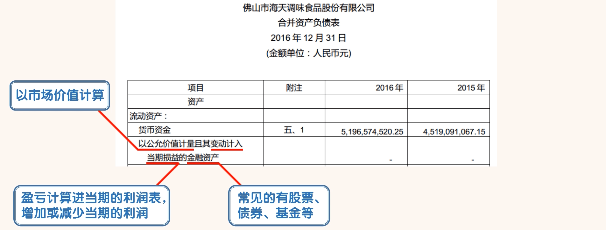
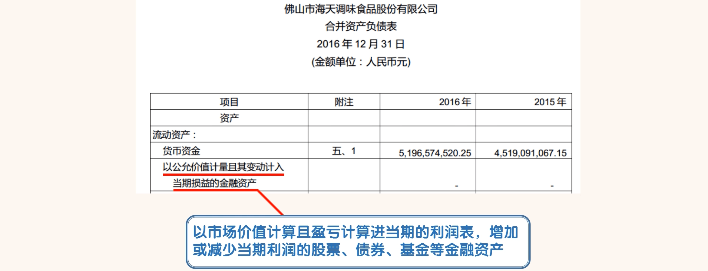
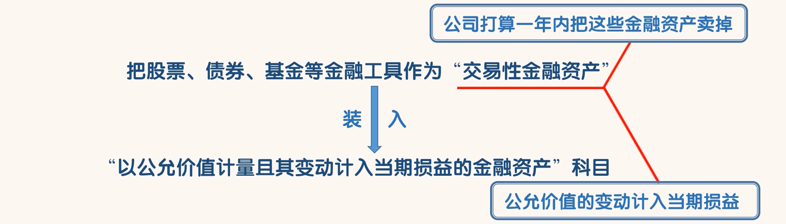
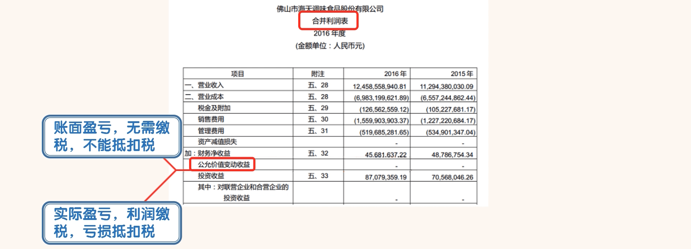

## 以公允价值计量且其变动计入当期损益的金融资产

### 交易性金融资

- 如果公司把股票、债券、基金等金融工具作为“交易性金融资产”放进“以公允价值计量且其变动计入当期损益的金融资产”这个科目。就说明公司是打算 1 年内把这些金融资产卖掉的。公司只想短期持有这些金融资产，当然至于公司最终持有多久都是可以的。打算卖并不一定真的需要卖。
- “交易性金融资产”在被持有期间，其公允价值的变动计入当期损益，其损益会被计算进利润表的“公允价值变动收益”科目，增加或减少当期的利润。

- 这里有一点要注意，公允价值变动增加或减少的利润是账面利润，这部分增加的利润不要缴税，减少的利润也不能抵扣税。当然最终卖出时产生的实际利润是需要缴税的，如果是亏损也能抵扣税。