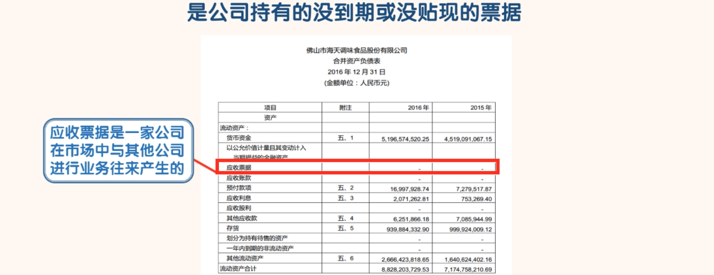
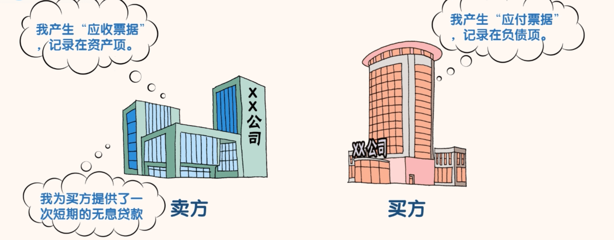
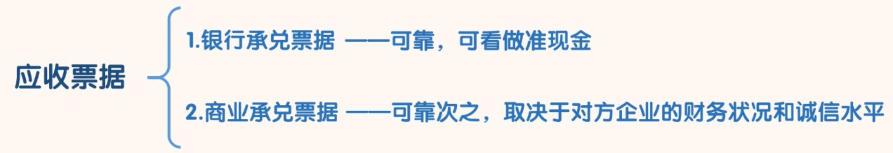
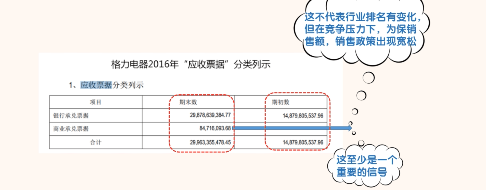
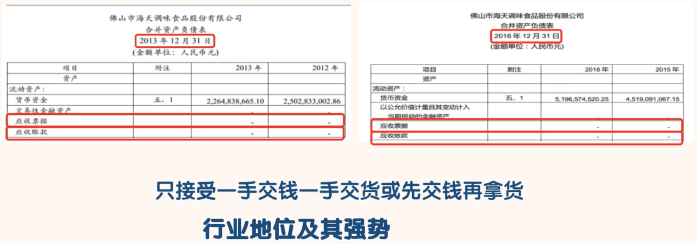
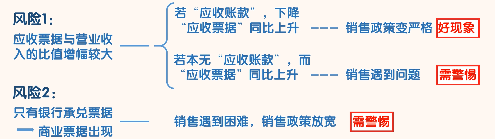

## 应收票据

### 认识应收票据

- 由于票据的期限一般不超过 6 个月，所以应收票据相当于卖方为买方提供了一次短期的无息贷款。

### 分类

- 银行承兑票据
  - 银行承兑票据是银行承诺兑现的，持有到期，持票方确定可以拿到现金。
  - 在票据没有到期前，持票方如果需要现金，持票方可以拿该票据到银行“贴现”，只是拿到的实际金额会略低于票面金额。总之银行承兑票据是有银行做担保的，持票人一定可以拿到钱。银行承兑票据约等于现金。同学们做分析的时候，可以把银行承兑票据当作准现金看待。
- 商业承兑票据
  - 商业承兑票据的可靠程度没有银行承兑票据高，持票人能否拿到钱，取决于开票企业的财务状况和诚信水平。不过总体来看，目前商业承兑票据违约的概率还是很小的。

- 了解了银行承兑票据和商业承兑票据的不同，通过查看两种票据在票据总额中的占比以及变化趋势，同学们就可以大概了解公司在行业中的地位以及销售政策。
  - 如果一个公司没有“应收账款”，只有“应收票据”，而且应收票据中全部是“银行承兑票据”这说明这家公司在行业中的地位是很强势的，而且销售政策也是比较保守的。这说明公司的竞争力和风控能力都很强。这基本是行业前 2 名的特征。当然这和行业本身也有很大的关系，不同行业会有很大的不同，同学们需要根据具体情况对待。
  - 如果一家公司没有“应收账款”，只有“应收票据”，但“应收票据”中主要是“商业承兑票据”，这说明公司在行业的地位也相对较强，有较强的竞争力，公司的销售政策相对宽松一些，但是标准还是较高的，风险控制能力也较强。
  - 如果一家公司的“应收票据”一直都是“银行承兑票据”，某年“商业承兑票据”突然大量增加，就预示公司的产品或销售遇到了困难，开始放松销售政策。这是公司由好转坏的起点。

- 2016 年的这个变化说明，虽然格力电器依然是行业的老大，但是强势地位有所下降。也可以理解成在强大的竞争压力之下，格力电器为了能保住销售额，销售政策变的比以前宽松了一些。当然一年的数据并不能说明什么问题，而且要确定这个结论我们还需要通过其他方面的数据去验证。但是这至少为我们提供了一个重要的信号。

- 海天味业只接受现款现货和先款后货，先款后货从负债项的“预收款项”中可以看出，这个我们后面会讲。从海天味业的销售政策，我们就能感受到海天味业在行业内的地位是极其强势的。

### 如何通过“应收票据”科目识别公司的风险

- 1、应收票据与营业收入的比值增幅较大
  - 正常情况下该比值应该是稳定的。该比值增幅较大，我们就要寻找原因，如果找不到合理原因。我们就可以认为公司有问题。
  -  事实上该比值增大并不一定完全是坏事，需要分情况来看。如果公司“应收账款”下降了，而“应收票据”有了同比例上升，这说明公司的销售政策变严格了。这说明公司的发展在变的更好。
  - 如果公司本来就没有“应收账款”只有“应收票据”，此时比值的上升可能表明公司销售遇到了问题。
- 2、原来只有银行承兑票据，某年商业票据开始出现。
  - 往往预示这公司的销售遇到了困难，公司开始放宽销售政策。公司的风险在悄悄增加。