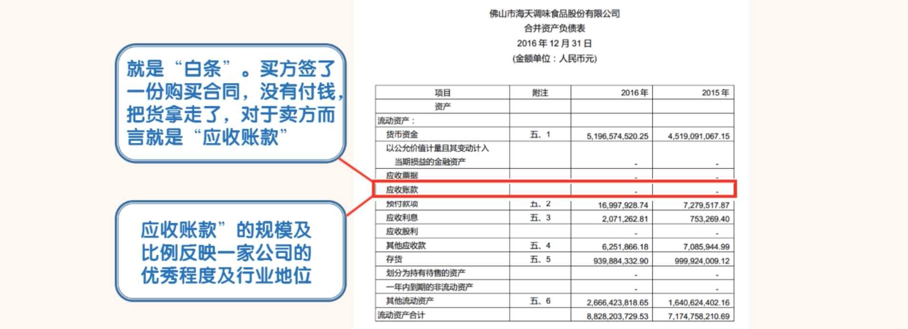
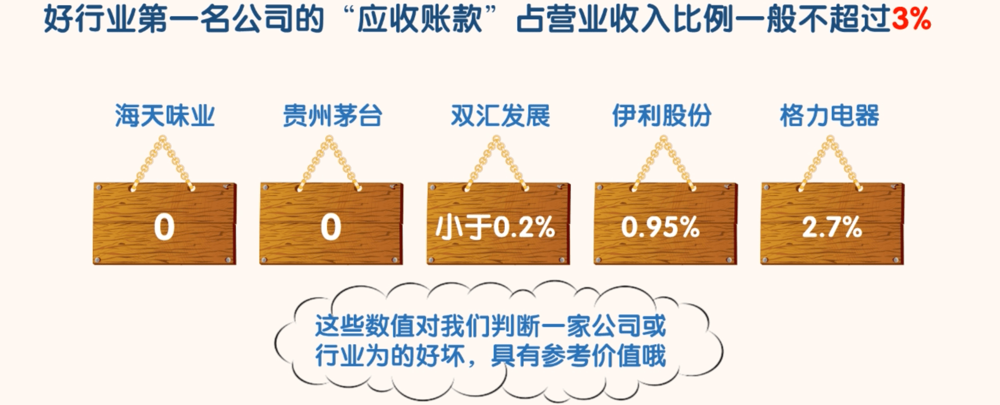
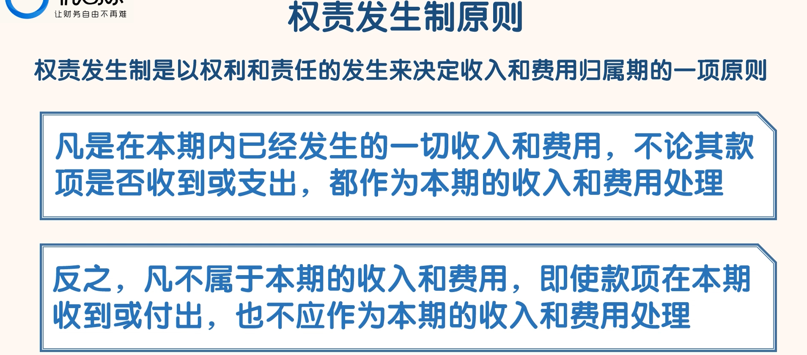
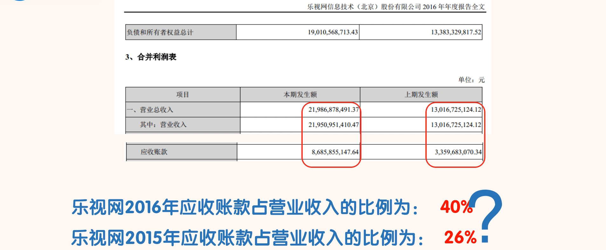

## 应收账款

### 认识应收账款

- 应收账款就是“白条”，买方签了一份购买合同，没有付钱，就把货拿走了。后期钱能否收回全看买方的信用。这样的“白条”交易，对于卖方而言就是“应收账款”，记录在卖方的资产项里。对于买方而言，就是“应付账款”，记录在买方的负债项里。
- 优秀的公司只有很少的“应收账款”甚至没有“应收账款”。我们通过“应收账款”的规模及比例就能大概判断出一家公司的优秀程度以及其在行业中的地位。

- 通过海天味业的资产负债表可以知道海天味业连续 5 年以上都没有“应收账款”。能做到这个水平的，整个 A 股市场也没有多少家公司。海天味业没有“应收账款”。

- 因为行业不同，我们不能以数字的绝对值来判断哪家公司更好。但是这些数字的范围对我们判断一家公司甚至一个行业的好坏具有一定的参考价值。如果一个行业的第一名公司的应收账款与营业收入的比例超过 10%，我们有理由相信这个行业很可能是一个产能过剩的行业。对于这样的行业，风险相对是比较大的。

- 应收账款占营业收入超过 10%的公司，封老师一般会直接淘汰掉。应收账款占营业收入的比例与公司的竞争力成反比，股市中有不少好公司，我们为什么要选一家竞争力弱的公司呢？

- 为什么要按账龄计提坏账准备呢？
  - 常识告诉我们，时间越久，钱收回来的概率越小，“应收账款”变成烂账的可能性越大。根据谨慎性原则，会计准则要求公司对于“应收账款”必须计提坏账准备。

- 需要注意的是，计提的坏账准备，在资产负债表中，是一种资产损失，会减少公司的账面资产；同时在利润表中算作费用，需要从当期的利润中扣去，减少当期的利润。
- 另外需要注意的是，无论坏账准备计提了一部分还是全额，并不影响债权的存在。即使“应收账款”已经全部计提坏账准备，账面价值已经为 0，公司依然有权继续追讨。一旦后期这笔钱要回来了，实际收到的钱和报表上账面价值的差额，还可以回到利润表“资产减值损失”科目冲抵，从而增加利润。

- 需要注意的是：计提坏账准备这个本来出于谨慎的规则，也会被公司用来操纵利润。比如今年大幅计提“坏账准备”，降低今年的利润，下年收款转回，增加下年的利润。

- 由于不同公司可能采用不同的坏账计提方法，而不同的坏账计提方法会对利润产生不同的影响。所以同学们以后在比较同行业两家类似公司的利润时，要关注一下两个公司计提坏账的标准是否一样。要评估一下因为坏账准备计提标准的不同对利润造成的影响。

- 一般来说，计提标准严格的公司可信度更高。如果千禾味业采用和恒顺醋业一样的计提标准，千禾味业的利润就会增加。所以我们在做财务分析的时候，不能简单的去比较两家公司的利润，我们还要关注影响利润的因素。

### 应收账款”是怎么产生的

- 根据权责发生制原则，签了销售合同，客户把货拉走了，合同上的成交金额就可以算做公司的收入了，这样就产生了利润。
- 虽然公司一分钱也没有拿到，而且还要为账面收入和利润缴税。既然通过这种方式就可以增加公司的收入和利润，一些“聪明”的公司就开始动歪脑筋了。为了增加收入，就开始大量增加“应收账款”，买方不用付钱，自然是不要白不要。
- 还有些“更聪明”的公司，干脆和自己人签订销售合同，连货都不用出仓库，就可以增加公司的收入了。
- 当然在“应收账款”科目做手脚，还是比较容易被识破的。现在在“应收账款”上做手脚的现象比较少了。但是“应收账款”依然值得我们重点关注。

### 如何通过“应收账款”科目识别公司的风险

