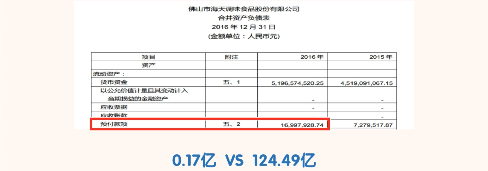
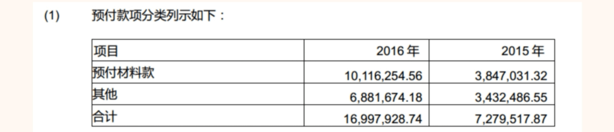
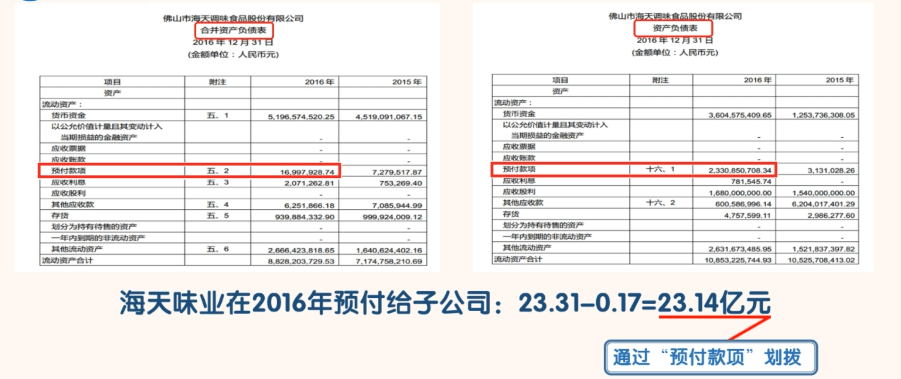

## 预付账款

### 认识预付账款

- 一家正常经营的公司，有一些“预付款项”是很正常的事情。如果公司在正常经营中需要预付大量款项给供应商，则说明公司在供应链体系中的地位较低，竞争力较弱。

- 海天味业 2016 年海天味业的“预付款项”有 0.17 亿元，这个数额占其 124.59 亿的营业收入的比例极低。
- 搜索“预付款项”，判断出这就是海天味业正常经营当中产生的预付款。

- “合并资产负债表”中“预付款项”金额占营业收入比例比较高的，需要注意其是否合理。可以通过与其历史数据和同行业其他公司的数据进行比较，来判断其“预付款项”的金额是否合理。封老师自己一般会把“预付款项”占“营业收入”比例长期高于 5%的公司淘汰掉。这只是个经验值，不绝对。

### 如何通过“预付款项”科目识别公司的风险

- 1、预付款项与营业收入的比值大幅波动
  - 正常情况下，预付款项会随营业收入的变化而同趋势变化，其比值应该是稳定的才对。如果该比值出现大幅波动，我们就要找合理原因。如果找不到合理的原因，我们就可以认为公司有问题。
  - 实际上，有的公司会通过“预付款项”向关联方提供资金。
- 2、预付款项长时间挂账且金额较大
  - 正常情况下，公司经营需要提前预付一些账款是正常合理的。
  - 但是如果提前 1 年付款买东西就显得不合理了。这是常识。所以预付款长期挂账，金额又比较大的。我们就需要找合理的原因。如果找不到，我们就可以认为公司有问题。
