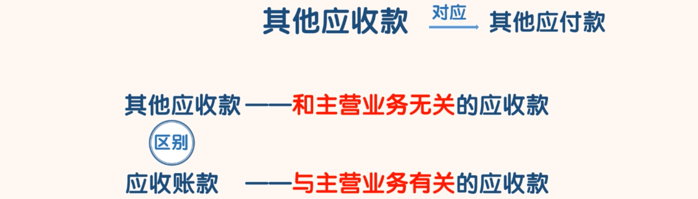
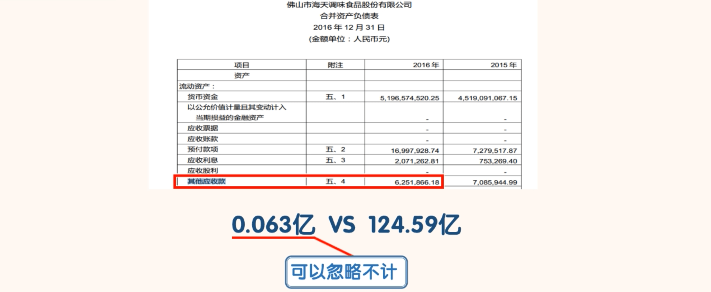
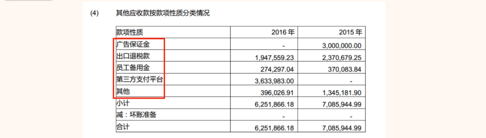
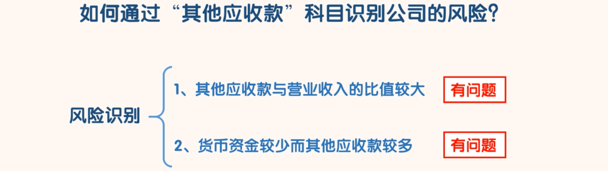

## 其他应收款

### 认识其他应收款

- 搜索“其他应收款”

- 优秀的公司和海天味业一样，它们的“其他应收款”金额都极小，甚至为 0。如果有的公司“其他应收账”金额比较大，我们至少可以认为这家公司的经营是不规范的。

### 如何通过“其他应收款”科目识别公司的风险

- 1、其他应收款与营业收入的比值较大
  - 正常情况下，该比值肯定会很小。如果比值较大，我们就要找原因。如果找不到合理的原因，我们就可以认为公司有问题。
- 2、货币资金较少而其他应收款较多
  - 自己都没有多少钱了还允许别人欠自己很多钱。这一看就是有问题的。