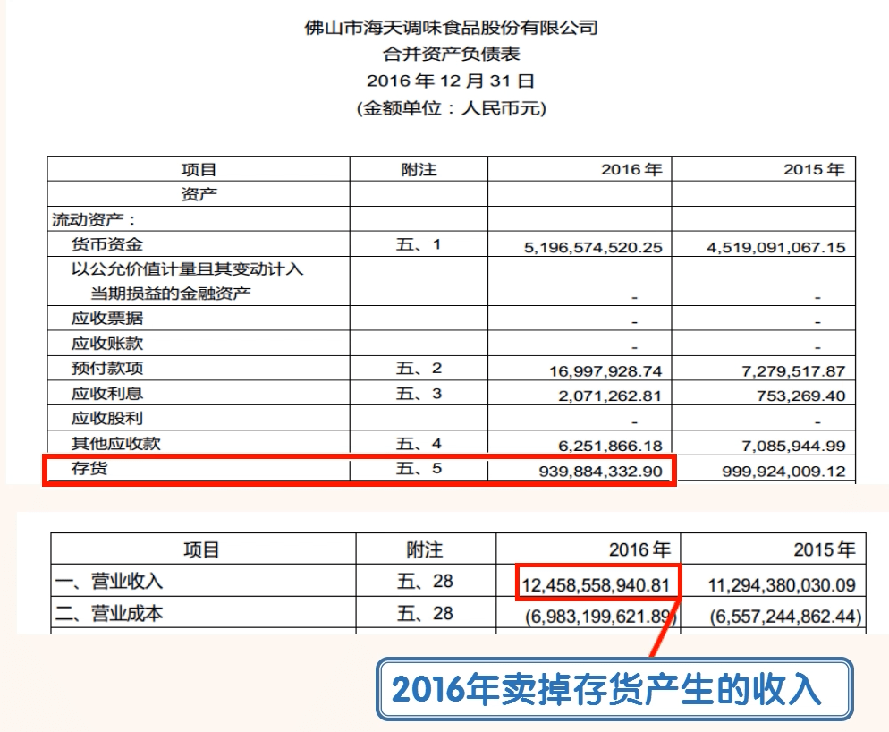
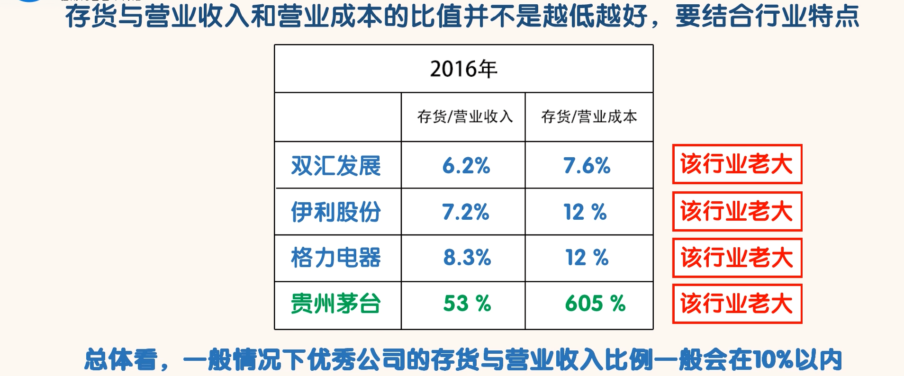

## 存货

### 认识存货

- “存货”是指企业在日常经营活动中持有的以备出售的产成品、处在生产过程中的在产品以及原材料等。
- 简单的说，存货就是产品和生产产品所需的东西。
- 我们知道产品是公司与客户之间的纽带。公司通过生产产品并把产品销售给客户来获利。公司的产品生产好以后先变成存货，然后再把存货卖掉产生销售收入。1 年下来公司卖掉的存货就变成了年营业收入，金额记录在“合并利润表”的“营业收入”科目里；没有卖掉的部分就是存货，记录在“合并资产负债表”的“存货”科目里。

- 搜索“存货本年变动”

- 通过以上数据，我们可以计算出海天味业的存货占营业收入的比例为 7.5%，占营业成本的比例为 13%。这两个比值相对都是比较低的，由此也可以看出海天味业的存货规模不大。

- 当然存货与营业收入和营业成本的比值并不是越低越好，这个要结合行业特点来分析。
- 一般存货容易坏的行业，其存货比例可能相对较低。

- 因为茅台酒从生产到销售需要 5 年的时间，这 5 年当中都是存货。而且茅台酒存的时间越久，价格就越高。这就与绝大部分行业不同了。高存货反倒变成了高端白酒行业的优势。当然一般情况下，高存货都是不利于公司的。
- 搜索“存货”

- 海天味业存货具体由：原材料、在产品、产成品、包装物、低值易耗品构成。其中“在产品”占了存货的 63%。这是比较合理的。因为海天味业的主要产品生产周期需要 2-6 个月
- 还需要了解存货的计量和跌价准备等关键信息。搜索“存货”，我们找到以下内容：

- 通过框内的内容，我们可以知道：存货的初始计量按其成本，在以后的资产负债表日，存货的计量按成本和可变现净值孰低。就是根据谨慎原则，哪个数额低就按哪个算。
- 当可变现净值高于成本时，不用计提存货跌价准备；当可变现净值低于成本时，差额需要计提存货跌价准备。存货跌价准备会同时影响资产负债表和利润表。
- 有些公司为了要增加利润，它们可能会故意不对已经贬值的存货计提跌价准备。这样就能减少当期费用，增加当期利润。

### 如何通过“存货”科目识别公司的风险

- 1、存货与营业收入的比值增幅较大
  - 正常情况下，该比值应该是稳定的。如果该比值增幅较大，我们就要找原因。如果找不到合理的原因，我们就可以认为公司有问题。实际上这种情况的出现很可能是由于市场竞争的加大，公司产品销售出了问题。
- 2、存货没有计提跌价准备
  - 存货没有计提跌价准备不一定就有问题，比如贵州茅台和海天味业的存货都没有计提跌价准备。我们知道茅台存的越久，价值越高。海天味业的销售情况非常好，剩下的存货很快就会卖掉。
  - 但是有些公司的存货由于积压，其存货的可变现净值已经大幅低于成本了。这种情况下如果还不计提跌价准备，就涉及虚增利润了。
  - 所以对于存货没有计提跌价准备的公司，我们要结合该公司的存货规模、销售状况、与同行公司对比来判断这样做是否合理。对于不合理的公司，我们就要怀疑其有问题，然后淘汰掉。
- 3、毛利率和存货金额都有明显提高
  - 正常情况下，毛利率的提高说明公司产品竞争力提升，比较畅销。相应的是存货减少才对。如果存货不减反增，这就说明公司很可能有问题。我们就需要找到合理的原因。如果找不到，就淘汰掉。
  - 事实上，存货的大幅提升，可以降低单位产品的固定成本，从而降低单位产品的总成本。在产品售价不变的情况下，单位产品成本降低，毛利率会提高，利润也会提高。但是这种利润提高是以大量库存为代价的。这种大量的库存积压，后期面临跌价，会给公司带来巨大的损失。