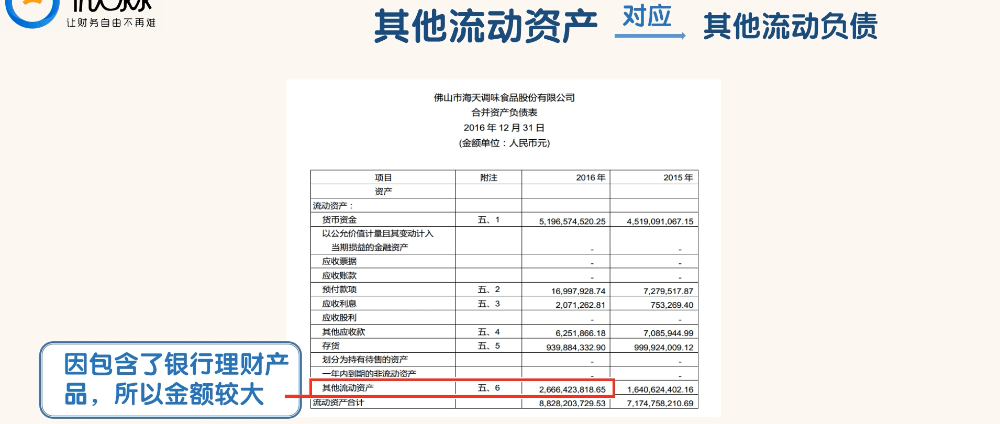
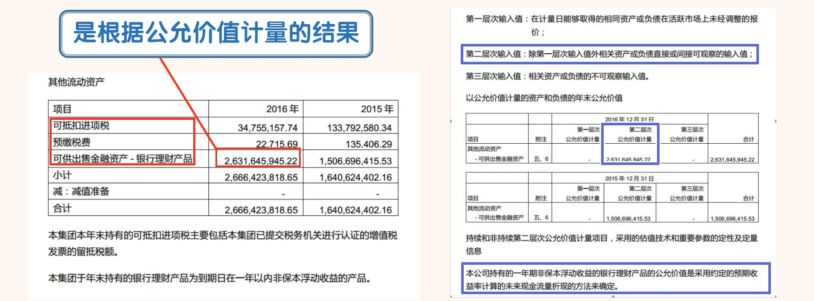

## 其他流动资产

- “其他流动资产”是指除了归属以上提到的科目之外的流动资产。它可以包括很多种类的流动资产。与之对应的是负债项的“其他流动负债”。

- 海天味业的“其他流动资产”金额为 26.66 亿，在流动资产中是除了“货币资金”科目之外金额最大的科目。“其他流动资产”这个科目的金额一般应该不会太大，但是现在很多公司都把银行理财放在这个科目里。所以这个科目的金额也比较大了。
- 搜索“其他流动资产”，我们会找到以下内容：

- 像海天味业这种“其他流动资产”金额巨大，但是 99%是银行理财产品，也算是正常现象。因为买银行理财产品获得的收益还是比直接放到“货币资金”科目好一些。

### 如何通过“其他流动资产”科目识别公司的风险

- 1、其他流动资产与总资产的比值较大
  - 正常情况下“其他流动资产”占总资产的比值应该很小，甚至为 0。如果比值较大，我们就要查找原因。如果找不到合理的原因，我们就可以认为公司有问题。
- 2、其他流动资产与总资产的比值增幅较大
  - 如果“其他流动资产”与总资产的比值增幅较大，我们就要了解是什么原因导致了这个变化。如果找不到合理解释，我们就可以认为公司有问题。