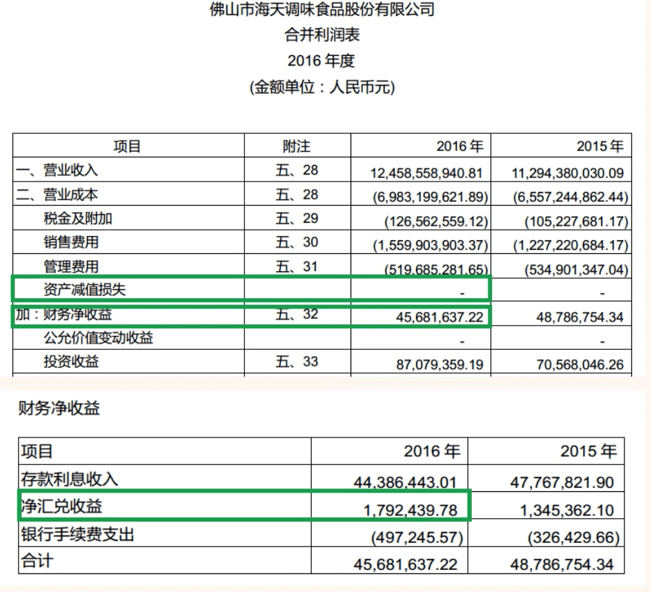

## 可供出售金融资产

### 认识可供出售金融资产

- 比如债券

- 搜索“可供出售金融资产”可以找到以下内容

 

- 公允价值变动”造成的损失或盈利是暂时的，未来可能还能回来

- 搜索海天味业“可供出售金融资产的减值方法”，可以找到以下内容：

- 同时要从资产负债表"资本公积"项目中的"其他综合收益”科目里，去掉该项资产过去累计的利得收益。

- 另外如果利息或股利已经宣告发放,但实际还没有发放，那么利息和股利计入利润表"投资收益”科目的同时应计入资产负债表中的“应收利息"和“应收股利”科目

### 通过“可供出售金融资产”识别风险

- 同学们要注意这种情况：某种金融资产浮亏较大，但没有进行“资产减值损失”处理
  - 在某些情况下，金融资产的公允价值变动较大，产生较大的浮亏也是正常的
- 当我们发现某种金融资产因公允价值变动产生了较大的浮亏以后
  - 我们要判断这种浮亏的产生是暂时的还是长期性的，影响金融资产价值的根本因素没有发现变化
  - 如果是暂时的那就是正常情况
  - 如果浮亏是长期性的，那么公司就有故意不进行“资产减值损失”处理的可能。因为一旦进行“资产减值损失”就会减少公司的当期利润。