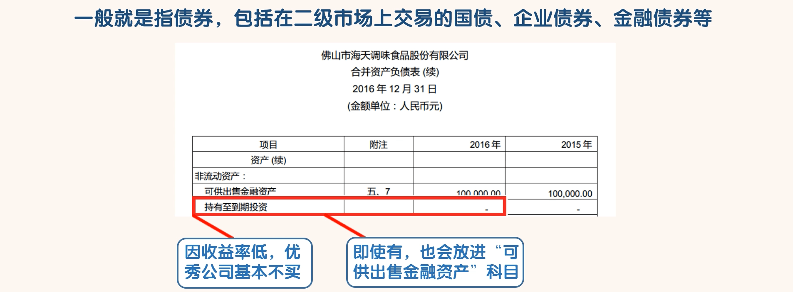
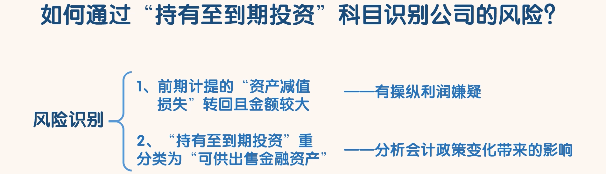

## 持有至到期投资

### 认识持有至到期投资

- 我们可以看到海天味业的“持有至到期投资”金额为 0。 一般优秀的公司这个科目金额都为 0，即使有金额也很少。
- 想一下就能明白，债券的收益率本身就不高，很少有公司会选择把债券持有到期。即使有债券也会放在“可供出售金融资产”这个科目中，这样随时可以卖掉，当然也可以持有到期

### 通过“持有至到期投资”识别风险

- 第1种情况，债券发生的资产减值在后期减值迹象消失以后是可以转回的，公司可以利用这个规则操作利润
  - 比如本期把因“公允价值变动”造成的浮亏进行“资产减值损失”处理，减少本期利润，后期进行“资产减值损失”转回，增加当期利润
  - 若某个公司把前期计提的“资产减少损失”转回且金额较大时，就要分析一下公司是否有操纵利润的情况。如果发现有问题，淘汰该公司。
- 第2种情况“持有至到期投资” 科目里的金融资产是可以重新划分到“可供出售金融资产”这个科目的
  - 重分类后金融资产的计量将从“摊余成本计量”变为“公允价值计量”。
  - 采用“公允价值计量”后市场价值与成本价的差额，将计入资产负债表中股东权益部分的“其他综合收
    益”科目。
  - 会计政策的任何变化，都值得我们注意。我们要分析公司这样调整后会带来哪些变化。