## 长期股权投资

### 认识长期股权投资

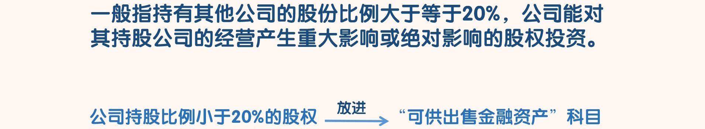

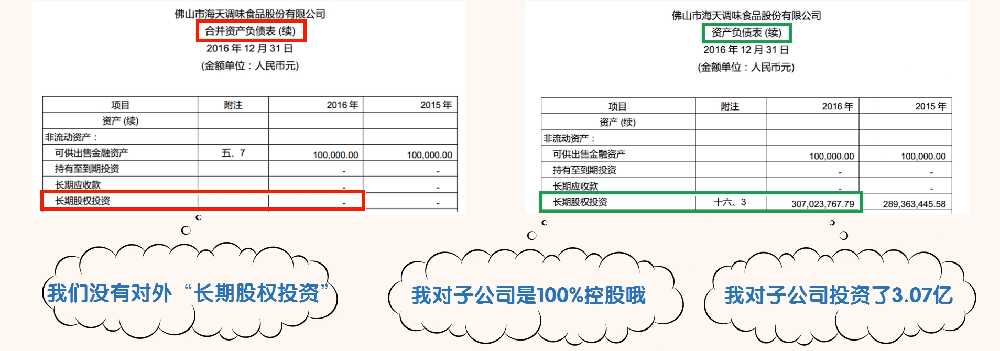

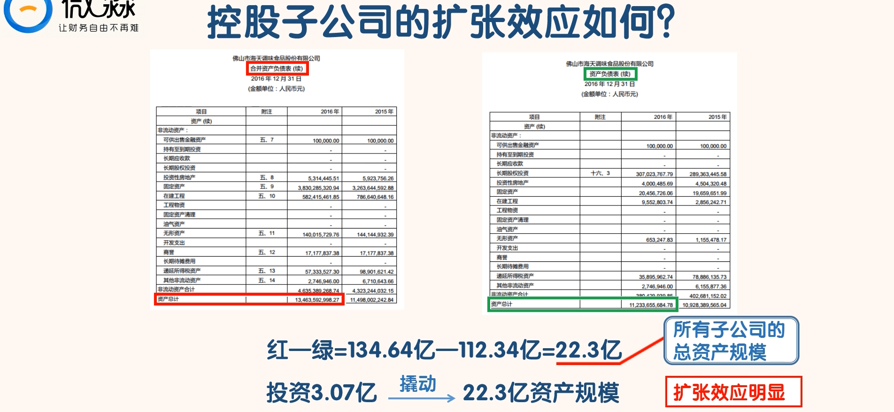

- 我们大致可以得出一个结论：海天味业子公司的整体经营状况还是很好的。
  - 假如海天味业投资了 3.07 亿，只撬动了 2 亿的资产规模
  - 就说明海天味业的子公司整体经营情况很差，整体处于亏损的情况

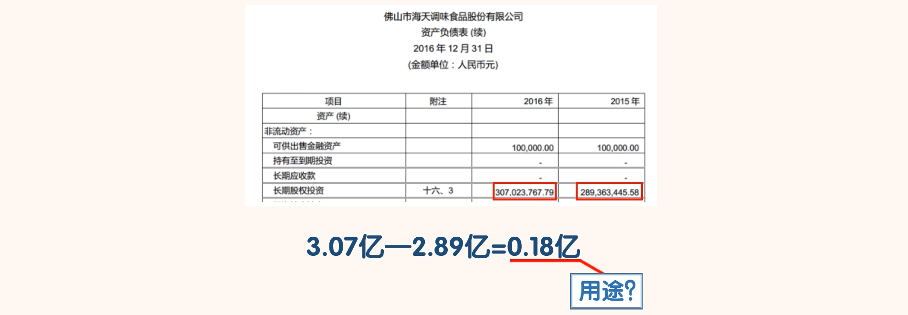

- 我们发现“资产负债表”中“长期股权投资”科目 2016 年的金额为 3.07 亿，2015 年的金额为 2.89亿，增加了 0.18 亿。

- 这说明在 2016 年中，海天味业要么是新成立了子公司，要么是对原有子公司进行了增资。
- 搜索“长期股权投资”：

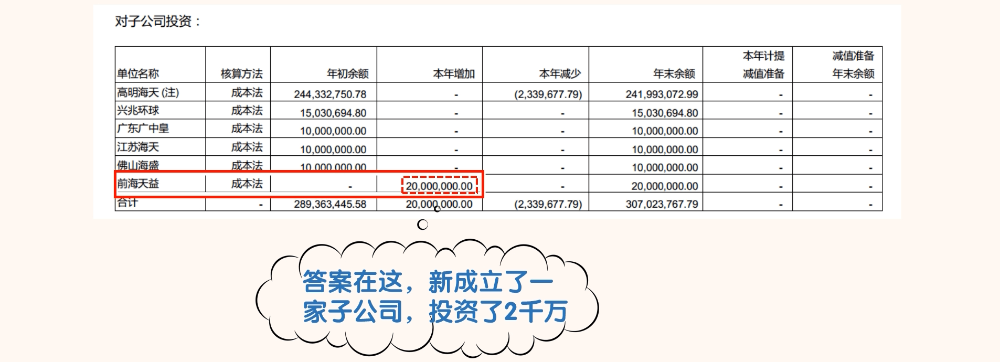

### “长期股权投资”的初始确认和后续计量

- 搜索“长期股权投资”：

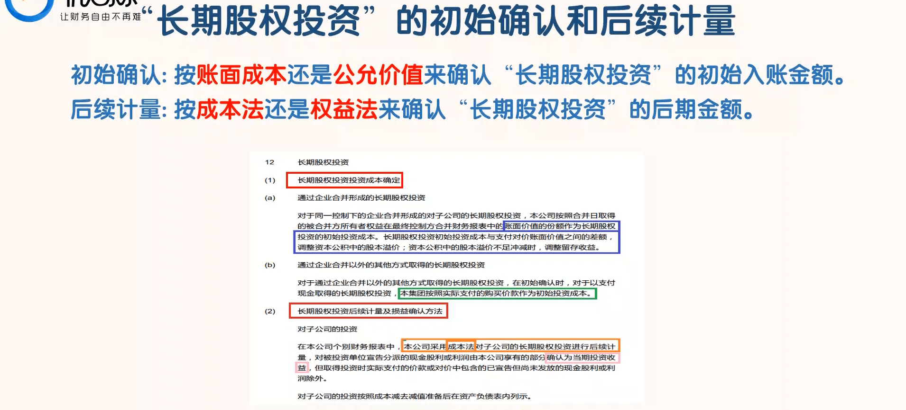

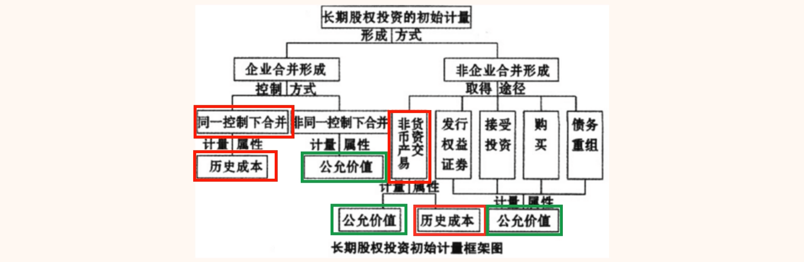

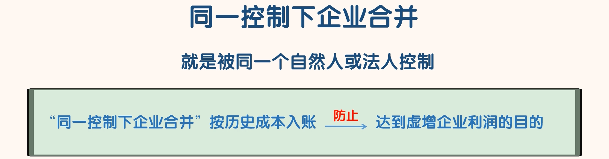

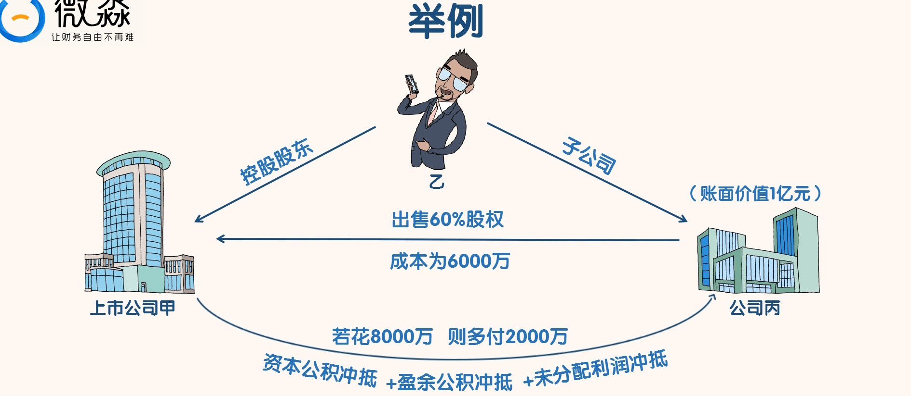

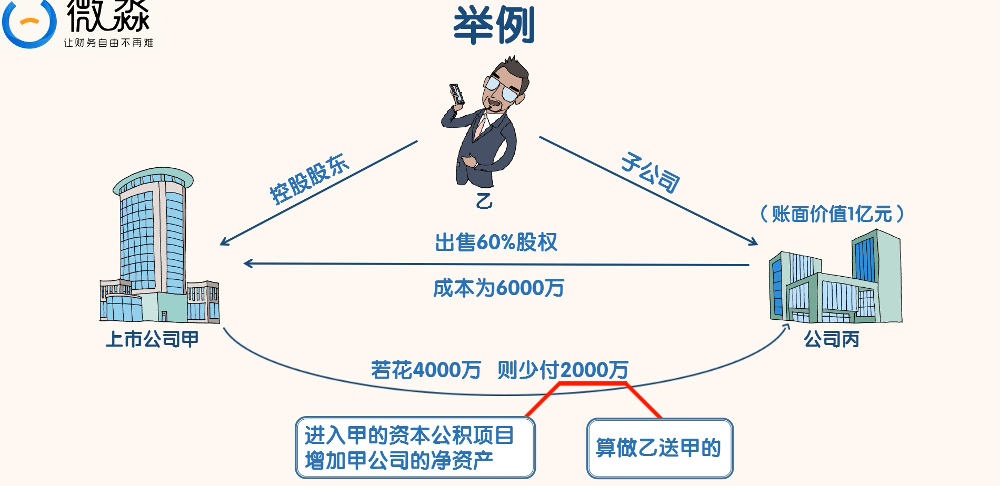

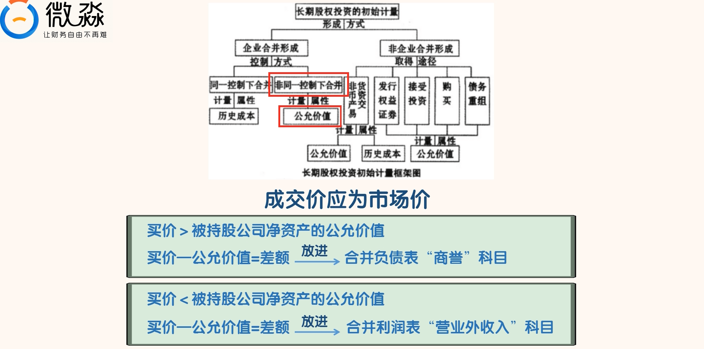

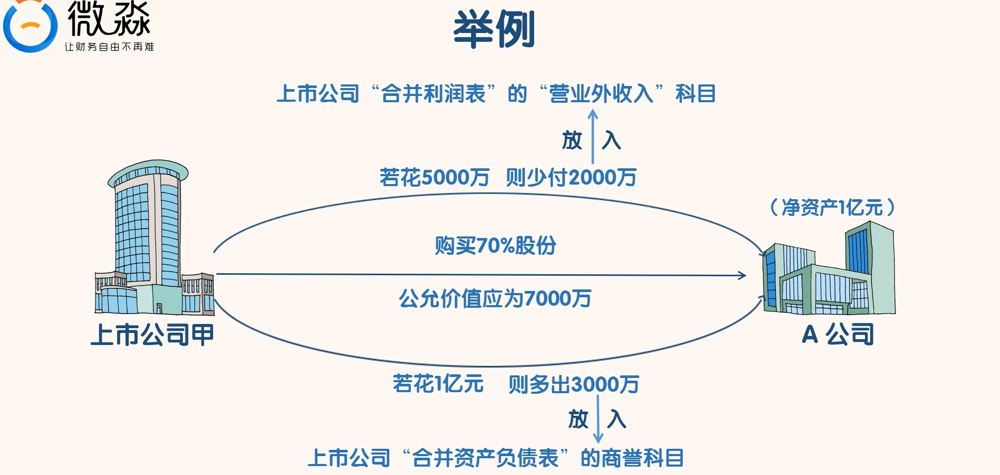

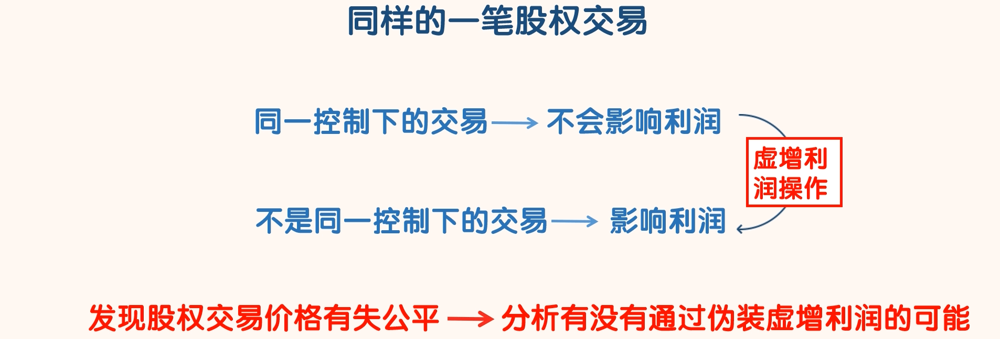

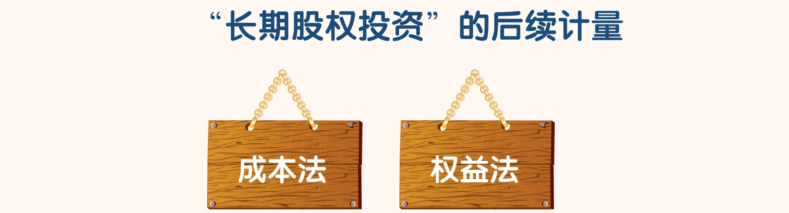

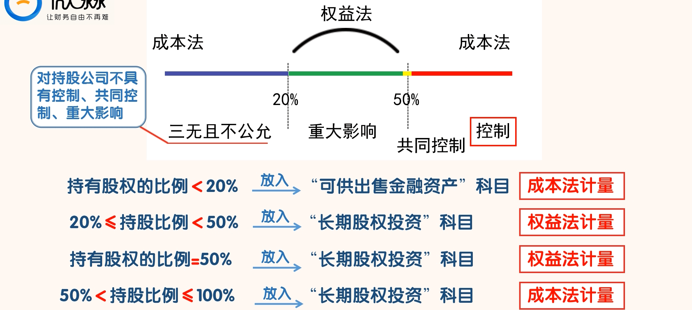

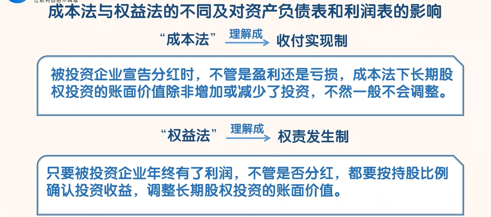

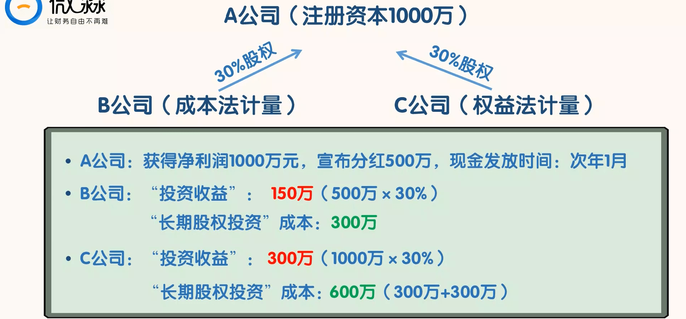

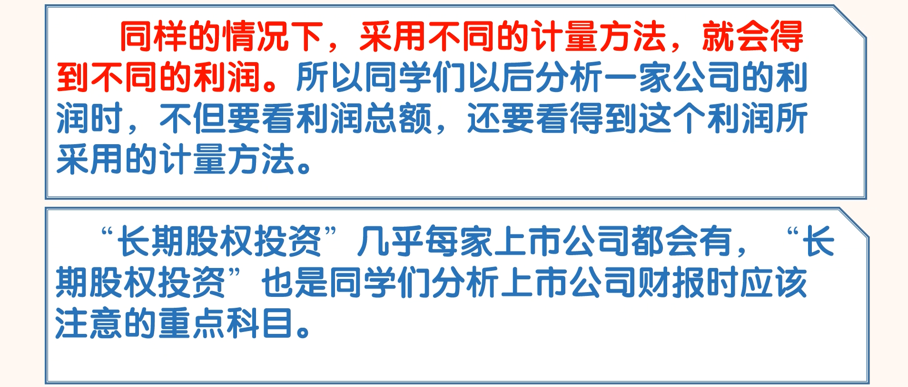

### 通过“长期股权投资”识别风险

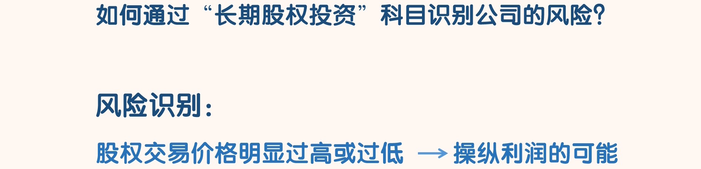

- 注意这种情况：股权交易价格明显过高或过低
  - 当这种情况出现，我们要怀疑公司有操纵利润的可能。
  - 因为交易价格过高或过低，是异常现象。
  - 这其中可能的情况是公司的利益相关方通过伪装成非相关方，与公司进行交易，帮公司虚增利润。