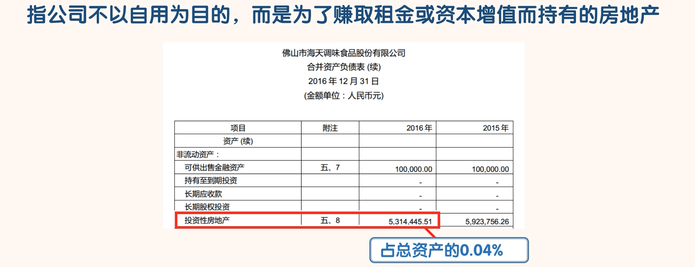
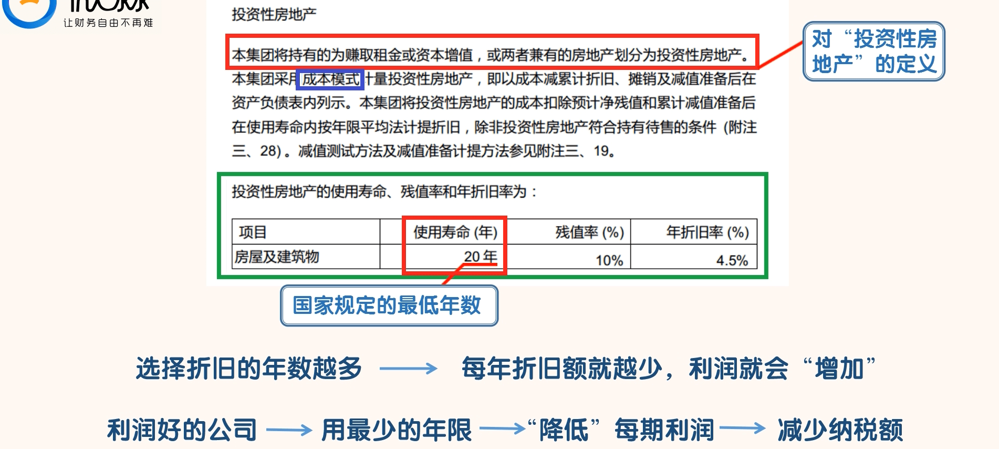
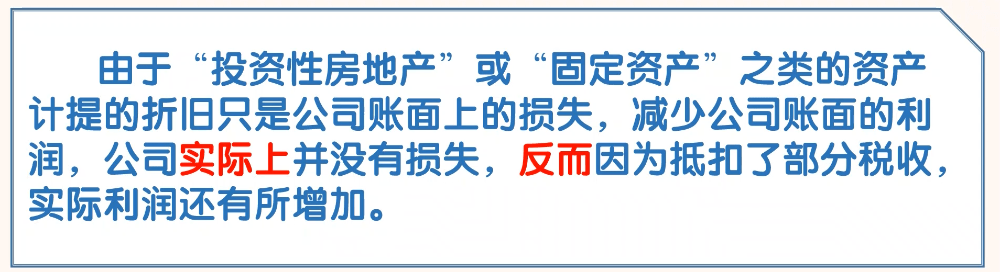
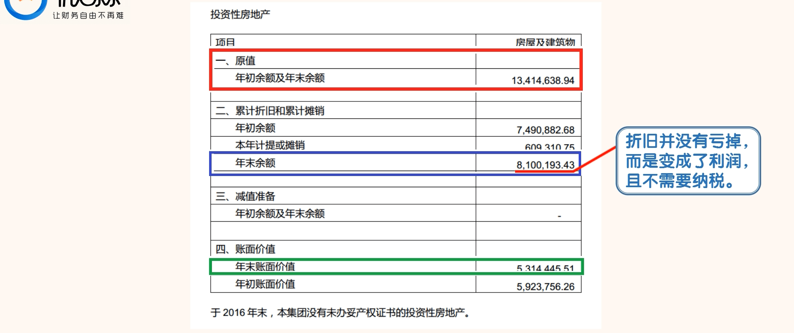
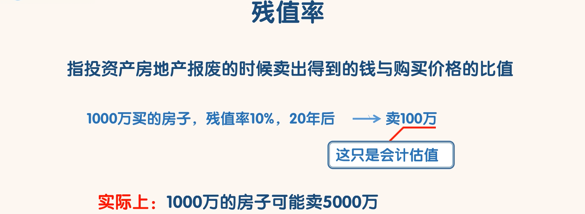
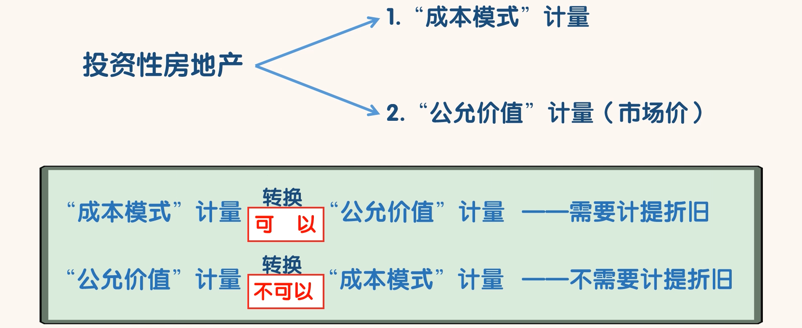
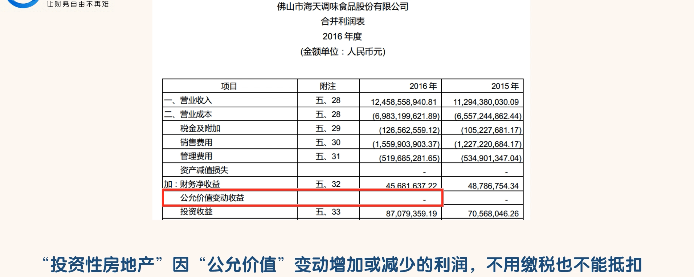
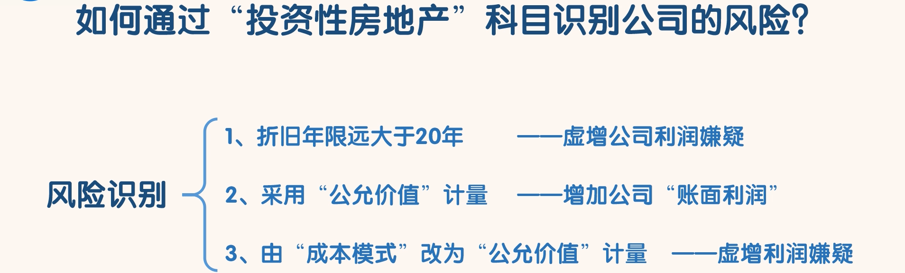

## 投资性房地产

### 认识投资性房地产

- 我们可以看到海天味业“投资性房地产”金额只占总资产的 0.04%，可以忽略不计。
- 封老师认为像海天味业这种专注于主业的行为还是非常值得肯定的。
- 封老师不喜欢投资性房地产占总资产比例较大的公司，除非是专门从事房地产投资的公司。

- 搜索“投资性房地产”

- 蓝色框内的内部表明海天味业采用“成本模式”计量投资性房地产。采用“成本模式”计量的，需要根据投资性房地产的使用寿命、残值率按年提折旧。

### 残值率

- 一些“投资性房地产”占总资产比例较高且采用“成本模式”计量的公司，这块可能会有彩蛋。

### 通过“投资性房地产”识别风险

- ①折旧年限远大于 20 年
  - 20 年折旧年限是国家规定的最低年限。
  - 在此基础上公司可以选择不同的年限，折旧年限越久，每年的折旧额就越少，当期利润就会“增加”。
  - 有的公司可能会通过延长折旧年限来虚增公司的利润。

- ②采用“公允价值”计量的
  - 会计准则建议采用“成本模式”计量。
  - 同样的“投资性房地产”采用“公允价值”计量的一般会增加公司的“账面利润”。
  - 当比较两家公司的利润时，特别是房地产公司的利润时，要考虑两家公司“投资性房地产”计量方式是否一样，如果不一样，不能直接拿利润额进行比较。

- ③由“成本模式”改为“公允价值”计量的
  - 当公司由“成本模式”改为“公允价值”计量时，
  - 要分析公司为什么要这样做？是否有虚增利润的嫌疑。