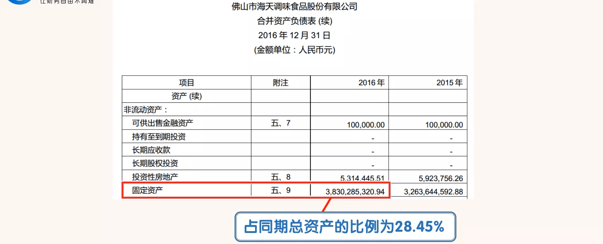
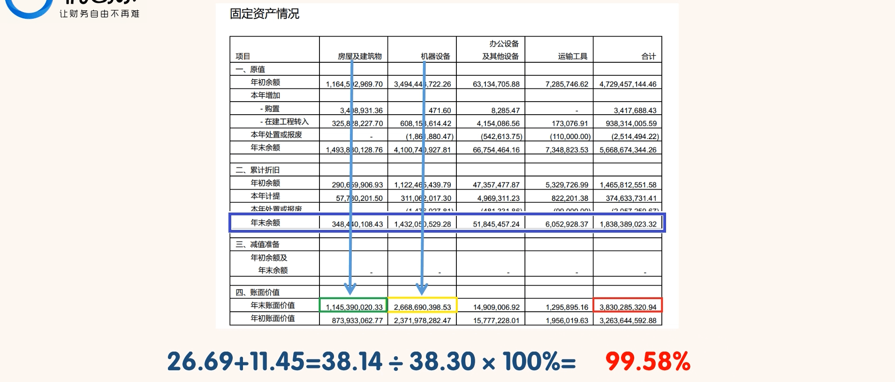
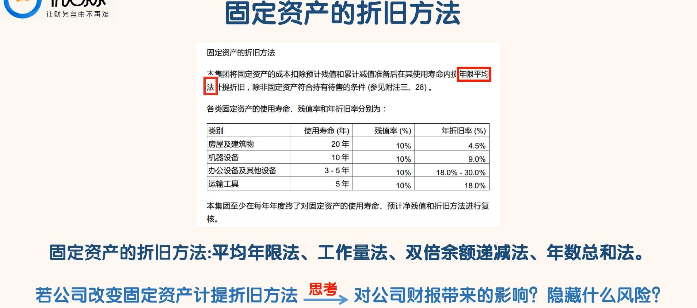
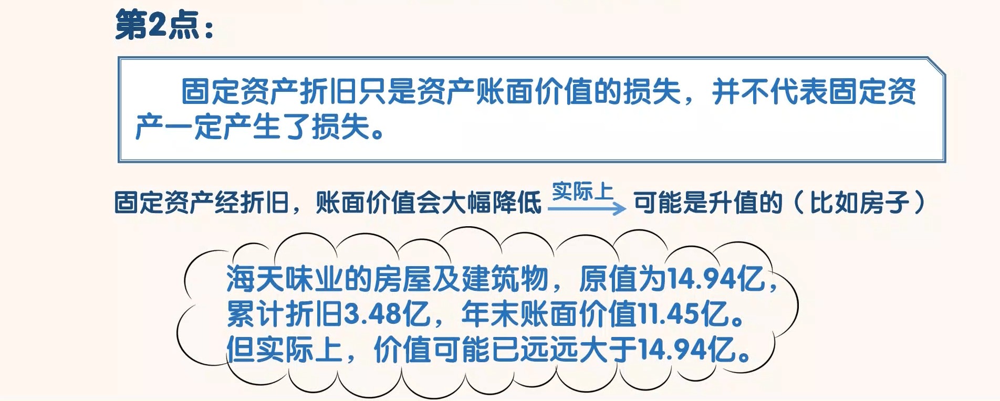
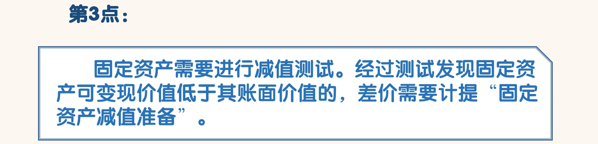
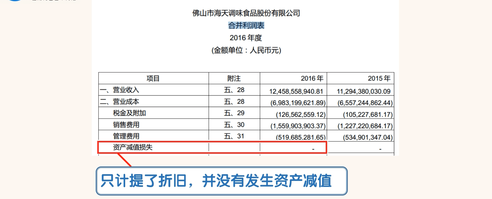
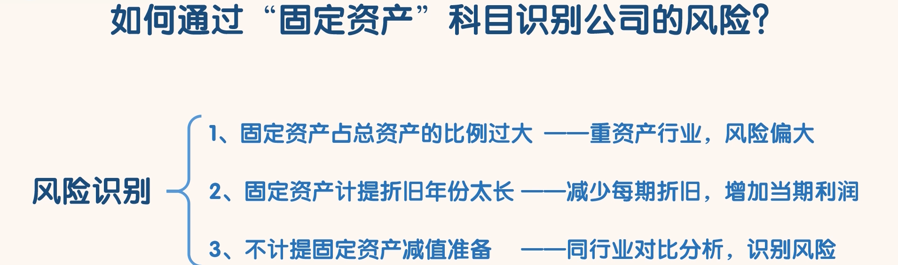

## 固定资产

### 认识固定资产

- 搜索“固定资产的折旧方法”

- “固定资产减值准备”会减少当期利润，计入合并利润表的“资产减值损失”科目
- 在现实中有些公司的固定资产事实上已经发生了减值，但是为了不影响利润而故意不计提“资产减值损失”

### 通过“固定资产”识别风险

- ①固定资产占总资产的比例过大，比如大于 40%
  - 固定资产占总资产的比例过大，属于重资产行业，
  - 每年维护保养，后期更换都需要更多的资金，
  - 如果遇到市场不景气，停工也会造成固定资产的闲置，
  - 重资产行业的风险天然就比轻资产行业要大

- ②固定资产计提折旧年份太长
  - 折旧年份拉的时间过长，每期计提的金额就少，当期利润就会“增加”。
  - 经营良好的公司一般会使用最短的折旧年数，这样就能减少当期的纳税额。
  - 经营不好的公司可能会通过延长折旧年数，减少每期折旧额，增加当期利润

- ③不计提固定资产减值准备
  - 在固定资产没有发生减值损失的情况下是不用计提减值损失的。
  - 事实上已经发生了减值损失，但是公司却故意不计提减值损失。
  - 因为计提减值损失会减少当期利润。
  - 对于长期不计提固定资产减值损失的公司，与其同行业公司的固定资产减值损失的计提情况相比较，就能识别风险