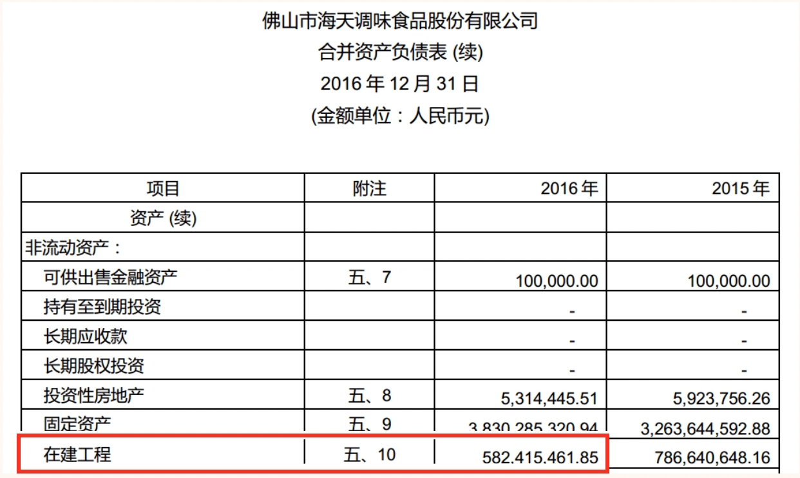
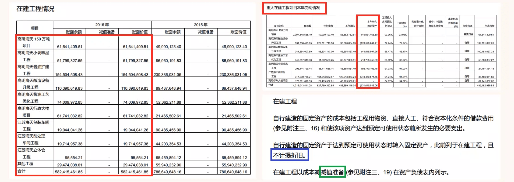

## 在建工程

### 认识在建工程

- 搜索海天味业“在建工程”的具体情况

- 通过“重大在建工程项目本年度变动情况”，我们可以看到重大在建工程更具体的情况，我们还可以看到本年有多少“在建工程”转入了“固定资产”。
- 通过“在建工程”蓝色框内内容，我们可以知道“在建工程”不计提折旧，但是对于已经发生减值的“在建工程”要计提“减值准备”。

### 通过“在建工程”识别风险

- ①金额巨大且不转成固定资产
  - 在建工程应当会陆陆续续的转成固定资产。
  - 在建工程金额巨大但不转成固定资产或者转成固定资产的金额很小。同学们要思考公司出现了什么问题。
  - 有时“在建工程”已经建造完成投入使用，但是公司为了不计提折旧，增加当期利润，就故意不在报表中将“在建工程”转成“固定资产”。
  - 有时有些公司也会通过“在建工程”把钱支付给自己的相关利益方，造成“在建工程”长期不能转固定资产。因为根本就没有工程在建

- ②计提高额减值损失
  - 在建工程”因某种原因大量损坏。
  - 事实上有些公司的钱通过“在建工程”支付出去以后，因为某种原因不能收回，干脆就通过意外事故等名义，计提高额“减值损失”。这样就名正言顺的解决了棘手问题