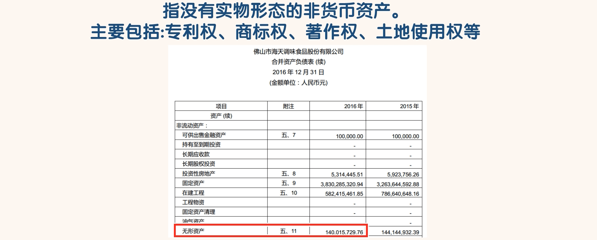
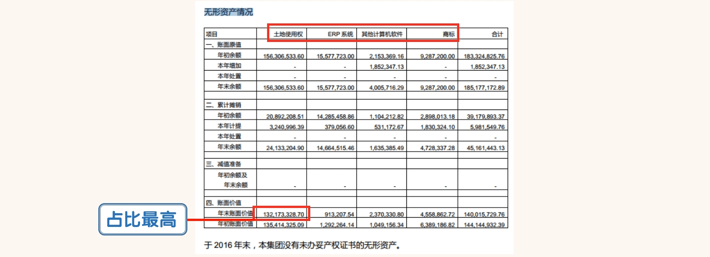
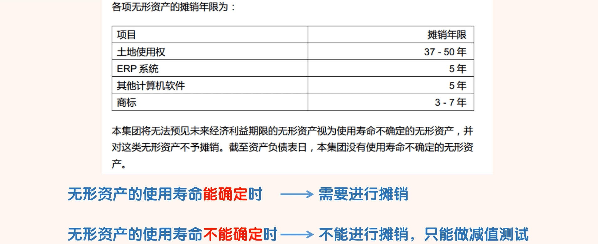
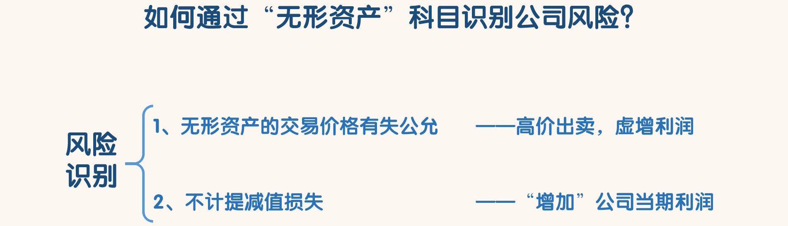

## 无形资产

### 认识无形资产

- 搜索海天味业“无形资产情况”：

- 搜索“无形资产的摊销年限”：

- 其实摊销和折旧就是一个意思。
  - 因为无形资产没有实物形态，不会变旧，自然不用折旧，所以就有了摊销。
- 但无形资产的摊销和固定资产的折旧也有些不同。
  - 当无形资产的使用寿命能确定时，无形资产需要进行摊销；
  - 当无形资产的使用寿命不能确定时，无形资产就不能进行摊销，只能做减值测试。减值损失一旦确定，
    后期是不能转回的。

### 通过“无形资产”识别风险

