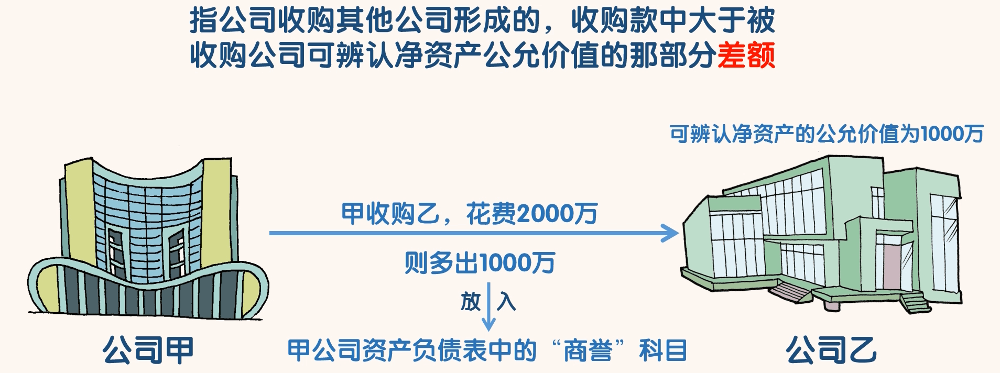
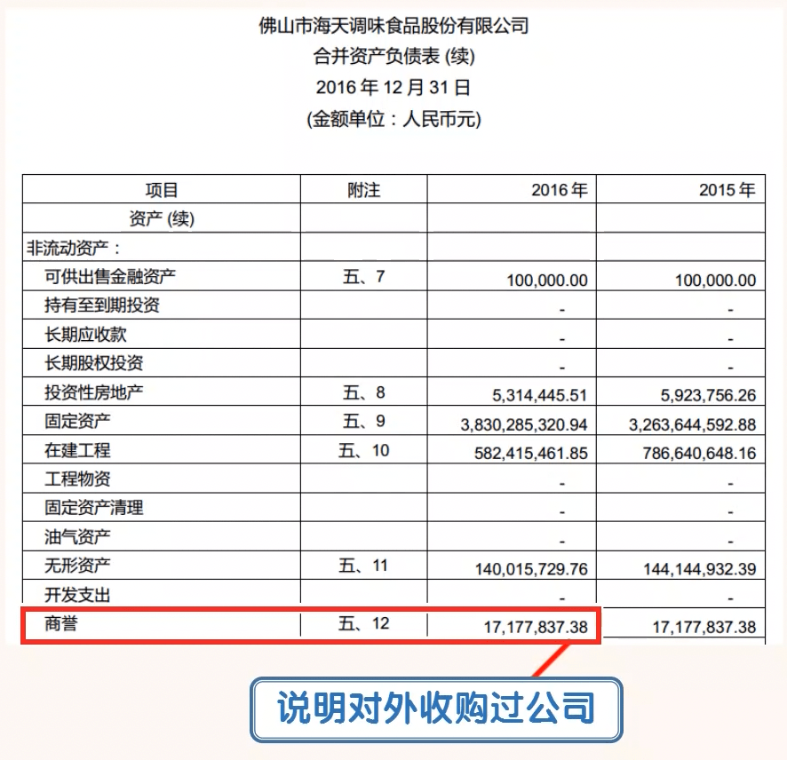
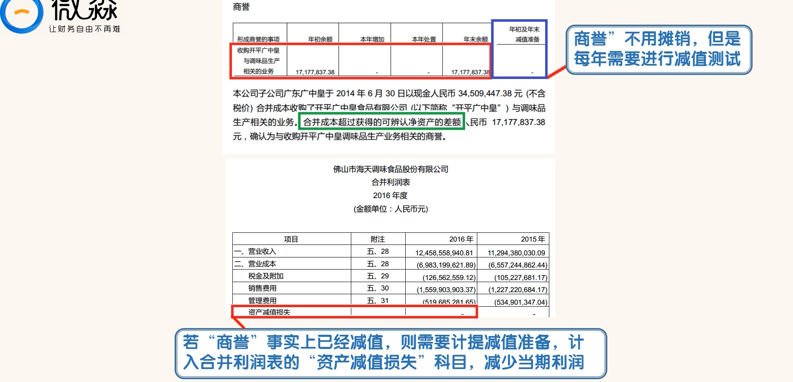
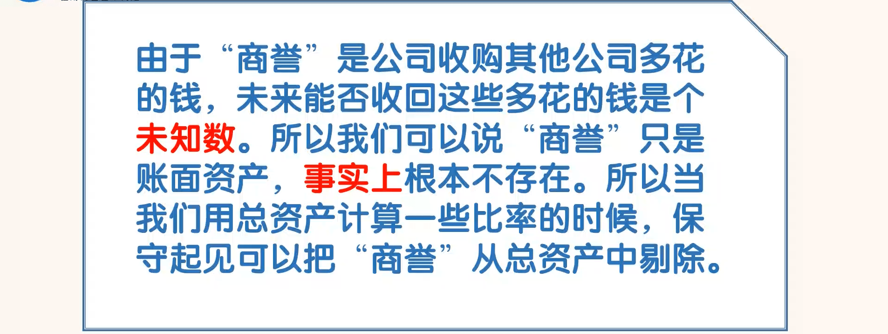
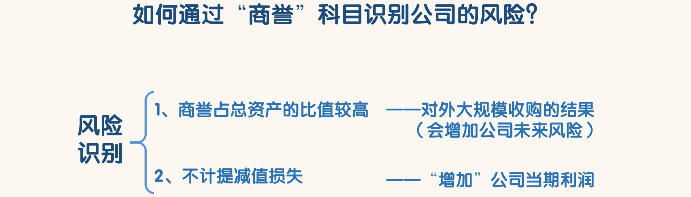

## 商誉

### 认识商誉

- 简单的说，就是一家公司收购另外一家公司多花的那部分钱。
- 商誉”听起来很好听，但是公司后期能否赚回多花的这部分钱，是个未知数。事实上很多收购案最终的结果都不好。

- 搜索海天味业“商誉”：

- 海天味业的子公司在 2014 年 6 月 30 日收购了“开平广中皇与调味品相关的业务”。从绿色框内内容我们可以知道，这次收购多花了 1714.84 万。
- 我们可以看到蓝色框内的内容，“减值准备”为 0。
- 这说明海天味业年末经过商誉减值测试后认为商誉没有发生减值，不用计提减值准备。
- 这里要说一下，“商誉”不用摊销，但是每年需要进行减值测试。
- 如果发现“商誉”在事实上已经减值，那就需要计提减值准备，计入合并利润表的“资产减值损失”科目，减少当期利润
- “商誉”的资产减值损失一旦确认，后期不能转回。
- “商誉”只是账面资产，事实上根本不存在。
- 所以当我们用总资产计算一些比率的时候，保守起见可以把“商誉”从总资产中剔除

### 通过“商誉”识别风险

- ①商誉占总资产的比值较高
  - 这种情况一般是公司对外大规模收购的结果。但是收购成功的概率普遍较低，所以公司未来的风险也较大
-  ②不计提减值损失
  - 在“商誉”事实上已经发生减值的情况下故意不计提减值损失来增加公司当期利润