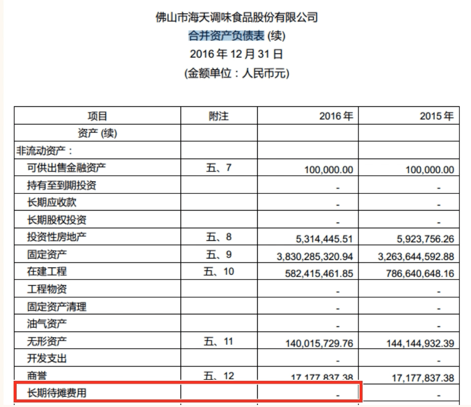

## 长期待摊费用

### 认识长期待摊费用

- “长期待摊费用”虽然待在“资产负债表”的资产项中，但是它本质上还是一笔已经花掉的费用。它是一个披着资产外衣的费用。
- “长期待摊费用”不能变现，只是账面的数字。这项数字越大，表明公司的资产质量越差。
- 当我们看一家公司的总资产时，保守的做法是把这个科目的金额减掉。优秀的公司“长期待摊费用”的金额一般极小，甚至为 0。
- 不过有些公司会把一些费用放进“长期待摊费用”，因为这样可以减少当期的费用，这样就能增加当期的利润

### 通过“长期待摊费用”识别风险

