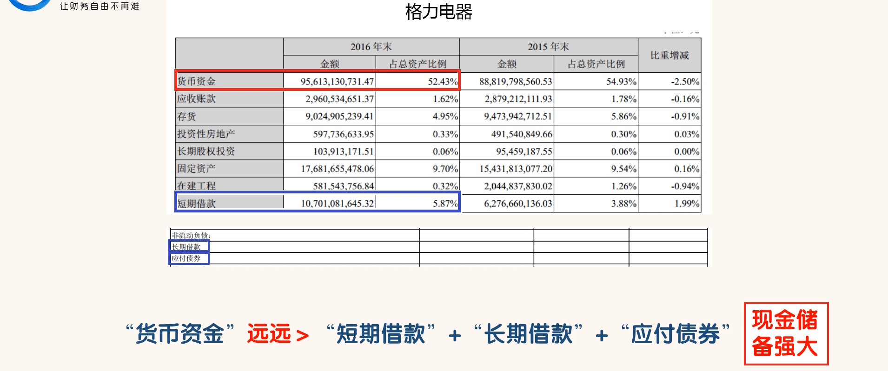

## “短期借款”、长期借款”和“应付债券”

### 认识“短期借款”、长期借款”和“应付债券”

- “短期借款”指还款期限在 1 年以内的借款。
  - “短期借款”产生的原因一般是用来弥补公司自有流动资金的不足。
  - 最优秀的公司“短期借款”金额一般为 0。因为最优秀的公司自有流动资金一般比较充足。
  - 优秀的公司“短期借款”占“总资产”的比例一般不会太高，比如一般不超过 5%。当然，这些只是经验值，同学们不能绝对化
- “长期借款””指公司借的还款期限在 1 年以上的借款
  - “长期借款”和“短期借款”唯一的区别就是借款期限不同。
- “应付债券”指公司发行的约定在未来某个特定日期还本付息的有价证券。
  - 债券是公司融资的一种重要的金融工具。

- 我们可以看到海天味业的“短期借款”金额为 0，“长期借款”金额为 0，“应付债券”金额也为 0。
- 这说明海天味业的自有资金相当充足。
- 完全依靠自有资金就能解决日常经营和长期投资所需要的资金。
- 这点我们从“货币资金”科目可以看出。

- 为什么在不差钱的情况下格力电器还借了 107 亿的短期贷款。
  - 考虑到美元的短期贷款利率极低,贷款利率应该小于2%,贷款利率小于中国的定期存款利率,套取利差或许是格力电器有大量"短期借款”的原因。当然或许也有可能还有其他原因。

### 通过“短、长期借款”和“应付债券”识别风险

- 公司在不缺钱的情况下还借了很多钱,这些钱是需要支付利息的,出现这种情况同学们要弄清楚为什么?
  - 是公司在进行套息交易
  - 还是公司只是账面上有钱,实际却没有钱了