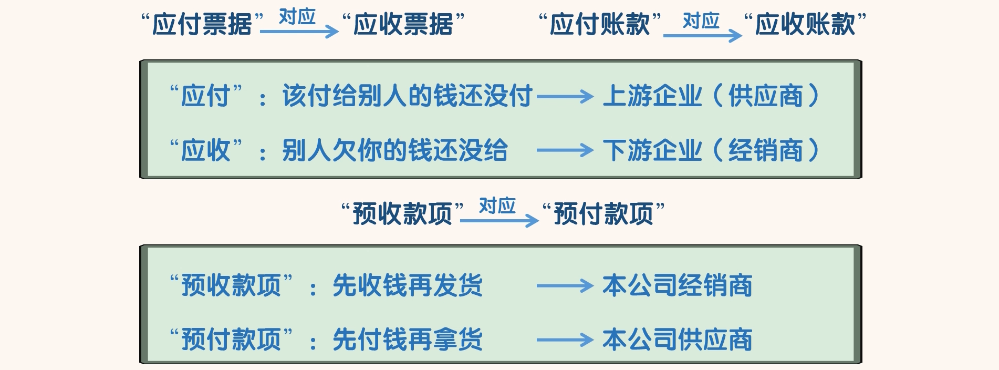
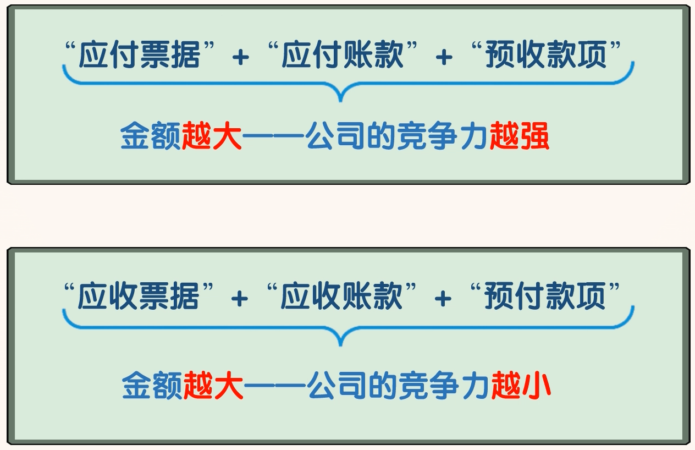
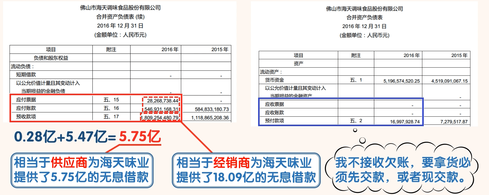
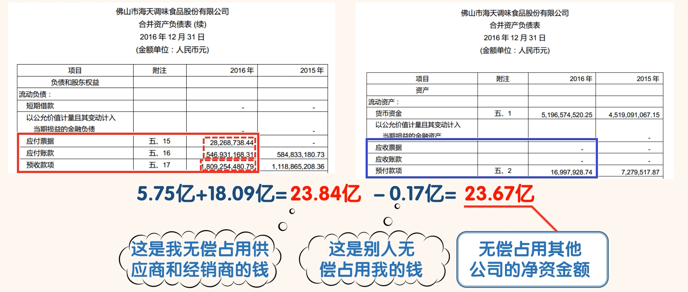

## “应付票据”、“应付账款”、“预收款项”

- 如果“应付”中主要由“应付账款”构成，说明本公司的竞争力更强，行业地位更高。
- 如果“应收”中主要由“应收账款”构成，说明本公司的竞争力更弱，行业地位更低

- 海天味业的“应付票据”为 0.28 亿，“应付账款”为 5.47 亿，“应付”中主要以“应付账款”为主。
- 通过“应付”科目，我们知道海天味业无偿占用了供应商 5.75 亿的资金。这相当于供应商为海天味业提供了 5.75 亿的无息借款。
- “预收款项”为 18.09 亿，这说明海天味业无偿占用了经销商 18.09 亿的资金。这相当于经销商为海天味业提供了 18.09 亿的无息借款
- 海天味业的“应收票据”为 0，“应收账款”为 0，这说明海天味业的经销商对海天味业没有欠账，海天味业的经销商要从海天味业拿货必须要“先款后货”或者“现款现货”。
- 这也能看出海天味业对于经销商的地位是相当强势的。“预付款项”为 0.17 亿元，金额很小

- 通过以上 6 个科目的数据，我们知道海天味业无偿占用了供应商和经销商 5.75+18.09=23.84 亿资金，
- 其他公司无偿占用了海天味业 0.17 亿资金，海天味业无偿占用的其他公司的净资金额为 23.67 亿。
- 从这就能看出海天味业在行业内有极强的竞争力和行业地位。这样的公司想不赚钱都难