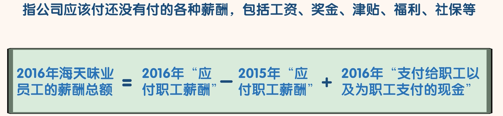
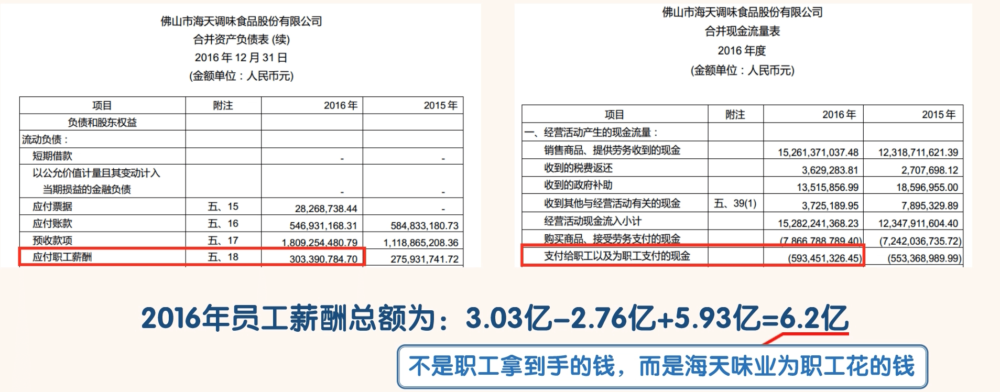
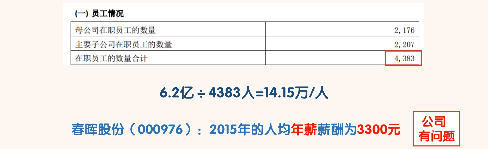

## 应付职工薪酬

### 认识应付职工薪酬

- 比如工资一般都是次月发，当月月底结束做报表的时候，已经产生但还没有发放的薪酬就是“应付职工薪酬”。
- 用“应付职工薪酬”科目 2016 年的金额减去 2015 年的金额，差额加上现金流量表中“支付给职工以及为职工支付的现金”科目中的金额，就是 2016 年海天味业员工的薪酬总额。

- 搜索“员工情况”：

- 广州所有上市公司的人均薪酬就在 14 万多点，看来海天味业的人均薪酬还是比较合理的。
- 如果我们算出一家公司的人均薪酬过低或过高，我们也可以认为这家公司有问题。