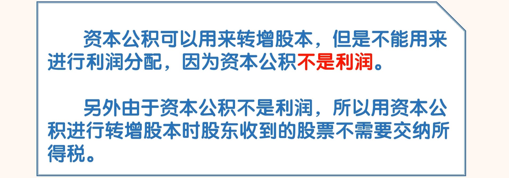
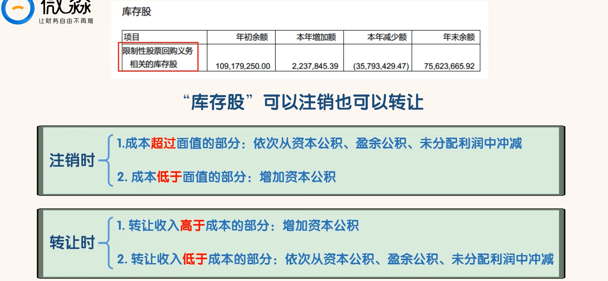
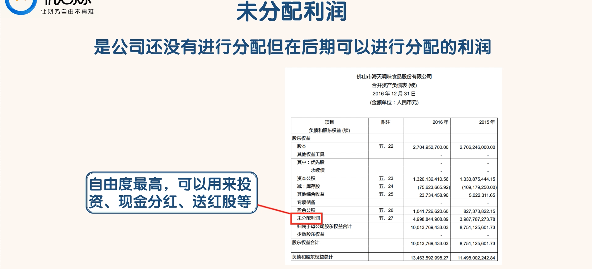

## 学习“股东权益”的各个主要科目

### 股东权益

- “股东权益”就是总资产减去总负债剩余的部分。“资产=负债+股东权益”。
- 股东权益主要由“股本”、“资本公积”、“其他综合收益”、“盈余公积”和“未分配利润”这 5 个科目组成。
- 这 5 个科目我们又可以分成三类。
  - 第一类是股东入资，就是股东投入的钱，包括股本和资本公积。
  - 第二类是利润的积累，就是公司在经营中赚的钱，这些钱都是通过交易产生的，包括盈余公积和未分配利润。
  - 第三类是资产增值，就是公司持有的资产账面价格的变动发生的增值，这些增值不是通过交易产生的，其他综合收益就属于这类。

### 股本

### 其他股权工具

- “优先股”是相对于普通股而言的，“优先股”的优先体现在：
  - ①公司破产清算时，在受偿顺序上排在普通股之前；
  - ②在股利分配方面排在普通股之前，按固定股息率发放。
- 另外优先股没有表决权，不能参与公司经营管理。

### 资本公积

- 搜索海天味业“资本公积”：

- 红色框内增加的 3750 万股股本，就是 IPO 时发行的新股，同时资本公积增加了 18 亿。
- 从蓝色框内的内容我们可以看到 2014 年海天味业通过资本公积转增股本 7.48 亿股，海天味业当年股本增加到 15.04 亿，资本公积减少了 7.48 亿，为 25.5 亿。
- 我们可以看到 2016 年海天味业的资本公积为 13.2 亿，这是因为海天味业后期还进行过资本公积转增股本以及部分股票回购

### 库存股

- “库存股”指上市公司回购的本公司的股票。
- “库存股”因为没有股东，所以“库存股”既不获得分红也没有投票权。

- “搜索海天味业“库存股”

- 海天味业的“库存股”是因“限制性股票回购义务”而产生的。

### 其他综合收益

- “其他综合收益”是从“资本公积”中分出来的一个科目。
- “其他综合收益”更像是一个过渡性的科目，在未来还需要转出。而“资本公积”属于已经确定的事实，在以后期间不能转出

- 比如“可供出售金融资产”科目中成本 100 万的股票，市场价值变成了 200 万，增加的 100 万就计入“其他综合收益”。
- 后期市场价值变成了 150 万，那就把“其他综合收益”里的 100 万调整成 50 万。
- 再后期以 130 万的价格卖出了，获利 30 万。
- 则 30 万要从“其他综合收益”中转出，另外这 30 万的收益，要计入利润表中“投资收益”科目。

### 盈余公积

- 1、弥补前期亏损
  - 企业以提取的盈余公积弥补亏损时，应当由公司董事会提议，并经股东大会批准。
- 2、转增股本
  - 企业将盈余公积转增股本时，必须经股东大会决议批准。
  - 在将盈余公积转增股本时，要按股东原有持股比例结转。盈余公积转增股本时，转增后留存的盈余公积的数额不得少于注册资本的 25%。
  - 盈余公积金转增股本时，股东需要交纳个税。
- 3、分配股利
  - 原则上企业当年没有利润，不得分配股利，如为了维护企业信誉，可以用盈余公积分配股利，但必须符合特定的条件

### 未分配利润

- 它是公司在过去实现的净利润经过弥补亏损、提取盈余公积和分红后剩余的利润。
- 在资金的使用自由度上，未分配利润是最自由的。
- 未分配利润可以用来投资、现金分红、送红股等。未分配利润进行现金分红和送红股的时候要缴纳个税，税率为 20%

- 海天味业 2016 年的“未分配利润”为 49.99 亿。这不代表公司有 49.99 亿的现金等着去分。
- 因为这 49.99 亿中的部分钱可能已经被投资用掉了。
- 公司真正可以用来分红的钱是“货币资金”科目中的现金及现金等价物。
- 海天味业 2016 年年末的“现金和现金等价物”金额为 51.69 亿。
- 这个金额大于“未分配利润”的 49.99 亿。在这种情况下，理论上这 49.99 亿的“未分配利润”是可以全
  部分掉的。
- 如果“现金和现金等价物”的金额只有 30 亿。在这种情况下，公司可以分红分掉的钱最多就是 30 亿

### 归属于母公司股东权益合计

- 我们把红色框内各科目的金额相加，就得到了“归属于母公司股东权益合计”的金额。
- 我们可以看到 “归属于母公司股东权益合计”的金额为 100.14 亿。这就是归属于海天味业本公司股东的权益。
- 由于海天味业的所有子公司都是由海天味业 100%控股，所以“少数股东权益”的金额为 0。“归属于母公司股东权益合计”就等于“股东权益合计”。
- 很多时候，由于上市公司对其子公司并不是 100%控股，这种情况下，小股东的权益就会被记入“少数股东权益”。这时“归属于母公司股东权益合计”加上“少数股东权益”才等于“股东权益合计”。

