## 如何快速的通过资产负债表看懂一家公司

### 第一步，先看总资产

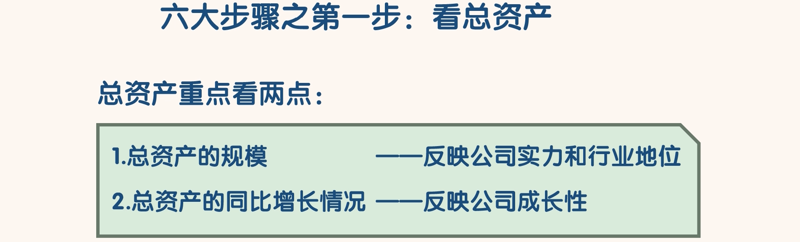

- 一家公司的总资产规模代表这家公司掌控的资源规模，也就是这家公司的实力。
- 通过一家公司的总资产规模，在一定程度上能看出这家公司在行业中的地位。
- 一般情况下，总资产规模排名第一的公司就是这个行业中的老大
- 另外总资产同比增长较快的公司一般处于快速扩张之中，这样的公司成长性较强。
- 如果一家公司的总资产同比负增长，那么这家公司很可能处于收缩或者衰退之中

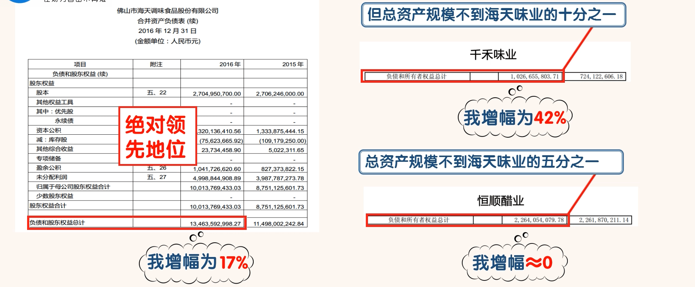

- 海天味业 2016 年年末的总资产为 134.64 亿，比 2015 年的 114.98 亿增加了 19.66 亿，增幅为 17%，我们可以初步判断海天味业处在扩张之中
- 千禾味业 2016 年年末的总资产为 10.27 亿，比 2015 年的 7.24 亿增加了 3.03 亿，增幅为 42%，我们可以初步判断千禾味业处于快速扩张之中。但是千禾味业的总资产规模还不到海天味业的十分之一，两家公司的实力如何？我们就能有个初步判断了
- 恒顺醋业 2016 年年末的总资产为 22.64 亿，比 2015 年的 22.62 亿增加了 0.02 亿，增幅近乎为 0，我们可以初步判断恒顺醋业停滞不前，过去一年好像白干了。恒顺醋业的总资产规模还不到海天味业的五分之一，两家公司的实力如何？我们就能有个初步判断了
- 通过以上 3 家公司总资产规模的对比
  - 我们可以看到海天味业的总资产规模是最大的，处于绝对领先的地位，事实上海天味业也是调味品行业的龙头老大。
  - 海天味业的总资产规模不但最大，而且海天味业的总资产同比增长速度也较快，这说明海天味业仍然处于快速扩张之中，在未来一段时期内，海天味业很可能持续保持行业老大的地位

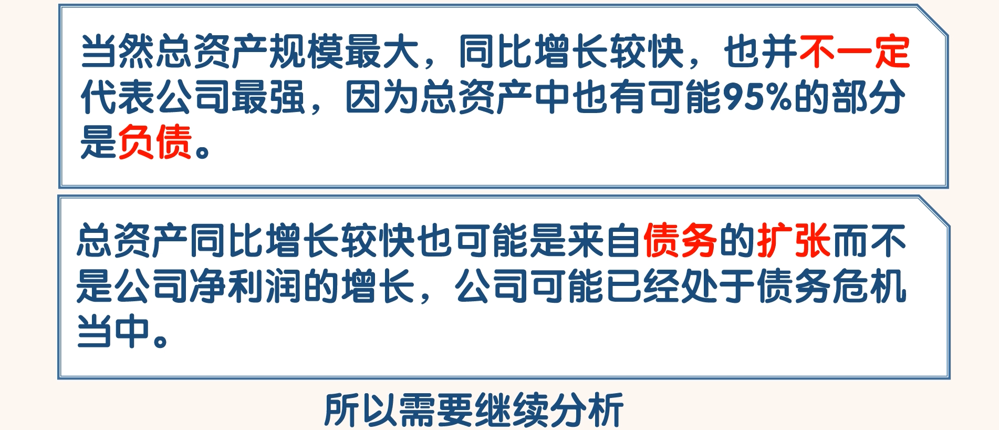

### 第二步，看负债和股东权益

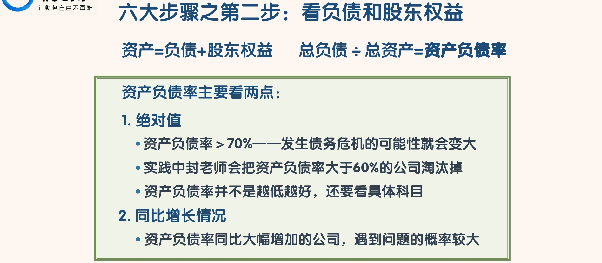

- 资产负债率主要看两点，一是绝对值；二是同比增长情况。
- 在实践当中封老师会把资产负债率大于 60%的公司淘汰掉。
- 不过资产负债率并不是越低越好，要知道像“应付票据”、“应付账款”和“预收款项”之类的负债高恰恰是公司竞争力强的表现。
- 另外对于资产负债率小于 60%的公司，我们还要看同比变化情况。比如一家公司的资产负债率今年是 50%，依然处于安全范围内，但是它上年的资产负债率只有 30%，同比增长了 67%，这样的变化情况就属于异常情况，是值得注意的。
- 一般资产负债率同比大幅增加的公司，遇到问题的概率比较大

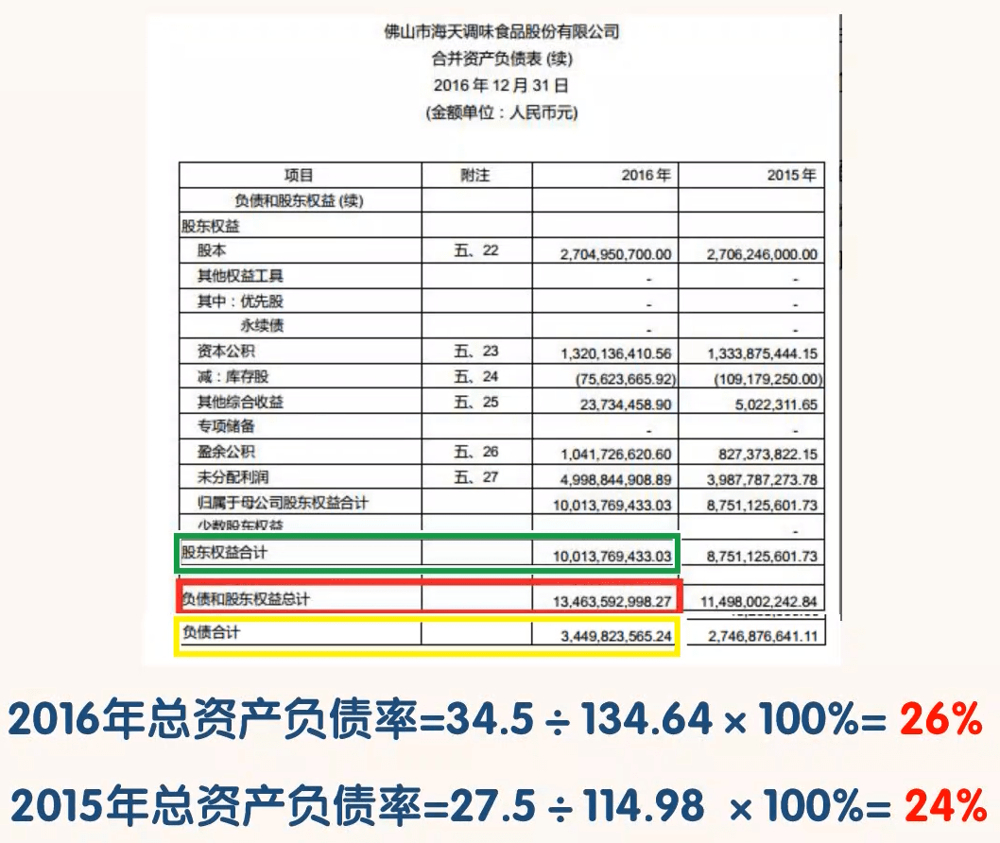

- 海 天 味 业 2016 年 年 末 总 负 债 为：34.5 亿 ， 股 东 权 益 为 100.14 亿 ， 总 资 产 负 债 率 为 ：34.5/134.64*100%=26%。总资产中负债还是比较少的。
- 同理我们还可以计算出海天味业 2015 年的资产负债率为 24%。
- 两年的资产负债率都比较低，也比较稳定，这是好现象。通过资产负债率我们大概就能知道海天味业在未来发生债务危机的可能较小
- 为了更准确的判断一家公司的偿债能力，我们需要进行下一步

### 第三步，看有息负债和货币资金

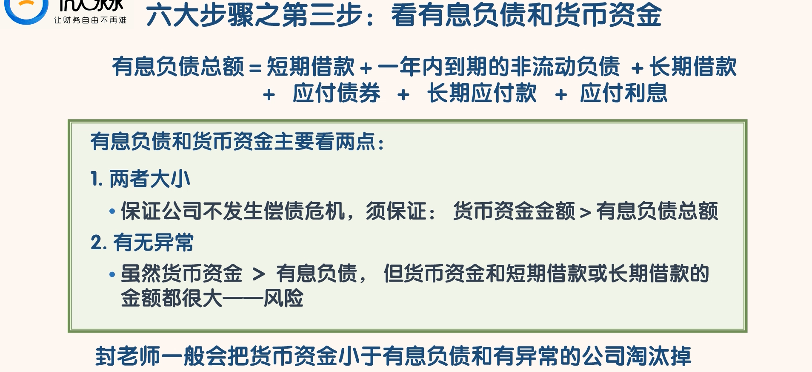

- “有息负债”就是需要还本付息的债务，它是因公司融资行为产生的，公司在未来需要用钱去偿还。
- 有息负债总额＝短期借款＋一年内到期的非流动负债＋长期借款＋应付债券＋长期应付款 + 应付利息。
- 偿还有息负债需要现金，也就是货币资金。
- 有息负债和货币资金主要看两点。一是两者大小；二是有无异常。
- 要保证公司不发生偿债危机，就必须保证货币资金金额大于有息负债总额。
- 但是这里有一个异常情况要注意。那就是虽然货币资金大于有息负债，但是货币资金和短期借款或长期借款的金额都很大。
- 一个有大量现金的公司还借那么多钱，关键是这些钱都是有利息的。这很可能意味着公司只是在账面上有大量现金，而实际上却没有。这就是风险。
- 在实践中，封老师一般会把货币资金小于有息负债和有异常的公司淘汰掉

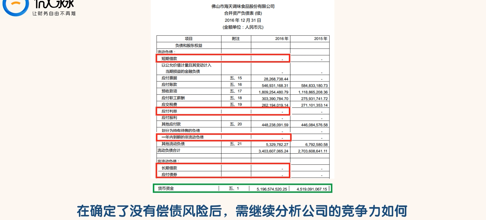

- 海天味业的“有息负债”总额为 0，而货币资金总额为 51.97 亿。一点有息负债都没有，海天味业在未来一段时间不存在债务危机的可能。
- 在确定了一家公司没有偿债风险以后，我们要看看这家公司的竞争力如何了

### 第四步，看“应收应付”和“预付预收”

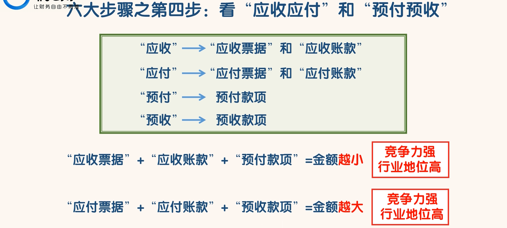

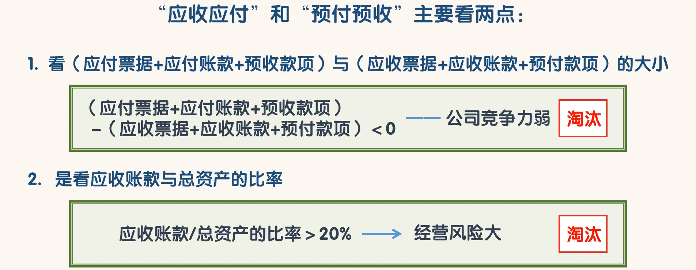

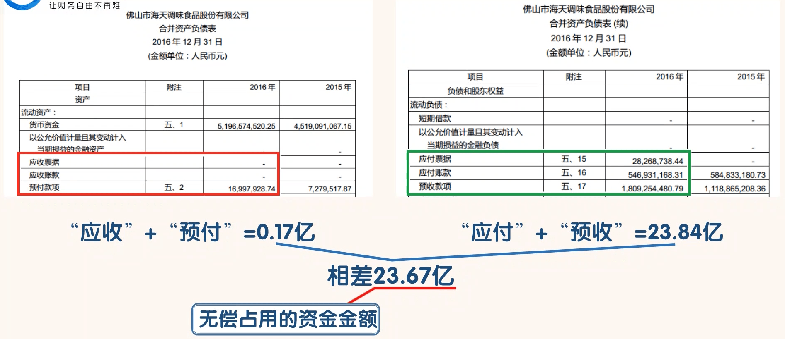

- 海天味业“应收”和“预付”总金额为 0.17 亿；“应付”和“预收”总金额为 23.84 亿。
- 后者减去前者的差是 23.67 亿。这就是海天味业无偿占用其上游供应商和下游经销商的资金金额。
- 这相当于海天味业的上下游公司为海天味业提供了大量的无息贷款。海天味业具有“两头吃”的能力。
- 一般只有行业的龙头公司才具备“两头吃”的能力。从这点我们也能理解为什么海天味业没有“有息负债”
- 当我们判断出一家公司的竞争力水平以后，我们还要看公司持续保持竞争力的成本

### 第五步，看固定资产

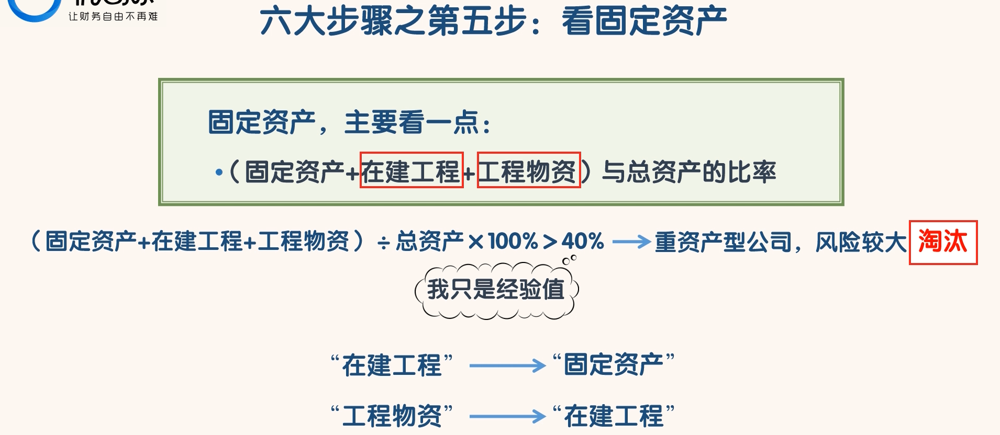

- 固定资产，只要看一点，那就是（固定资产+在建工程+工程物资）与总资产的比率。
- 在实践中，封老师会把（固定资产+在建工程+工程物资）/总资产\*100%大于 40%的公司淘汰掉。
- 封老师认为这个比率大于 40%的公司属于重资产型公司，公司自身的风险较大当然这个数值只是个经验值，没有绝对的标准。
- 这里我们把“在建工程”和“工程物资”也算作固定资产，因为“在建工程”建好以后就会转成“固定资产”，“工程物资”也是为了“在建工程”而准备的。
- 当然如果一家公司的（固定资产+在建工程+工程物资）/总资产*100%大于 40%就一定不能投资吗？这个也不是，具体还要结合其他情况来定。
- 重资产型公司只是维持竞争力的成本比较高，风险相对较大，不代表公司盈利能力差

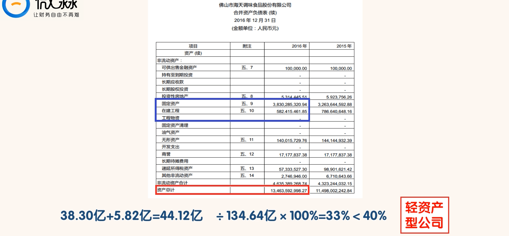

- 海天味业的“固定资产”+“在建工程”+“工程物资”的金额为 44.12 亿，总资产的金额为 134.64 亿，两者比率为 33%，小于 40%，海天味业属于轻资产型公司。
- 不过海天味业在轻资产型公司中属于资产比较重的。
- 作为一家轻资产型的公司，要保持持续的竞争力成本相对要低一些。
- 但是一家公司能否保持持续的成功，不但要看客观因素，还要看主观态度。比如一家持续专注于主业的公司，其获得持续的成功的概率就会大一些

### 第六步，看投资类资产

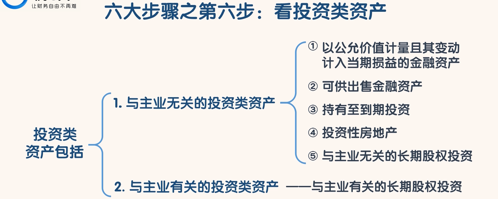

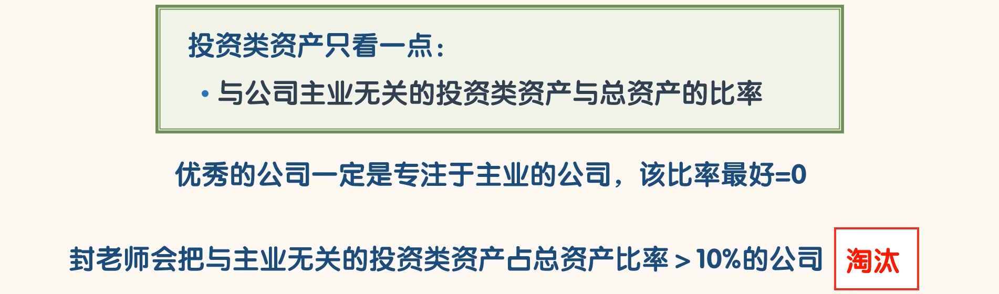

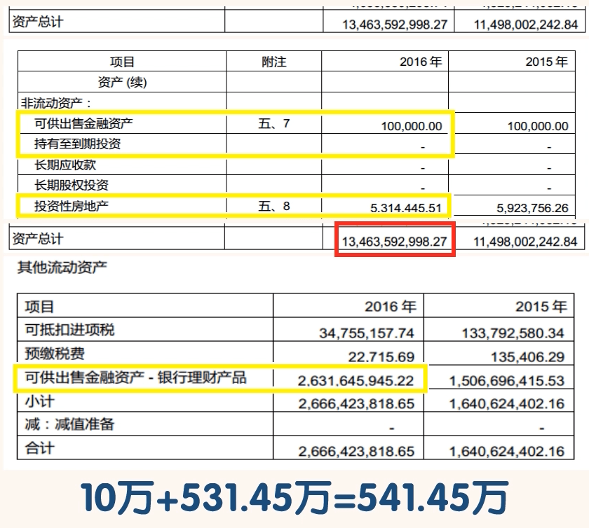

- 海天味业与主业无关的投资类资产总额为 541.45 万，与 134.64 亿总资产相比，可以忽略不计。我们可以说海天味业还是很专注于主业的。
- 不过在其他流动资产中我们可以看到海天味业买了 26.32 亿的银行理财产品
- 这些理财产品期限都在 1 年内，我们可以认为这是海天味业进行货币资金管理的一种手段。
- 那么多钱去买理财产品而不是去增加新的产品线，海天味业在行业内还能找到更好的投资机会吗？
- 总之，海天味业买理财产品这种行为是要给海天味业减分的

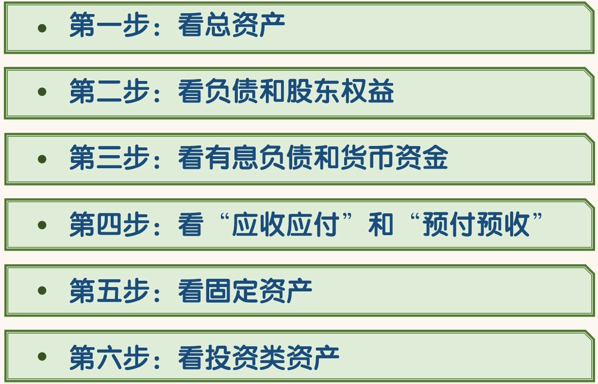

- 当然我们通过以上 6 步选出来的公司，只能叫海选。要深入了解一家公司的情况，还需要看《利润表》和《现金流量表》。另外还要进行历史对比和与优秀同行对比。