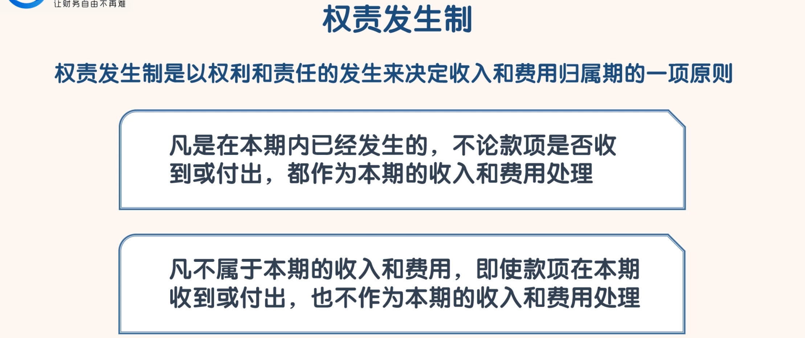
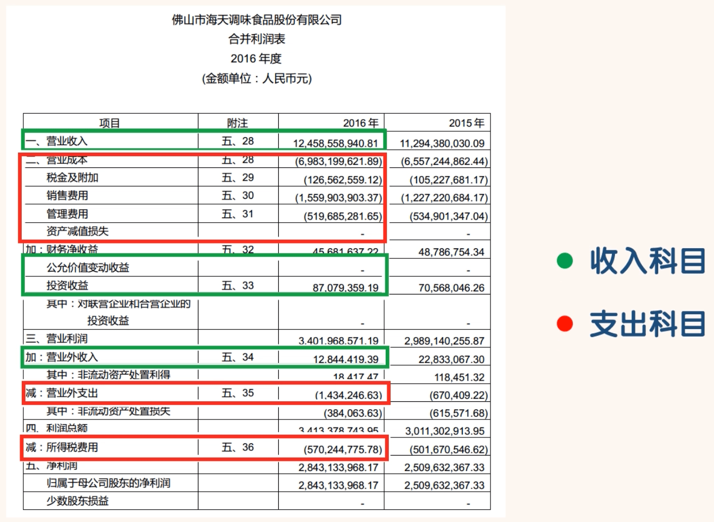
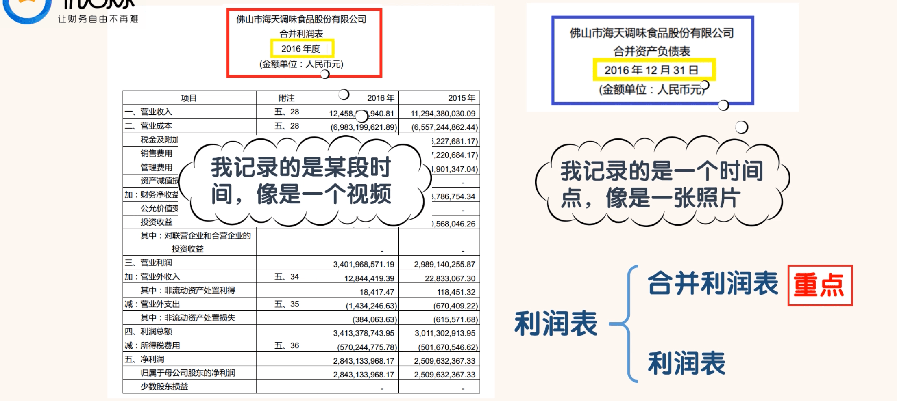

## 读懂利润表

- 利润表是反映公司在某段时间内经营成果的会计报表
  - “经营成果”指的就是盈亏状况。当然这个“经营成果”只是账面上的“成果”，真实“成果”可能和“账面成果”一致也可能相差甚远。
  - 一家公司利润虽然看起来很好，但不一定就赚钱了。有时一家公司在账面上赚了很多利润但在实际中却亏了很多钱。之所以会这样，主要是因为利润表是按权责发生制编制的。

- 当我们看利润表的时候，一定不能拿到利润表中的净利润数据就直接用，我们一定要思考一下这个利润数据是怎么来的？这个数据是真的吗？
- 当然要判断净利润的真实性，光靠利润表是做不到的，还需要结合现金流量表和资产负债表一起来看
- “利润表”是用来反映一家公司经营成果的。

- 收入-支出=利润，这里的“收入”和“支出”都是广义的。
- 凡是能增加利润的科目都是收入；凡是能减少利润的科目都是支出

- 资产负债表反映的是一家公司在某个时点上的能以货币计量的资源的情况。它就像是一张照片，记录的就是那一瞬间的情况。
- 利润表则反映的是一家公司在某段时期内的经营成果，也就是收支情况。它就像是一段视频，记录的是那一段时间的收支情况