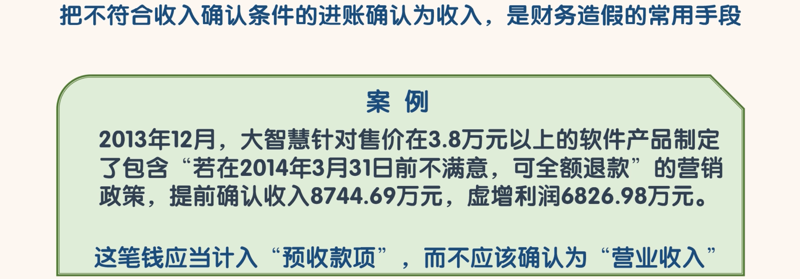
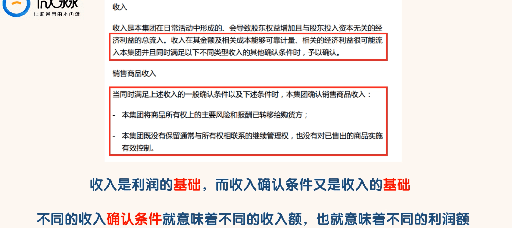
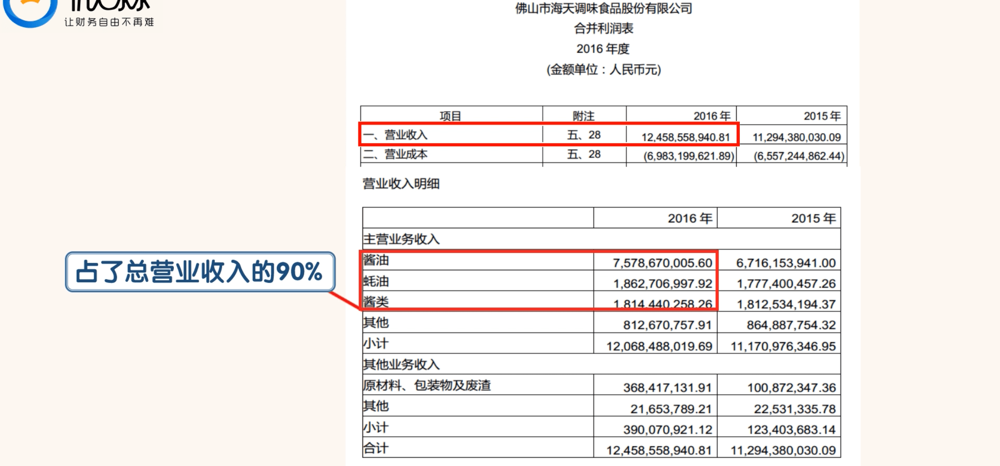
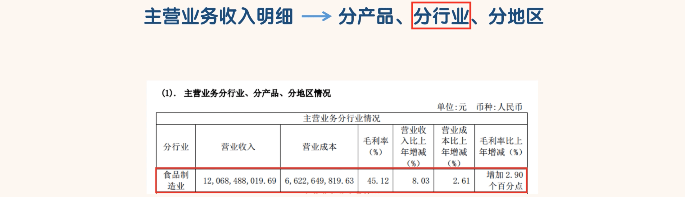
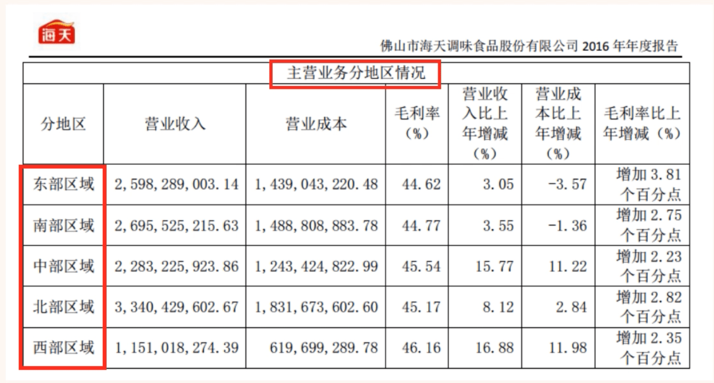
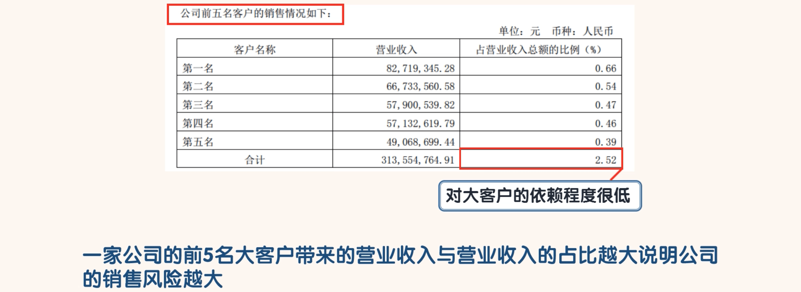

## 营业收入

- ”营业收入”是利润的基础，我们看“营业收入”时不能只关心其金额，更应该关心“营业收入”的确认条件。

- 因为客户在付钱后的 3 个月内可以无条件退款，这笔钱应当计入“预收款项”，而不应该确认为“营业收入

- 上图是海天味业关于收入的确认条件。我们发现一笔进账要确认为收入是需要符合以上条件的。
- 海天味业 2016 年度的营业收入为 124.59 亿。我们搜索“营业收入明细”：

- 可以看到酱油、耗油、酱类这三种调味品带来的营业收入占了总营业收入的 90%，可见海天味业还是非常专注于主业的。
- 一般专注于主业的公司更容易保持竞争优势获得持续的成功。
- 封老师不喜欢一家公司同时涉及 2 个或 2 个以上的行业，这样会分散公司有限的资源，很难保持公司的竞争优势。
- 当然公司可以选择在一个行业内进行产品的多样化策略。当一种产品的市场占有率稳居行业第一名的时候，可以研发新产品，通过多产品策略扩大市场规模。
- 主营业务收入的明细除了分产品还有分行业和分地区。搜索“分行业”：

- “分行业”就是看海天味业的营业收入主要来自哪些行业。专注于一个行业，这是优秀公司的特质

- “分地区”就是看海天味业的营业收入主要来自哪些地区，判断收入的均衡性
- 西部人口少，营业收入最小

- 假如海天味业前5名大客户带来的营业收入占营业收入的比例为25.2%，那么海天味业就很难做到先钱后货和一手钱一手货了