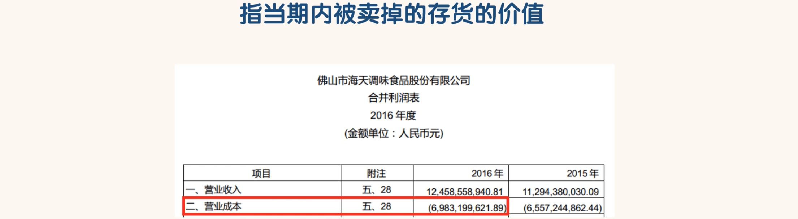
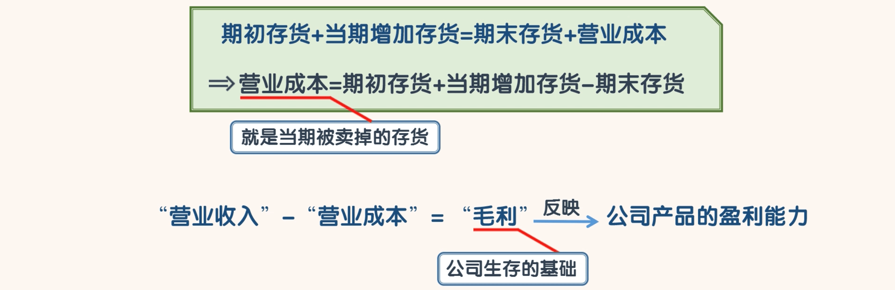
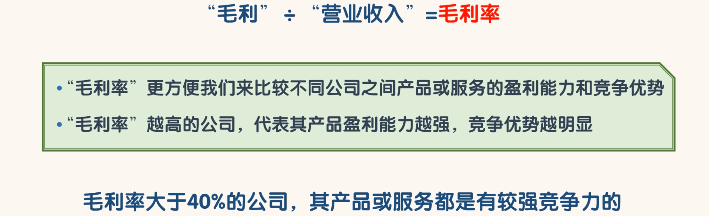
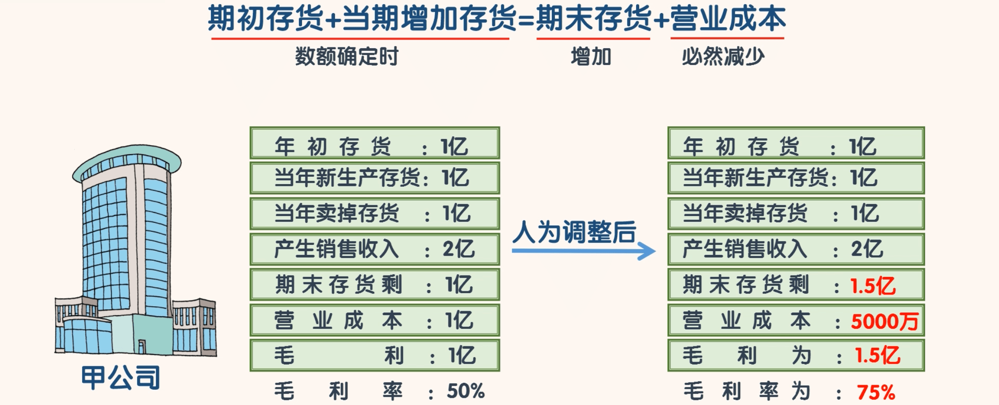

## 营业成本

- 高“毛利率”的公司应该是我们选择的重点，封老师一般不会选择毛利率低于 40%的公司。

- 当我们在选择高"毛利率”公司时,也应当注意公司可能出现的利润操纵问题
  -  比如有的公司存货已经卖掉，但是没有及时结转成本，在账面上制造存货“积压”现象，这样就能降低“营业成本”，提高当期毛利润，从而提高当期净利润

- 当然这种人为的操纵我们还是能发现一些蛛丝马迹的。
  - 因为这种毛利率的提高伴随着存货的增加。
  - 我们在资产负债表中“存货”科目中讲过，毛利率的提高一般应是伴随着存货的减少，如果毛利率提高的同时存货也增加，说明公司很可能有问题