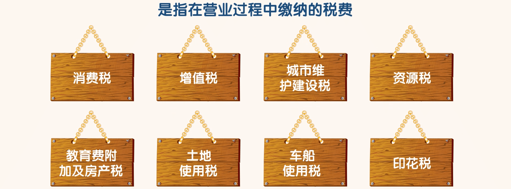
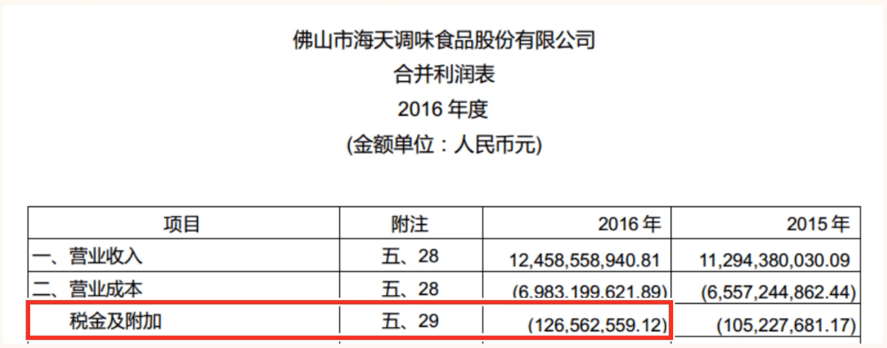
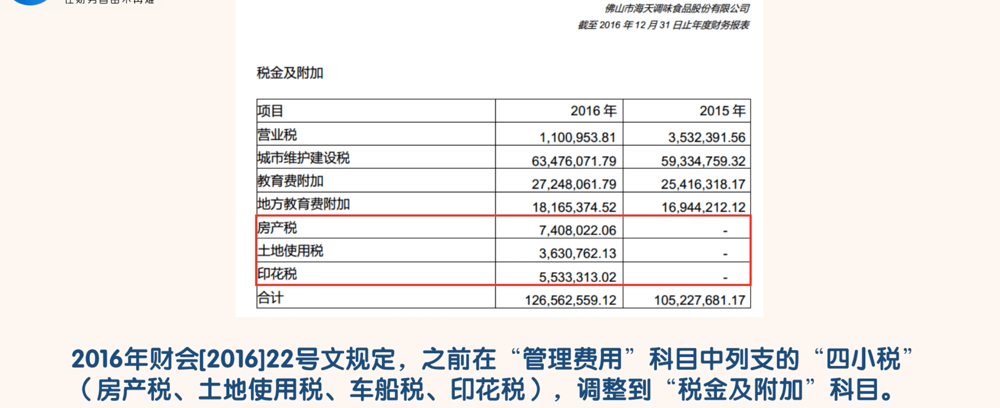
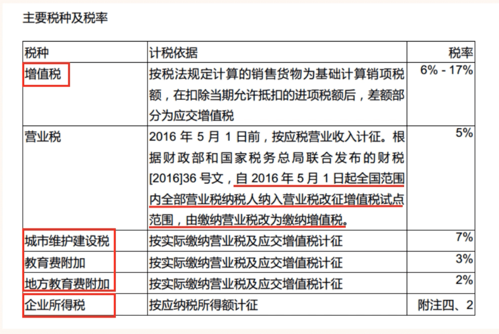

## 税金及附加

- 搜索海天味业 2016 年“税金及附加”：

- 我们发现 2016 年度比 2015 年度增加了房产税、土地使用税和印花税三个项目。
- 其实这不是税项的增加，而是归属科目的调整。
- 2016 年财会[2016]22 号文规定，之前在“管理费用”科目中列支的“四小税”（房产税、土地使用税、车船税、印花税），调整到“税金及附加”科目
- 想要进一步了解各税项的税率，搜索“税率”：

- 我们可以看到海天味业需要缴纳的主要税种有增值税及附加税、企业所得税。营业税自 2016 年 5 月 1 起改为增值税