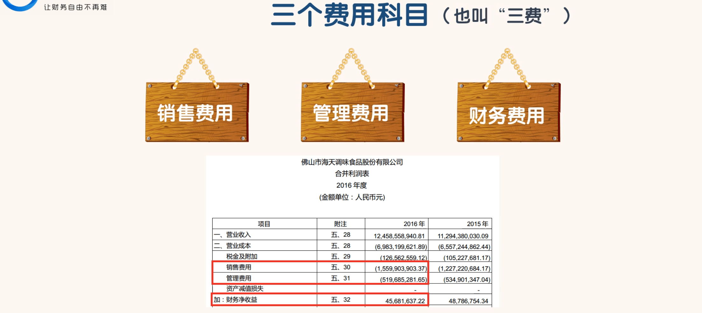
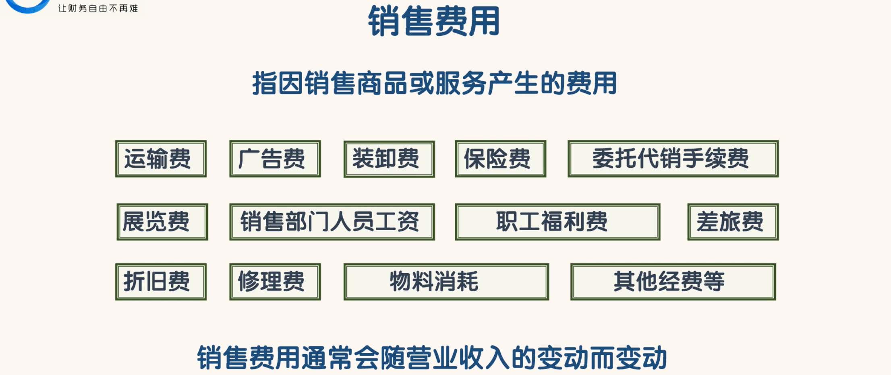
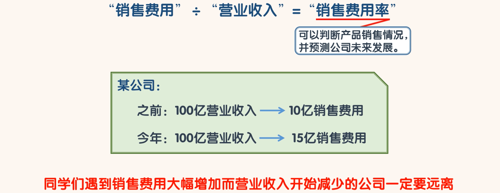
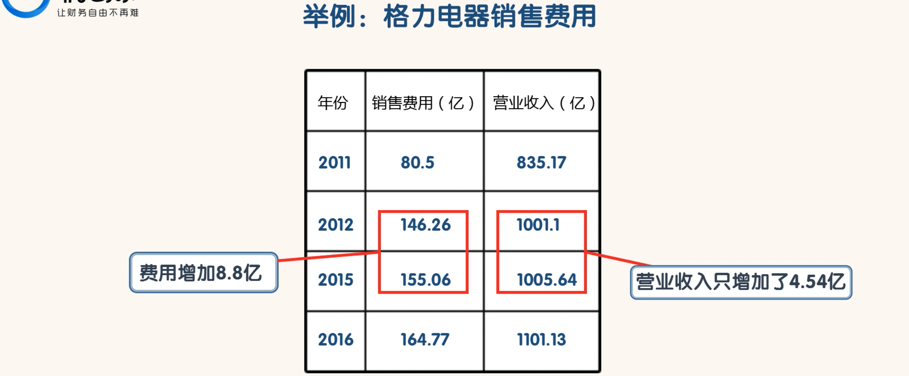
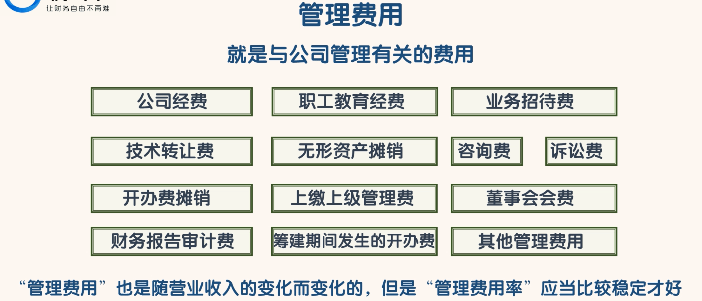

## 三个费用科目

- 总之所有和销售有关的费用都是“销售费用”。销售费用通常会随营业收入的变动而变动。
- “销售费用”÷“营业收入”=“销售费用率”

- 用销售费用率来判断一家公司产品的销售情况，以及预测公司未来的发展情况
- 封老师认为“销售费用率”可以看作一个先行指标。因为一家公司由强转弱往往是从产品的滞销开始的。
- 产品滞销之后，往往会增加销售费用同学们遇到销售费用大幅增加而营业收入开始减少的公司一定要远离，这样的公司已经开始走下坡路了，以后可能会变的更差

- “管理费用”这个科目就是个大杂烩，只要不属于“销售费用”和“财务费用”的费用都可以放到“管理费用”。
- “管理费用”也是随营业收入的变化而变化的，但是“管理费用率”应当比较稳定才好。如果“管理费用率”有较大的增长也是不好的征兆

- 不过海天味业合并报表中没有用“财务费用”科目，而是用了“财务净收益”科目，
- 这只是表达方式的不同，负的“财务费用”就是“财务净收益”。
- 可能是海天味业货币资金金额太大，银行存款利息比较多，而且海天味业也没有有息负债，导致海天味业的“财务费用”是负的，所以海天味业就用了“财务净收益”。

- 当我们计算“三费”时，
  - 出于保守考虑，如果“财务费用”是正数，就把“财务费用”计算在内。
  - 如果“财务费用”是负数，就不把“财务费用”计算在内