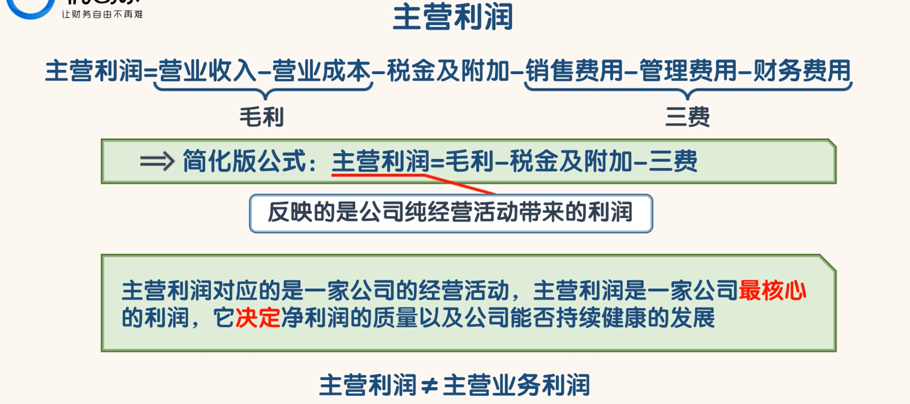

## 主营利润

- 主营利润反映的是公司纯经营活动带来的利润。
- 主营利润与资产减值损失、投资收益和营业外收入净额等都无关。
- 主营利润对应的是一家公司的经营活动，主营利润是一家公司最核心的利润，它决定净利润的质量以及公司能否持续健康的发展。
- 主营利润≠主营业务利润
- 这里的“主营利润”和 2006 年之前的“营业利润”是比较像的。但是 2006 年以后的“营业利润”的内涵发生了变化，它已经不能反映公司经营活动创造的利润

- 如果“经营活动产生的净现金流量净额”与“主营利润”的比值大于 1.1，就说明公司的经营活动产生的利润都变成钱收回来了。
- 为什么是 1.1 呢？因为利润表中的营业收入是不含增值税的，而现金流量表中的金额是含增值税的。
- 另外“销售费”和“管理费”中会有一些折旧和摊销的费用，这些费用会降低账面的“主营利润”，但是这些钱并没有损失，不减少现金流量表中的金额。
- 这样估算下来大概就是 1.1

