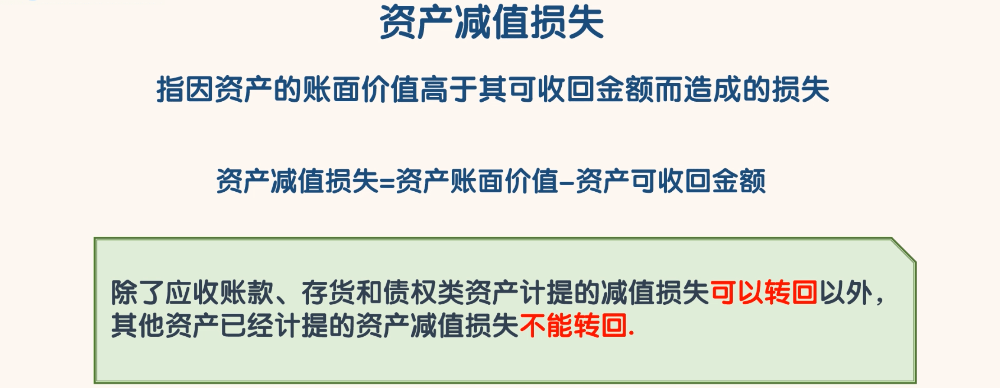
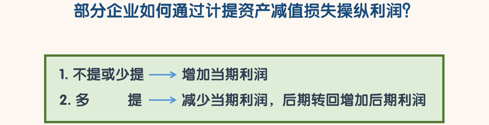
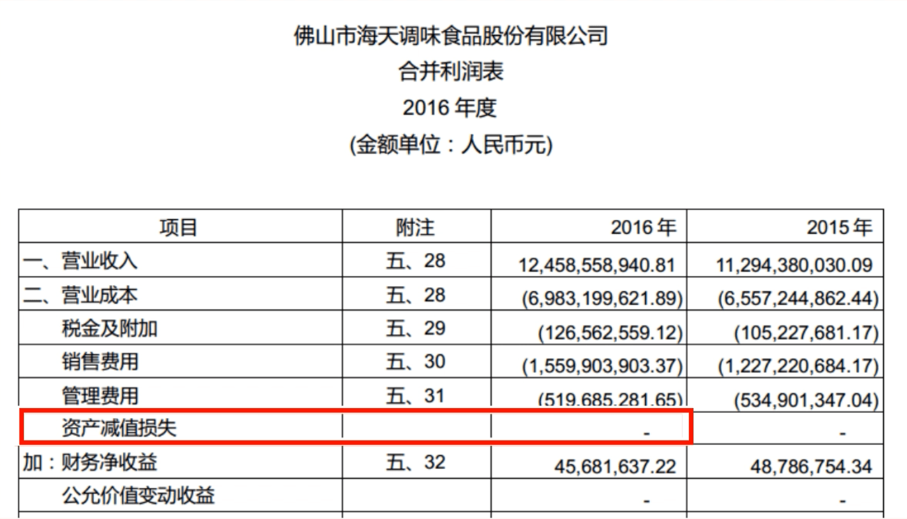
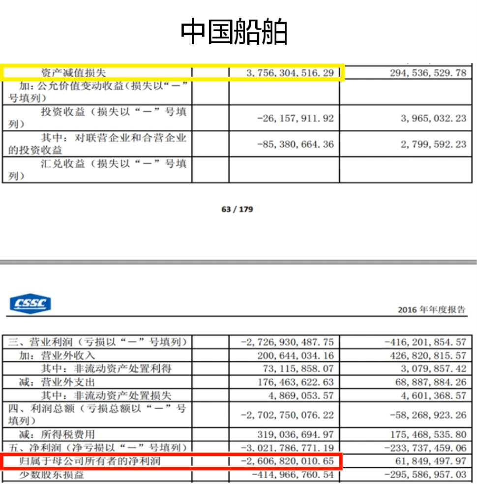

## 资产减值损失

- 根据现行的会计准则，到会计期末，公司要对多项资产进行减值测试，资产有减值迹象的时候需要计提资产减值损失。资产负债表中的绝大部分资产都需要进行资产减值测试。
- 除了应收账款、存货和债权类资产计提的减值损失可以转回以外，其他资产已经计提的资产减值损失不能转回。
- 所以应收账款、存货和债权类资产计提资产减值损失以及转回是我们需要注意的，特别是有大金额出现的时候

- 2016 年度“资产减值损失”这个科目就损失了 37.56 亿，这导致了中国船舶 2016 年度“归属于母公司所有者的净利润”巨亏 26.07 亿。
- 事实上从 2013 年到 2015 年这三年，中国船舶的营业利润都是亏损，但是这三年中国船舶都是通过大额的“营业外收入”实现了微利。
- 不过连续几年微利之后，一般都会出现一次大亏，中国船舶也摆脱不了这个现象。