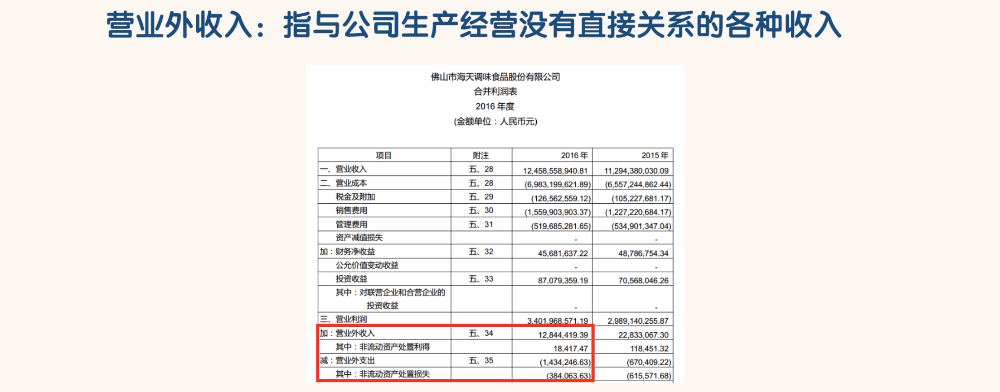
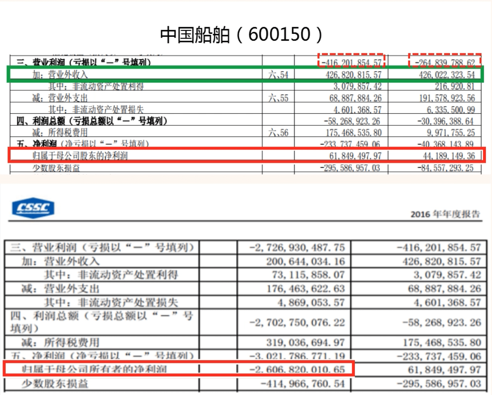

## 营业外收入和营业外支出

- 通俗一点讲就是，除公司营业执照中规定的业务范围之外的所有收入都是营业外收入。
- 主要包括：

- ”营业外支出”与“营业外收入”对应

- “营业外收入”和“营业外支出”都是偶发的不可持续的。这两者的金额一般不应太大。
- 当同学们发现一家公司的“营业外收入”金额过大且占利润总额的比值过半时，我们几乎可以确定这家公司在装饰自己的财务报表。
- 这样的报表后期一定会变脸。同学们遇到这样的公司可以直接淘汰掉

- 我们可以看到 2014 年和 2015 年度，中国船舶的营业利润都是亏损，分别亏损 2.65 亿和 4.16 亿。
- 但是这两年中国船舶每年都有 4.26 亿的营业外收入，这其中大部分都是政府补贴。
- 在大额营业外收入的影响下，中国船舶 2014 年和 2015 年的净利润都由亏转盈，分别盈利了 0.44 亿和 0.62 亿元。但是这种情况是不能持续的。
- 到了 2016 年度，中国船舶净利润巨亏 26.07 亿。

- 一般连续微利之后往往就是巨亏，通过巨亏填平之前的坑。
- 如果估计不错的话，2017 年度中国船舶会盈利的