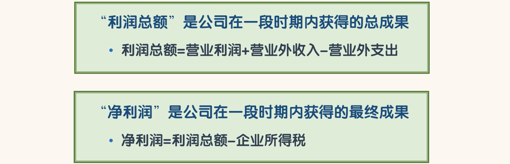
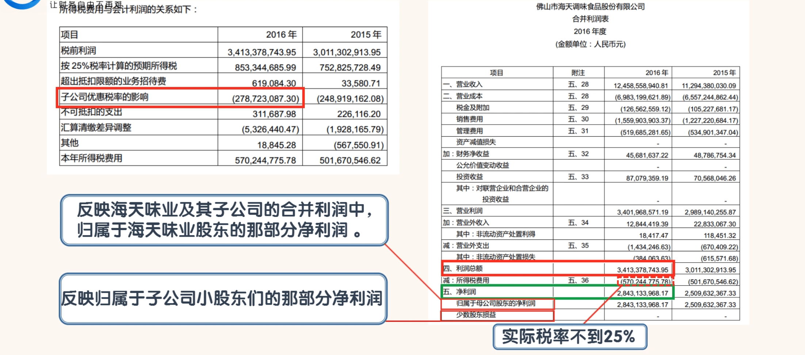
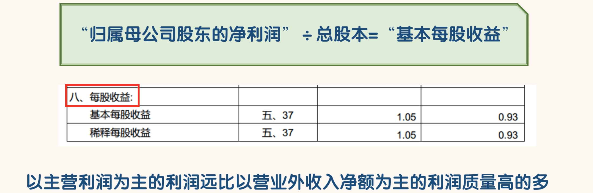
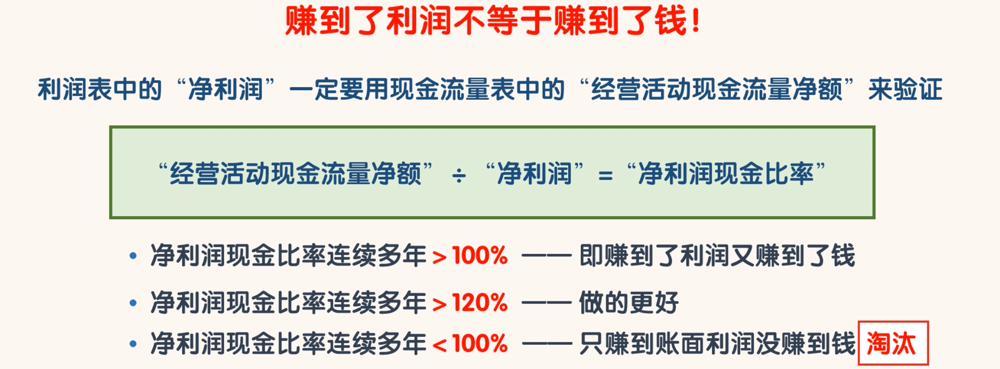

## 利润总额和净利润

- 企业所得税税率一般为 25%,也有的公司会享受税收优惠政策。
- 搜索海天味业 2016 年“所得税费用”：

- 我们可以看到海天味业 2016 年年度的所得税费用的具体情况，海天味业子公司因享受优惠税率少缴了2.79 亿的税费。

- 在“净利润”下面有两个科目，一个是“归属母公司股东的净利润”，一个是“少数股东损益”。
- “归属母公司股东的净利润”反映的是在海天味业及其子公司的合并利润中，归属于海天味业股东的那部分净利润。“少数股东损益”反映的是归属于子公司小股东们的那部分净利润。
- 由于海天味业对其子公司们都是 100%控股，所以在海天味业的子公司中没有小股东，所以“归属母公司股东的净利润”的金额就等于净利润的金额

- “合并利润表”中的最后一项“每股收益”就是这样计算出来的。“每股收益”是投资者们很重视的一个指标。虽然“每股收益”这个指标比较重要，但是更重要的还是利润的质量。
- 以主营利润为主的利润远比以营业外收入净额为主的利润质量高的多。所以同学们在比较“每股收益”的时候不能只看数值，更要看利润的结构。

- 由于海天味业没有这类可转股的金融工具，所以海天味业的"基本每股收益”和“稀释每股收益”数值是相等的

- 赚到了利润不等于赚到了钱！利润表中的“净利润”一定要用现金流量表中的“经营活动现金流量净额”来验证。

- 同学们可以用“经营活动现金流量净额”除以“净利润”得到“净利润现金比率”。
  - 如果一家公司的“净利润现金比率”连续多年大于 100%，说明公司即赚到了利润又赚到了钱。
  - 当然这个数值还可以更大一些，如果连续多年大于 120%，那就更好。
  - 如果一家公司的“净利润现金比率”连续多年小于 100%，说明公司只赚到了账面利润但没有赚到钱。公司的资产负债表上很可能有大量“应收账款”或“存货”。
  - 这样的公司后期会出问题，同学们可以直接淘汰掉