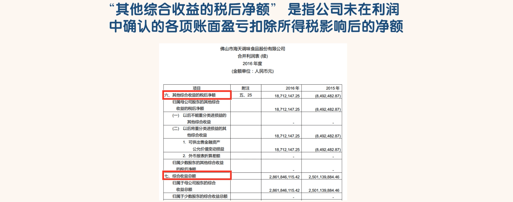
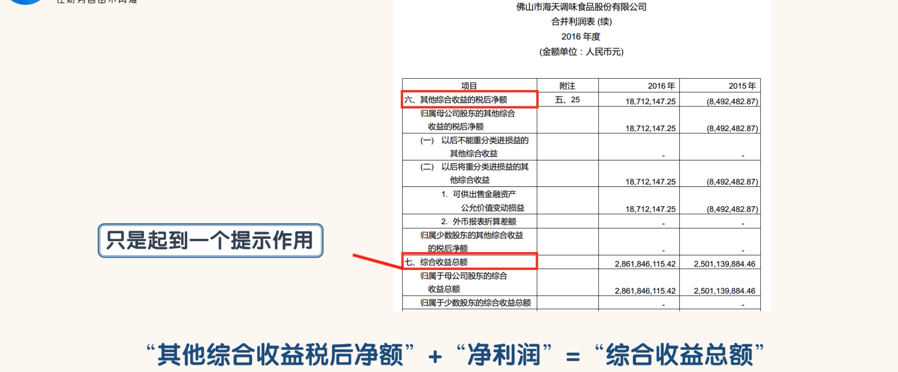

## 其他综合收益的税后净额和综合收益总额

- 有的公司有一些资产，比如可供出售金融资产，这些资产因公允价值变动或其他原因导致这些资产发生账面盈亏，账面盈亏不计入净利润，但要计入资产负债表股东权益下的“其他综合收益”科目。
- 利润表中的“其他综合收益的税后净额”就是与资产负债表中的“其他综合收益”相对应的。
- 资产负债表中的“其他综合收益”反映的是余额，而利润表中的“其他综合收益的税后净额”则反映的为发生额。
-  两表之间的关系体现为：资产负债表“其他综合收益”期初数+利润表“其他综合收益税后净额”中归属于母公司的部分=资产负债表“其他综合收益”期末数。

- “综合收益总额”起到的也只是一个提示作用，把一些资产的的账面价值进行了反映，没有太多实际的意义。
- 同学们在读利润表的时候，“净利润”科目及其之前的科目是应该重点关注的，“净利润”科目之后的科目，了解一下就行