## 如何快速的通过利润表看公司

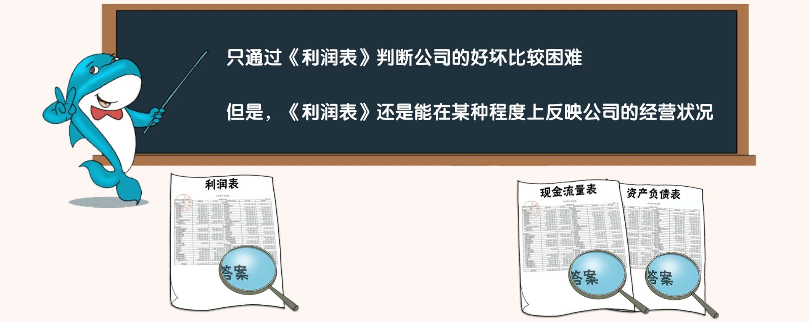

- 在没有《资产负债表》和《现金流量表》的情况下，只通过《利润表》去判断公司的好坏，还是比较困难的。
- 因为《利润表》里充满了会计假设和会计估计。在一定范围呢，利润想要多少就有多少。
- 但是即便如此，《利润表》还是能够在某种程度上反映出一家公司的经营状况

### 第一步，看营业收入

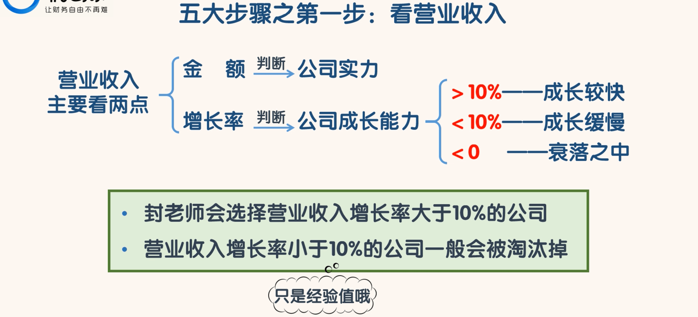

- 从营业收入的金额我们大概可以判断出公司的实力，一般来说营业收入金额大的公司实力也相对较强。
- 从营业收入增长率我们可以判断出公司的成长能力。
  - 营业收入增长率大于 10%，说明公司处于成长较快，前景较好。营业收入增长率低于 10%，说明公司成长缓慢。
  - 营业收入增长率小于 0，说明公司可能正在处于衰落之中
  - 封老师会选择营业收入增长率大于 10%的公司。营业收入增长率小于 10%的公司一般会被淘汰掉。

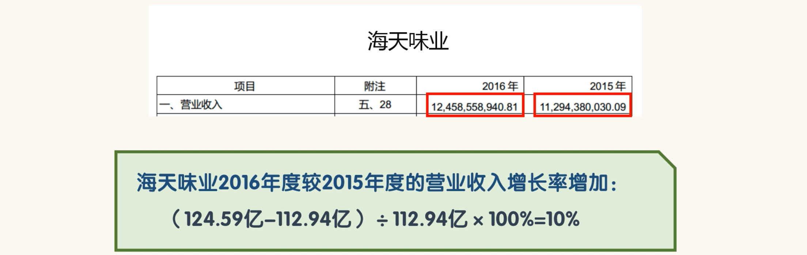

### 第二步，看毛利率

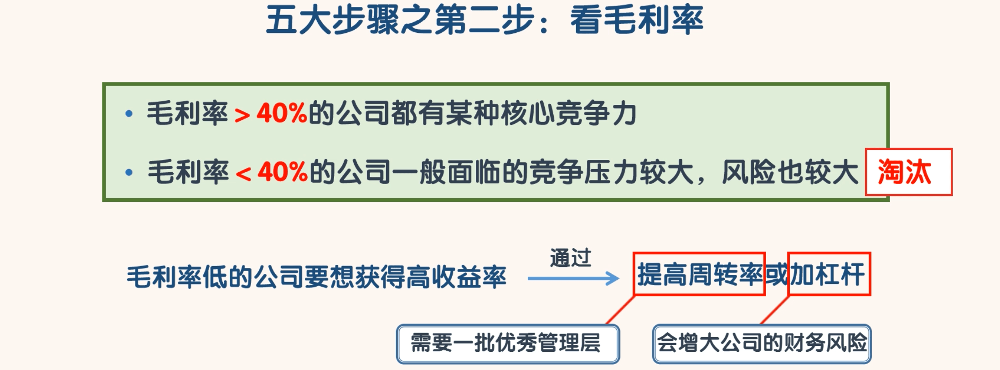

- 高毛利率说明公司的产品或服务有很强的竞争力。低毛利率则说明公司的产品或服务竞争力较差。
- 一般来说，毛利率大于 40%的公司都有某种核心竞争力。
- 毛利率小于 40%的公司一般面临的竞争压力都较大，风险也较大。
- 毛利率低的公司要想获得高的收益率，就必须要提高周转率或加杠杆。提高周转率需要强大的运营能力，这需要一批优秀的管理层。加杠杆会增大公司的财务风险。
- 总之，低毛利率的公司要想获得成功需要比高毛利率的公司付出更大的代价，这就增加了公司的风险。在实践中，封老师会把毛利率小于40%的公司淘汰掉。

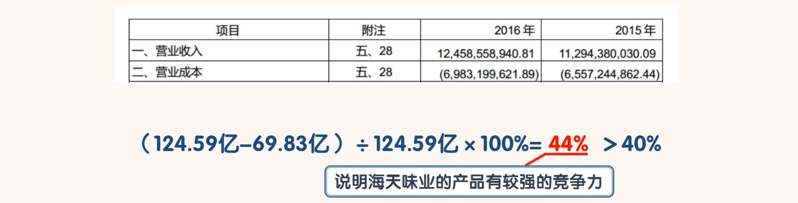

### 第三步，看费用率

- 费用率是指销售费、管理费用、财务费三费之和占总营业收入的比例。
- 保守起见，如果财务费用是正数，则把财务费用计算在费用之内。如果财务费用是负数，则不把财务费用计算在费用之内，只把销售费用和管理费用之和算作费用。
- 毛利率高，费用率低，净利润率才可能高。优秀公司的费用率与毛利率的比率一般小于 40%。
- 在实践中，封老师会把费用率与毛利率的比率大于 60%的公司淘汰掉

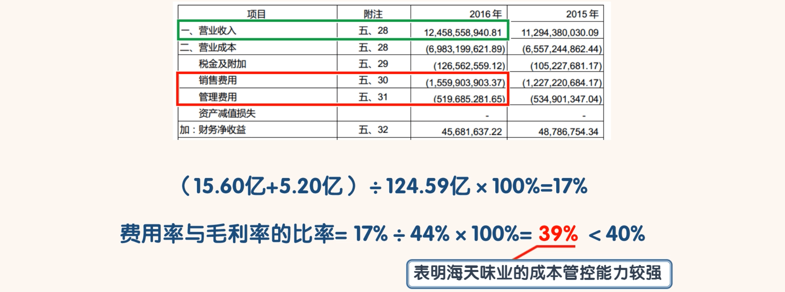

### 第四步，看主营利润

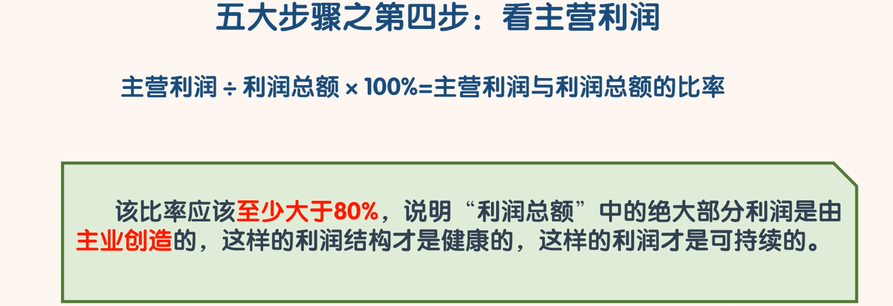

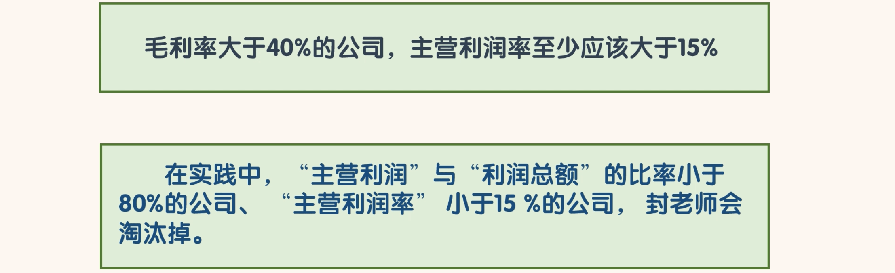

- 主营利润是一家公司最重要的利润，计算出主营利润以后，应当和利润总额进行比较。
- 用“主营利润”除以“利润总额”，我们可以计算出“主营利润”与“利润总额”的比率，这个比率应该至少大于 80%，说明“利润总额”中的绝大部分利润是由主业创造的，这样的利润结构才是健康的，这样的利润才是可持续的。这个比率越高越好。
- 另外毛利率大于 40%的公司，主营利润率至少应该大于 15%。
- 在实践中，“主营利润”与“利润总额”的比率小于 80%的公司、“主营利润率”小于 15%的公司，封老师会淘汰掉。这样的公司不具备持续的竞争力

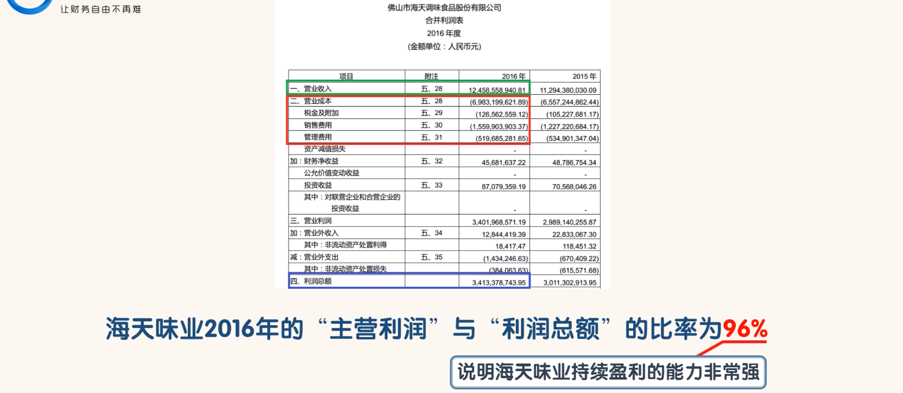

###  第五步，看归母净利润

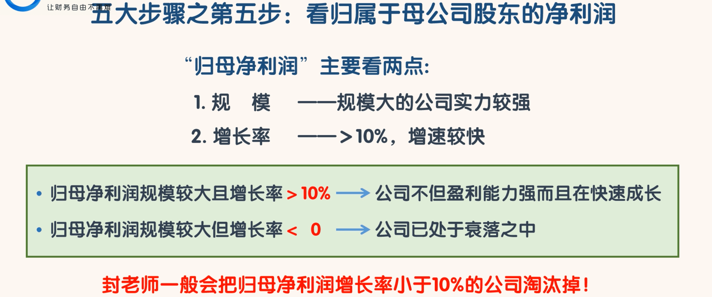

- 当到这一步，还没有被淘汰掉的公司，净利润质量一般是比较高的。我们可以把“归属于母公司股东的净利润”简称为“归母净利润”
- 归母净利润主要看两点，一是规模，二是增长率。
- 一般来说，归母净利润规模大的公司实力较强。
- 另外归母净利润的增长率也很重要，增长率大于 10%，说明公司在以较快的速度成长。
- 归母净利润规模较大并且增长率大于 10%的公司，说明公司不但盈利能力强而且还在快速成长。
- 归母净利润规模较大但增长率小于 0 的公司，很可能意味公司已经处于衰落之中了。
- 在实践中，封老师一般会把归母净利润增长率小于 10%的公司淘汰掉。

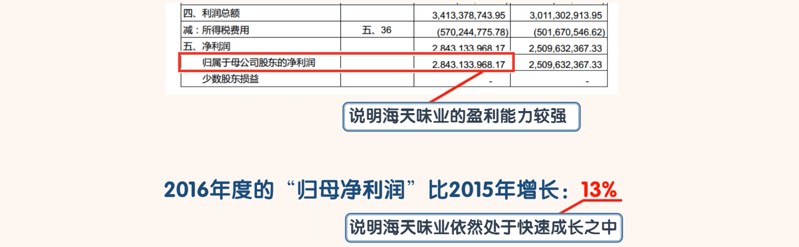

- 在只看《利润表》的情况下，通过以上 5 步，我们可以把差公司淘汰掉，把相对较好的公司留下。当然这些被留下来的公司主要是看起来相对比较好的。
- 如果想要更深入的了解一家公司，就必须要结合《资产负债表》和《现金流量表》一起看