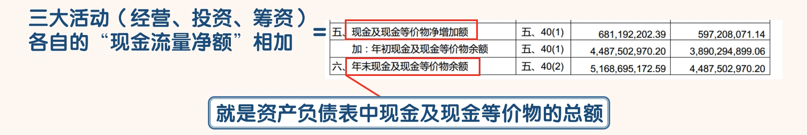
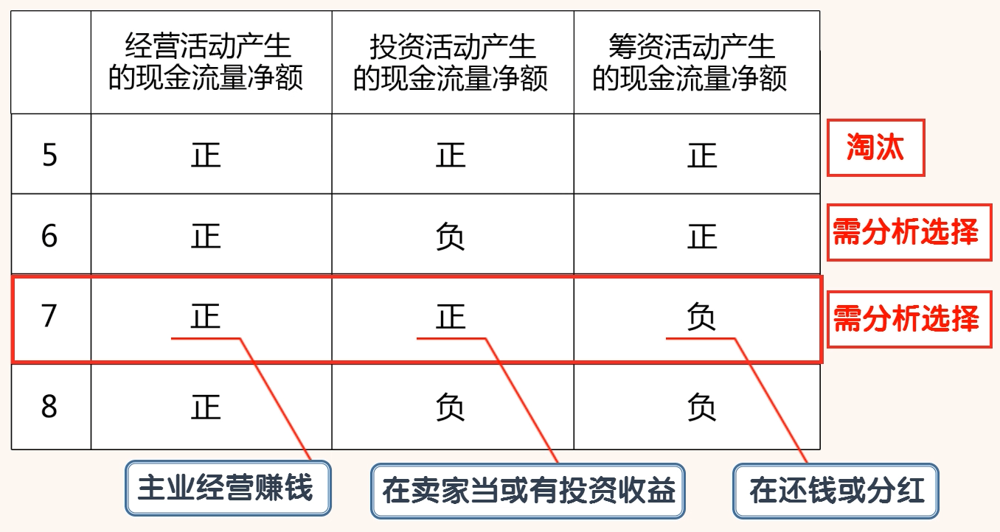

## 学习现金流量表

- 如果把一家公司看作一个人，现金流就是公司的血液。
- 长期亏损但现金流充足的公司可能会活的很久并且变的更强大，比如京东。利润良好但现金流暂时断裂的公司却会突然倒闭，比如曾经的巨人集团。
- 可以说现金流决定公司的生死存亡，而现金流量表则反映一家公司的现金流入和流出的具体情况。
- 现金流量表同样分为“合并现金流量表”和“现金流量表”两种，我们主要看“合并现金流量表”

- 通过海天味业的“合并现金流量表”来学习现金流量表的主要内容

- 学习第一大块，经营活动产生的现金流量。
- 经营活动指公司发生的直接与生产、销售商品或提供劳务有关的一切行为。经营活动是公司经营的核心。
- 投资活动和筹资活动通常是因为经营活动而发生的。
- 一家公司需要生产更多的商品，这就属于经营活动。生产更多的商品，就需要加大固定资产的投资，这就属于投资活动。要进行投资，但是公司自己的钱不够，公司就需要向银行贷款或者让股东增加投资，这就属于融资活动
- 经营活动现金流量是公司造血能力的表现。“经营活动现金流量净额”大，说明公司自己造血能力强大，公司持续发展的内部动力强劲

- 经营活动产生的现金流量分为经营活动产生的现金流入和经营活动产生的现金流出两部分。
- 绿色框内的科目为现金流入部分；红色框内的内容为现金流出部分。现金流入总额减去现金流出总额，就得到了现金流量净额，就是黄色框内的科目

- 两个重要的科目，“销售商品、提供劳务收到的现金”和“经营活动产生的现金流量净额”
- 用“销售商品、提供劳务收到的现金”与合并利润表中的“营业收入”进行对比，我们可以检验“营业收入”的含金量。
- 好公司“销售商品、提供劳务收到的现金”的金额一定会大于“营业收入”的金额。这是因为“销售商品、提供劳务收到的现金”的金额中是包含增值税的，而“营业收入”的金额中不包含增值税。
- “销售商品、提供劳务收到的现金”与 “营业收入”的比值大于 1，说明公司销售产生的款项基本都收回来了，公司的经营状况比较好。
- “销售商品、提供劳务收到的现金”与 “营业收入”的比值小于 1，说明公司销售产生的款项有部分没有收回。该比值越小，说明没有收回来的钱越多，这说明公司的产品或服务竞争力低下。
- 如果一家公司的利润较好而该比值较低，我们还要警惕该公司虚增收入

### 经营活动产生的现金流量净额

- 这个科目可以说是现金流量表中最重要的科目了
- 用“经营活动产生的现金流量净额”与“主营利润”或“净利润”进行比较，我们可以检验利润中的含金量。
- “经营活动产生的现金流量净额”与“主营利润”或“净利润”的比值应该至少大于 1，如果能大于 1.1会更好，
- 说明利润中的含金量比较高。这个比值越大越好。
- 而且这个比值要连续多年大于 1 才有意义，某一两年大于 1 没有太大的意义

- 另外一家公司要想长期健康的发展，还需要满足这个条件：
  - 经营活动产生的现金流量净额>固定资产折旧和无形资产摊销+借款利息+现金股利。
  - 只有满足这个条件，公司才有多余的资金扩大再生产

### 投资活动产生的现金流量

- 投资活动产生的现金流量的重点在于现金流出量。
- 我们来看下红框里面的内容，“购买固定资产、无形资产和其他长期资产支付的现金”是为了扩大再生产而进行的对内投资；
- “取得子公司及其他营业单位支付的现金净额”是为了扩大再生产而进行的对外投资；
- “投资支付的现金”是为了获得资本增值或利息而进行的对外投资。
-  “投资支付的现金”主要包括购买交易性金融资产、持有至到期投资、可供出售金融资产、长期股权投资（不包括取得子公司支付的现金）等所支付的现金以及支付的佣金、手续费等交易费用。

- 一般来说，处于扩张阶段的公司，“购买固定资产、无形资产和其他长期资产支付的现金” 或“取得子公司及其他营业单位支付的现金净额”的金额比较大。而“投资支付的现金”的金额应该比较小。扩张中资金用以购买固定资产，收购公司，所以用以赚取投资收益的资金就少。
- 投资活动产生现金流出，就会产生现金流入
- “购买固定资产、无形资产和其他长期资产支付的现金”会变成资产负债表中的固定资产、无形资产和其他长期资产。
- 这些资产一方面在生产经营中会增加“经营活动产生的现金流量净额”，另一方面后期可以卖掉变现，通过“处置购买固定资产、无形资产和其他长期资产支付的现金净额”再流回来。
- “取得子公司及其他营业单位支付的现金净额”未来可以通过“取得投资收益收到的现金”和“处置子公司及其他营业单位支付的现金净额”再流回来。
- “投资支付的现金” 未来可以通过“取得投资收益收到的现金”和“收回投资收到的现金”再流回来
- 开平广中皇就是子公司。

- 在看“投资活动现金流出量”时，我们重点要看其结构。

- 也就是重点看“购买固定资产、无形资产和其他长期资产支付的现金”、“取得子公司及其他营业单位支付的现金净额”、“投资支付的现金”各自的规模。
- 如果 “购买固定资产、无形资产和其他长期资产支付的现金”规模较大，说明公司目前正在对内扩大再生产，公司处于扩张之中。
-  如果 “取得子公司及其他营业单位支付的现金净额”规模较大，说明公司目前正在通过兼并重组等方式对外获得更多的资产，公司处于扩张之中。
- 如果 “投资支付的现金”规模较大，而“购买固定资产、无形资产和其他长期资产支付的现金”和“取得子公司及其他营业单位支付的现金净额”规模很小或者没有，说明公司目前的投资重点是获得利息、股息、资本利得，公司的扩张变缓甚至停止

- 海天味业“购买固定资产、无形资产和其他长期资产支付的现金”的金额从 2012 年到 2016 年分别为：4.71 亿、10.14 亿、8.82 亿、7.44 亿、7.88 亿。
- 我们可以看到 2012 年的金额为 4.71 亿，2013 年达到了 10.14 亿，金额大幅提升。从 2014 年开始金额开始回落，但是每年高于 7 亿元，也远高于 2012 年的金额。
- 这说明从 2013 年开始到 2016 年海天味业正在通过扩大再生产提高产能，海天味业目前依然处于稳步扩张之中。
- 另外我们可以看到海天味业在 2014 年和 2015 年有“收购开平广中皇与调味品生产相关的业务支付的现金”， 总额为 3450 万。
- 这说明海天味业也在通过对外收购同行业其他公司来提高产能，进行扩张。
- 从海天味业的扩张来看，无论是对内还是对外，我们都能看出海天味业还是很专注于主业的，这点是非常好的

- 不过海天味业“投资支付的现金”从 2014 年到 2016 年分别是：18 亿、24 亿、51.7 亿。
- 我们可以看到“投资支付的现金”是逐年在增加的，这主要是海天味业买了大量的短期银行理财产品所致。
- 这里要强调一下，海天味业的银行理财产品金额要小于“投资支付的现金”，比如 2016 年海天味业有26.32 亿的银行理财产品，而不是 51.7 亿。为什么会出现这种情况呢？
- 因为海天味业买的是短期银行理财产品，最短的只有一周的期限，这样一年买几次就提高了“投资支付的现金”金额。
- 对于海天味业买银行理财产品这件事，我们可以看作是海天味业进行货币资金管理的一种手段。
- 主要目的不是投资，而是管理货币资金。海天味业买的银行理财产品的期限已经显示了海天味业的意图。
- 如果是为了赚利息，是不太可能买那么多短期的理财产品的

- 对于公司的扩张，我们也要辩证的去看
- 一家公司如果“购买固定资产、无形资产和其他长期资产支付的现金”、“取得子公司及其他营业单位支付的现金净额”的规模很小，表明这家公司扩张缓慢或者已经停止扩张。
- 这样的公司未来基本失去了成长性。未来快速的成长一定源于今天大规模的投资。作为投资者，这样的公司还是需要谨慎考虑的。在实践中，封老师一般会把不再成长的公司淘汰掉。
- 不过一家处于快速扩张之中的公司，也不一定就是好事情。
- 扩张并不是目的，我们还要看扩张的效果。扩张可能会让一家公司变的更好，也可能会让一家公司变的更坏。
- 要知道导致公司失败的重要原因之一就是盲目扩张。
- 我们可以通过营业收入和主营利润去判断公司扩张的效果

- 通过以上数据我们可以看到
  - 随着海天味业在“购买固定资产、无形资产和其他长期资产支付的现金”方面持续的投入，海天味业的产能有了很大的提高，海天味业的营业收入和主营利润也有了很大的提高。
  - 这说明海天味业过去几年的扩张起到了积极的效果。
- 对于快速扩张的公司我们还是要注意
  - 当我们发现一家公司的营业收入和主营利润不能随着公司的扩张而提高的时候，我们就要小心了。
  - 因为这家公司的扩张很可能是盲目的，盲目的扩张很可能让公司走向失败

### 筹资活动产生的现金流量

- 筹资活动产生的现金流量的重点是看现金流入量

- 对于有筹资行为的公司，我们要看它筹了多少钱？是债务融资还是股权融资？筹来的钱做什么用？

- 一般来说，优秀的公司更偏向于债务融资，融资规模相对都不大，借款利率也比较低。对于以高利率进行大规模借钱的公司我们要警惕。这种公司风险较大。

- 另外我们还要看公司筹来的钱用来做什么？这点更重要。

  - 如果公司用筹来的钱扩大再生产，而且公司的产品主营利润率还很好，这样的公司风险较小机会较大。
  - 如果公司用筹来的钱去收购其他公司，这样的公司不确定性就很大，可能有大的机会也可能会大的风险，出于安全考虑还是要远离的好。
  - 如果公司用筹来的钱进行还债，这样的公司风险很大，一定要淘汰掉。

- 结论：

  - 如果筹资活动产生的现金流出中有异常的大金额出现，我们就要查明原因。
  - 有问题的公司我们直接淘汰掉。
  - 优秀的公司通常“筹资活动产生的现金流量净额”为负，这不是由于偿还利息所致，而是进行高额分红所致

  - 优秀的公司一般都会进行高比例的分红，分红率一般在30%-60%之间

- 我们可以看到海天味业 2015 和 2016 连续两年“筹资活动现金流入小计”金额为 0，这说明这两年海天味业没有进行任何的融资。
- 而“筹资活动现金流出小计”连续两年为负，我们可以看到“分配给普通股股东及限制性股票持有者股利支付的现金”这个科目连续两年有大额资金流出，这说明海天味业在这两年进行了大额的现金分红。
- 这里要说下，优秀的公司一般每年都会进行高比例的分红。分红率一般在 30%-60%之间。
- 事实上海天味业从 2009-2016 年平均每年的分红率为 64.25%。这在整个 A 股当中是很少见的

### 现金及现金等价物净增加额

- 三大活动各自的“现金流量净额”相加，就得到了“现金及现金等价物净增加额”。
- “现金及现金等价物净增加额”加上“年初现金及现金等价物余额”，就得到了“年末现金及现金等价物余额”。
- “年末现金及现金等价物余额”就是资产负债表中现金及现金等价物的总额

- 下面我们把经营、投资、筹资三大活动产生的现金流量净额联合起来看，从整体上去认识一家公司：
  - 三大活动产生的现金流净额都有正和负两种情况，
  - 我们把三大活动的“正负”现金流净额进行排列组合，会出现 8 种不同的情况

### “经营活动产生的现金流量净额”为负的四种情况

- “经营活动产生的现金流量净额”为负，说明公司的主业经营亏损。
- 一般情况下我们都会直接淘汰这种类型的公司。当然也有很多互联网公司在很长的时间内，“经营活动产生的现金流量净额”一直为负，但后来也变成了很成功的公司，比如亚马逊、京东等。
- 这是由于互联网公司的行业特点和商业模式决定的。
- 保守的投资者一般都会放弃这种机会，比如巴菲特就不投资互联网公司
- 虽然封老师自己也不投资“经营活动产生的现金流量净额”为负的公司，但是这几种组合我们还是要了解一下

- 类型 1：“负正正”型
  - 公司经营活动产生的现金流量净额为负，说明公司主业经营亏损；投资活动产生的现金流量净额为正，说明公司在卖家当。筹资活动现金流量净额为正，说明公司在通过借钱或者股权融资筹钱。
  - 如果把这类公司看作生活中的一类人，这类人不好好工作，靠卖家里的东西或者借钱度日。这类人的前途基本是能预见到的。这类公司的前途也不会好到哪里去。

- 类型 2：“负负正”型
  -  公司经营活动产生的现金流量净额为负，说明公司主业经营亏损；投资活动产生的现金流量净额为负，说明公司还在继续投资。筹资活动现金流量净额为正，说明公司在通过借钱或者股权融资筹钱。
  - 公司主业不赚钱，而且公司还在通过借钱继续投资。如果是处于创业期的公司这也是正常现象，那重点就要通过公司的创始人、核心团队、商业模式等关键因素来分析公司的前景了。
  - 这种公司在美国的纳斯达克市场上还是很多的。不过在中国，创业期的公司是不能上市的，所以 A 股中这种类型的公司基本都是主营经营不行了，在尝试新项目的公司。这类公司的风险还是很大的。

- 类型 3：“负正负”型
  - 公司经营活动产生的现金流量净额为负，说明公司主业经营亏损；投资活动产生的现金流量净额为正，说明公司在卖家当。筹资活动现金流量净额为负，说明公司在还钱或分红，当然更可能的是在还钱，即使是分红也是不能持续的。
  - 这种公司主业亏钱，而且还要还钱，没办法只能卖家当。这样的公司日子是很不好过的

- 类型 4：“负负负”型
  - 公司经营活动产生的现金流量净额为负，说明公司主业经营亏损；投资活动产生的现金流量净额为负，说明公司还在继续投资。筹资活动现金流量净额为负，说明公司在还钱或分红。
  - 公司所有的活动都在造成现金流出，这才是真正的“烧钱”，说京东“烧钱”的人是没有见过这种类型的公司。
  - 这种公司如果不改变这种局面，将在“货币资金”被消耗完以后土崩瓦解。不过这种公司在股市中其实并不多见

### “经营活动产生的现金流量净额”为正的四种情况

- 类型 5：“正正正”型
  - 公司经营活动产生的现金流量净额为正，说明公司主业经营赚钱；投资活动产生的现金流量净额为正，说明公司在卖家当或有投资收益。筹资活动现金流量净额为正，说明公司在通过借钱或者股权融资筹钱。
  - 公司三大活动都带来现金流入，这种公司看起来好像很好，但是有点反常。
  - 一家公司主业赚钱又不对外投资的公司为什么要筹集资金呢？这种公司要么是马上要进行大规模的对内或对外投资，要么就是在背地里干坏事。
  - 遇到这种类型的公司，我们一定要弄清楚公司近期是否有大规模的投资计划。
  - 如果没有，我们就可以认为这是一家在背地里干坏事的公司。还是远离比较好

- 类型 6：“正负正”型
  - 公司经营活动产生的现金流量净额为正，说明公司主业经营赚钱；投资活动产生的现金流量净额为负，说明公司正在对内或对外投资。筹资活动现金流量净额为正，说明公司在通过借钱或者股权融资筹钱。
  - 这家公司把主业赚的钱都投到新项目中去了，但是还不够，于是公司通过融资来投资。
  - 一般处于快速成长期的公司可能会出现这种情况。如果新项目顺利，公司将会获得快速的发展；如果新项目并不顺利，投资出去的钱很可能就无法收回。
  - 这种类型的公司风险和机会并存。如果要投资这类公司，我们需要分析公司的新项目的前景。如果不看好，还是远离比较好。

- 类型 7：“正正负”型
  - 公司经营活动产生的现金流量净额为正，说明公司主业经营赚钱；投资活动产生的现金流量净额为正，说明公司在卖家当或有投资收益。筹资活动现金流量净额为负，说明公司在还钱或分红。
  - 一般在经营活动产生的现金流量净额为正的情况下，公司卖家当的可能性还是比较小的，一般是投资收益。
  - 如果经营和投资带来的现金流入大于还债或分红带来的现金流出，公司的情况就是比较健康的。
  - 投资活动现金流净额为正，说明这种类型的公司已经不再扩张，这种类型的公司一般处于成熟期，能带来稳定的现金流。
  - 这种类型的公司，如果价格合适，分红比较好，比如市盈率比较低、股息率比较高，还是有投资价值的。

- 类型 8：“正负负”型
  - 公司经营活动产生的现金流量净额为正，说明公司主业经营赚钱；投资活动产生的现金流量净额为负，说明公司在继续投资，公司处于扩张之中。筹资活动现金流量净额为负，说明公司在还钱或分红。
  - 公司靠着主营业务赚的钱支持扩张同时还还钱或进行分红。
  - 如果经营活动产生的现金流量净额持续大于投资和筹资产生的现金净流出额，说明公司造血能力强大，靠自己就能实现扩张，这样的公司很有价值，你值得拥有。
  - 当然如果经营活动产生的现金流量净额小于投资和筹资产生的现金净流出额，那么“正负负”型是没有办法持续的。后期很可能会变成“正负正”型

- 我们可以看到在过去 5 年中，海天味业只有 2014 年是“正负正”类型，其他年份都是“正负负”类型。
- 2014 年之所以特别是因为海天味业 IPO 所致。
- 我们可以看到除了 2013 年经营净现金流减去投资、筹资净现金流为-0.91 亿，其他年份都为正，且金额远大于-0.91 亿。
- 这说明海天味业不但属于“正负负”类型，而且具有良好的持续性