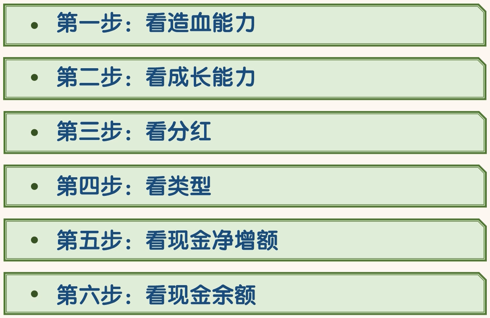

## 如何快速的通过《现金流量表》看公司

### 第一步，看造血能力

- “经营活动产生的现金流量净额”反映公司的造血能力。
- 这个科目主要看两点，一是正负，二是金额。
- 该金额必须要大于 0，小于 0 的公司没用造血能力，直接淘汰掉。主业亏损的公司，没有看的意义。
- 另外这个科目的金额越大越好，金额越大，说明公司的造血能力越强

### 第二步，看成长能力

- “购买固定资产、无形资产和其他长期资产支付的现金”这个科目金额的大小反映公司对内投资的力度。
- 这个科目的金额大，说明公司正在扩张之中，未来公司的营业收入和净利润有可能出现较大的提升，公司成长能力强。
- 这个科目的金额小，说明公司扩张慢，未来公司的营业收入和利润很难有较大的增长。
- 一般来说成长性较好的公司，“购买固定资产、无形资产和其他长期资产支付的现金”与“经营活动现金流量净额”比率也较高，正常的范围大概在 10%-60%之间

- 购买固定资产、无形资产和其他长期资产支付的现金”这个科目的金额应当小于“经营活动产生的现金流量净额”这个科目的金额。
- 如果“购买固定资产、无形资产和其他长期资产支付的现金”的金额持续大于“经营活动产生的现金流量净额”的金额，则公司必定要通过融资维持投资。
- 这就会加大公司的风险
- 在实践中，封老师一般会把“购买固定资产、无形资产和其他长期资产支付的现金” 与“经营活动产生的现金流量净额”的比率大于 100%或小于 10%的公司淘汰掉。
- 这两种类型的公司要么是太激进，要么是成长太慢。前者风险较大，后者回报较低。

- 另外“购买固定资产、无形资产和其他长期资产支付的现金”这个科目的金额应当远远大于“处置固定资产、无形资产和其他长期资产收回的现金净额”这个科目的金额。
- “处置固定资产、无形资产和其他长期资产收回的现金净额”与“购买固定资产、无形资产和其他长期资产支付的现金”的比率一般应小于 5%。
- 如果“处置固定资产、无形资产和其他长期资产收回的现金净额”与“购买固定资产、无形资产和其他长期资产支付的现金”的比率大于 100%，往往意味着公司在走下坡路。
- 安全起见，最好把这样的公司淘汰掉

### 第三步，看分红

- 通过“分配给普通股股东及限制性股票持有者股利支付的现金”金额，我们可以看到公司每年的分红额。
- 优秀的公司应当每年分红而且分红率一般会大于净利润的 30%。
- 分红率低于 30%的公司要么能力有问题，要么品质有问题。
- 在实践中，封老师一般会把分红率低于 30%的公司淘汰掉

- 我们可以看到海天味业在 2015 和 2016 年两年的分红金额分别为：12.78 亿和 16.23 亿。
- 在不看《利润表》，不知道净利润的情况下，可以用“经营活动产生的现金流量净额”代替净利润，计算一下分红金额与“经营活动产生的现金流量净额”的比率。
- 这个比率大于 25%的公司，在分红方面就算是比较慷慨的。
- 我们可以计算出海天味业 2015 年和 2016 年两年“现金分红”与“经营活动产生的现金流量净额”的比率分别为：58%和 40%。这个比率是比较高的。这说明海天味业是一家品学兼优的公司。
- 实际上海天味业 2015 和 2016 年两年的分红率都在 60%以上，这个分红率是非常高的

### 第四步，看类型

- 优秀的公司一般都是“正负负”和“正正负”型。
- 封老师一般只会选择“正负负”和“正正负”这两种类型的公司。
- 我们可以看到海天味业 2015 和 2016 两年的类型都是“正负负”

### 第五步，看现金净增额

- 现金及现金等价物的净增加额大于 0，公司才能积累更多的钱。
- 公司所属的“正负负”或“正正负”类型才能持续的保持。优秀的公司现金净增加额一般都是大于 0 的。
- 去掉现金分红后，现金及现金等价物的净增加额小于 0 的公司，淘汰掉
- 我们可以看到海天味业 2015 和 2016 两年的现金净增加额分别为 5.97 亿和 6.81 亿

### 第六步，看现金余额

- 现金及现金等价物余额直接反映公司手里有多少钱可以用。
- 一般钱越多的公司，实力越强。钱越多的公司，活的越好。
- 我们可以看到海天味业在 2016 年末有 51.68 亿的现金，可以海天味业的实力还是很强的。
- 在中国，有 51.68 亿现金的公司并不多

- 在只看《现金流量表》的情况下，通过以上 6 步，我们可以把差公司淘汰掉，把相对较好的公司留下。
- 当然这些被留下来的公司主要是看起来相对比较好的。
- 如果想要更深入的了解一家公司，就必须要结合《资产负债表》和《利润表》了