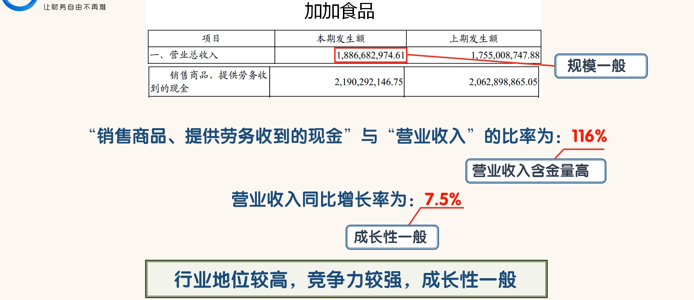
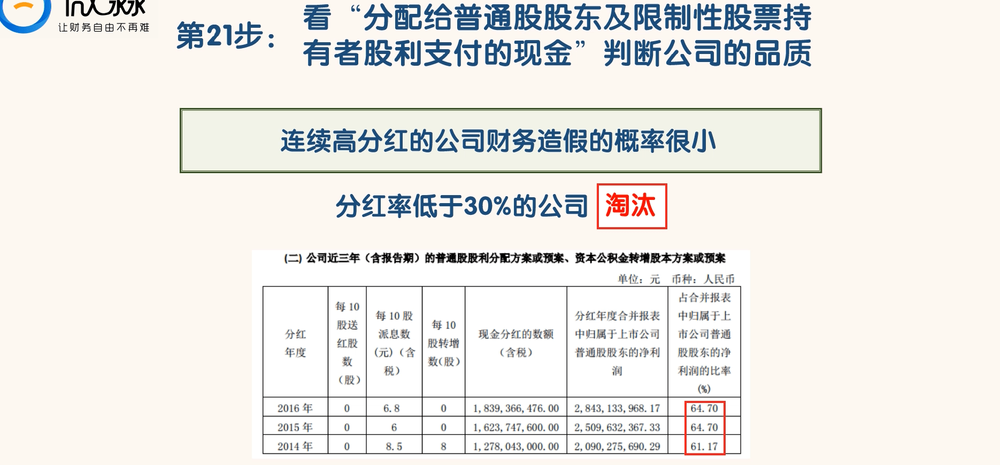

## 三表联系

- 资产负债表、利润表、现金流量表三大报表我们已经学习完了。
- 股东权益变动表很简单，分析方法和三张表一样。我们就不多说了
- 三大报表之间不是独立的，它们之间是相互联系的。它们从不同的方面共同来展示企业的情况

- 海天味业的资产负债表：
  - 我们可以看到 2015 年年底，海天味业的资产负债表中“盈余公积”与“未分配利润”之和为 48.15 亿。
  - 到了 2016 年年底，海天味业的资产负债表中“盈余公积”与“未分配利润”之和为 60.41 亿。
  - 2016 年底比 2015 年年底多了 12.26 亿。那么这 12.26 亿是怎么来的呢？为什么会多了那么多钱呢
- 看一下利润表：
  - 我们可以看到海天味业 2016 年的归母净利润为 28.43 亿
- 我们知道在 2016 年分配了 16.24 亿的现金分红。
  - 我们用 2016 年的归母净利润 28.43 亿减去 2016 年分掉的 16.24 亿现金，还剩下 12.19 亿。是不是和资产负债表中“盈余公积”与“未分配利润”的增加额差不多？
  - 其实这两个数字应该是一样的。我们发现利润表和资产负债表之间是有联系的。
  - 净利润=（期末盈余公积+期末未分配利润）+本期已实施的分红-（期初盈余公积+期初未分配利润）
  - 我们知道公司赚钱，就会增加股东权益；公司亏钱，就会减少股东权益。所以资产负债表的恒等式也可以写成这样：资产=负债+所有者权益+收入-费用，这个公式是动态表达式。
  - 这个动态表达式就把资产负债表和利润表联系在一起了

- 这个动态表达式还有一个重要的作用，就是它揭示了财务造假的思路。
  - 根据动态表达式，如果一家公司要虚增利润，那么它必定要虚减负债或虚增资产。虚减负债是不容易的，因为虚减负债需要债权人的配合。
  - 所以大部分造假公司会选择虚增资产。我们可以说虚增利润就会虚增资产，所以资产负债表对于财务打假很重要

- 三大报表中，不但资产负债表和利润表有联系。现金流量表与资产负债表和利润表的联系就更密切了

- 我们可以看到海天味业的货币资金 2016 年比 2015 年增加了 6.78 亿。那么这 6.78 亿到底是怎么来的呢？
- 现金流量表就具体反映了这增加的 6.78 亿中所有现金及现金等价物的具体变化情况。
- 我们可以看到 2016 年海天味业的现金及现金等价物净增加了 6.81 亿。6.81 亿和 6.78 亿有一点差别，这主要是有一小部分资金使用受到了限制
- 我们可以说现金流量表就是对资产负债表货币资金科目中的现金及现金等价物变动情况的详细展示

- 6.81亿和6.78亿有一点差别,这主要是有一小部分资金使用受到了限制

- 以上两个等式，同学们了解一下就好，不用掌握。我们只要知道现金流量表与利润表和资产负债表之间有紧密的联系。我们在看财务报表的时候，要把这三张报表结合起来看，这就可以了。

- 模拟经营过程

- 有两个人投资了 500 万成立了一家公司。
- 股东投的这 500 万就会反映在资产负债表的股东权益项下的“注册资本”科目中。同时这 500 万也会反映在资产负债表资产项下的“货币资金”科目中。

- 公司要买设备，就向银行贷款了 300 万，这 300 万就会反映在资产负债表负债项下的“长期借款”科目中。
- 同时这 300 万也会反映在资产负债表资产项下的“货币资金”科目中。另外这 300 万还会反映在现金流量表的“取得借款收到的现金”科目中

- 公司为了生产产品，就要建厂房、买设备。建厂、买设备花了 500 万，花的这些钱就会反映在现金流量表投资活动项下的“购建固定资产无形资产和其他长期资产支付的现金”科目。
- 厂房、设备就会反映在资产负债表资产项下的“固定资产”科目中，同时资产负债表资产项下“货币资金”科目减少 500 万。

- 厂房、设备有了以后，就要生产产品。这就需要招人、买原材料。购买原材料花了 80 万、招人花了 20万。花的这些钱就会反映在现金流量表经营活动项下的“购买商品、接收劳务支付的现金”科目。
- 人员工资、买原材料花的钱同时也会反映在利润表和资产负债表中。
- 生产人员的工资反映在利润表的“营业成本”科目中，管理人员的工资反映在利润表的“管理费用”科目中。原材料在资产负债表中反映在“存货”科目。同时资产负债表的“货币资金”科目要减少 100 万。

- 产品生产出来以后，卖掉产品，获得了 200 万的收入。200 万的收入会反映在利润表的“营业收入”科目。并且资产负债表的“存货”科目减少 80 万元。
- 收入有 2 种形式，一种是现金，现金收入 150 万。一种是应收账款，应收账款 50 万。
- 收入的现金部分 150 万会反映在现金流量表的“销售商品、提供劳务收到的现金”科目
- 同时资产负债表的“货币资金”科目增加 150 万。收入的应收账款部分会反映在资产负债表的“应收账款”科目。公司到年底净利润赚了 200 万，净利润会增加股东权益，反映在“未分配利润”科目。

- 公司积累了 500 万的未分配利润之后，公司决定分红 200 万，分红的钱会在现金流量表的“分红支付的现金”科目进行反映。
- 同时这些被分掉的钱也会减少“未分配利润”和“货币资金”科目 200 万，并在资产负债表中进行反映

- 非分配利润应该变成300万

## 如何通过三张表三位一体的去看公司

### 第 1 步，准备好相关公司的年报

- 我们要把目标公司过去 5-10 年的年报下载下来，年报的期数越多越好。
- 最好连招股说明书也下载下来。
- 另外目标公司同行业前 3 名公司过去 5-10 年的年报也要下载下来

### 第 2 步，先看目标公司最近期的年报

- 打开目标公司最近期的年度。
- 搜索“合并资产负债表”，先从“合并资产负债表”开始看起。

### 第 3 步，把合并资产负债表各个科目看一遍，标记异常科目

- 先把资产负债表的每个科目快速看一遍，同比增长或下降大于 30%的科目标记一下。
- 回头重点看，并查明原因。

- 海天味业的异常科目如下

### 第 4 步，搜索异常科目，查明原因

- 发现科目有异常变动之后，我们还要查明因。
- 并分析这种变化对于公司是有利还是有害。

- 海天味业 2016 年的“预付款项”为 0.17 亿，比 2015 年的 0.07 亿增加了 143%，增幅比较大。
- 但是我们发现 0.17 亿的“预付款项”只占 134.64 亿总资产的 0.13%。
- 像这种占总资产比率小于 3%的科目，出现较大的异常变动也是可以忽略不计的。因为对公司的影响是极其有限的

- 我们可以看到在占总资产比率超过3%的科目中，只有“其他流动资产”和"预收款项"这两个科目出现了异常变动

- 我们可以看到“其他流动资产”大幅增加的原因是海天味业 2016 年比 2015 年多买了 11.25 亿的短期银行理财产品，这是海天味业在进行货币资金管理。
- 我们知道海天味业的货币资金有 51.97 亿，进行一下货币资金管理也是正常的情况。
- “预收款项”的大幅增加主要是年末经销商提前打款，这是海天味业竞争力强的表现。这个科目金额增幅较大是好事情

-  注意：
  - 资产项中的应收票据、应收账款、其他应收款、预付款项、存货、在建工程、长期待摊费用这几个科目如果出现异常变化，是需要同学们重视的。这几个科目是财务造假的高发科目。
  - 负债项中的短期借款、应付票据、应付账款、其他应付款这几个科目如果出现异常变化，也是需要同学们重视的。
  - 偿债危机往往是从这几个科目开始的。
  - 我们可以看到海天味业的这些科目还是很正常的。
- 在第 4 步进行完以后，没有问题的公司我们可以继续往下进行。
- 有问题但找不到可信解释的公司。淘汰

### 第 5 步，看总资产，判断公司实力及扩张能力

- 一般来说，总资产金额大的公司实力更强，总资产同比增长快的公司扩张能力更强
- 以上是海天味业、中炬高新、加加食品 3 家公司 2016 和 2015 年的总资产。
- 从总资产的规模来看，海天味业的总资产比中炬高新和加加食品加起来还要多很多。
- 从总资产的同比增幅来看，海天味业增长了 17%；中炬高新增长了 8.6%；加加食品增长了 5.7%。
- 哪家公司的实力最强，扩张能力强还是一目了然的。

### 第 6 步，看资产负债率，判断公司的债务风险

- 资产负债率大于 60%的公司，债务风险较大。淘汰。
- 计算出海天味业 2016 和 2015 两年的资产负债率分别为：26%和 24%。
- 海天味业的资产负债率稳定在很低的水平，海天味业目前没有发生债务违约的可能。
- 计算出中炬高新 2016 和 2015 两年的资产负债率分别为：37%和 38%。加加食品 2016 和 2015 两年的资产负债率分别为：32%和 32%。
- 我们可以看到中炬高新和加加食品的资产负债率也比较稳定且比较低的，中炬高新和加加食品的债务风险也是很低的。
- 不过和海天味业相比的话，还是海天味业的风险更小

### 第 7 步，看有息负债和货币资金，排除偿债风险

- 对于资产负债率大于 40%的公司，我们要看它的货币资金是否大于有息负债。
- 货币资金小于有息负债的公司，淘汰。

- 海天味业有息负债为0，货币资金为 51.97 亿，没有债务违约的风险。

### 第 8 步，看“应收应付”和“预付预收”，判断公司的行业地位

- 行业地位强的公司留，行业地位弱的公司淘汰

- 海天味业具有"两头吃”的能力, 海天味业的行业地位很强
- 关于行业地位的判断，我们不能只看1年的数据,我们至少要看5年的数据

- 虽然中炬高新和加加食品都有两头吃的能力，但行业地位不如海天味业。

### 第 9 步，看固定资产，判断公司的轻重

- （固定资产+在建工程+工程物资）与总资产的比率大于 40%的公司为重资产型公司。
- 重资产型公司保持竞争力的成本比较高，风险比较大。
- 当我们遇到重资产型公司，安全起见还是淘汰

- 虽然处于同行业，加加食品维持竞争力的成本相对要比海天味业高很多。加加食品面临的风险也比海天味业高

### 第 10 步，看投资类资产，判断公司的专注程度

- 与主业无关的投资类资产占总资产比率大于 10%的公司不够专注。淘汰。

### 第 11 步，把利润表和现金流量表各个科目看一遍，标记异常科目

- 资产负债表过关后，我们需要看利润表和现金流量表。
- 资产负债表不过关的，就不用看利润表和现金流量表了。
- 先把利润表和现金流量表中的每个科目快速看一遍，标记异常科目。回头重点看，并查明原因。
- 我们可以看到海天味业的利润表中没有异常科目，现金流量表中有异常科目

### 第 12 步，搜索异常科目，查明原因

- 搜索经营活动产生的现金流量净额、现金流量同比变化，我们可以看到海天味业的这两个异常科目没有什么问题,而且对公司也是有利的

### 第 13 步，看营业收入，判断公司的行业地位及成长能力

- 我们通过营业收入的金额和含金量看公司的行业地位；通过营业收入增长率看公司的成长能力。
- 营业收入金额较大且“销售商品、提供劳务收到的现金”与“营业收入”的比率大于 110%的公司行业地位高，产品竞争力强。
- “营业收入”增长率大于 10%的公司，成长性较好。
- “销售商品、提供劳务收到的现金”与“营业收入”的比率小于 100%的公司、营业收入增长率小于10%的公司淘汰掉

### 第 14 步，看毛利率，判断公司产品的竞争力

- 一般毛利率大于 40%就意味着公司的产品竞争力较强。
- 毛利率高的公司，风险相对较小。毛利率小于 40%的公司，淘汰

- 假如行业地位一般的公司的毛利率比行业第一名公司的毛利率还高，那么这家公司很可能在造假

### 第 15 步，看费用率，判断公司成本管控能力

- 毛利率高，费用率低，经营成果才可能好。
- 优秀公司的费用率与毛利率的比率一般小于 40%。
- 费用率与毛利率的比率大于 60%的公司，淘汰。

### 第 16 步，看主营利润，判断公司的盈利能力及利润质量

- 主营利润是一家公司最主要的利润来源，主营利润小于 0 的公司，不用往下看了，直接淘汰。
- 毛利率大于 40%的公司，主营利润率至少应该大于 15%。主营利润率小于 15%的公司，淘汰。
- 另外优秀公司的“主营利润”与“利润总额”的比率至少要大于 80%。
- “主营利润”与“利润总额”的比率小于 80%的公司，淘汰

### 第 17 步，看净利润，判断公司的经营成果及含金量

- 净利润金额越大越好。净利润小于 0 的公司，直接淘汰掉。
- 优秀的公司不但净利润金额大而且含金量高。优秀公司的“净利润现金比率”会持续的大于 100%。
- 过去 5 年的“净利润现金比率（过去 5 年的“经营活动产生的现金流量净额”总和/过去 5 年的净利润总和*100%）”小于 100%的公司，淘汰掉

### 第 18 步，看归母净利润，判断公司自有资本的获利能力

- 用“归母净利润”和“归母股东权益”可以计算出公司的净资产收益率，也叫 ROE。
- 优秀公司的 ROE 一般会持续大于 15%。ROE 小于 15%的公司，淘汰。
- ROE 也需要看至少连续 5 年的数据。

### 第 19 步，看经营活动产生的现金流量净额，判断公司的造血能力

- 经营活动产生的现金流量净额越大，公司的造血能力越强。优秀的公司，造血能力都很强大。
- 优秀的公司满足经营活动产生的现金流量净额>固定资产折旧+无形资产摊销+借款利息+现金股利，这个条件。
- “经营活动产生的现金流量净额”持续小于（固定资产折旧和无形资产摊销+借款利息+现金股利）的公司，淘汰

### 第 20 步，看“购买固定资产、无形资产和其他长期资产支付的现金”，判断公司未来的成长能力

- “购买固定资产、无形资产和其他长期资产支付的现金”金额越大，公司未来成长能力越强。
- 成长能力较强的公司，“购买固定资产、无形资产和其他长期资产支付的现金”与“经营活动现金流量净额”比率一般在 10%-60%之间。
- 这个比率连续 2 年高于 100%或低于 10%的公司，淘汰

### 第 21 步，看“分配给普通股股东及限制性股票持有者股利支付的现金”判断公司的品质

- 连续高分红的公司财务造假的概率很小。优秀的公司应当每年分红且分红率一般会大于净利润的 30%。
- 分红率低于 30%的公司要么能力有问题，要么品质有问题。
- 分红率低于 30%的公司，淘汰。

### 第 22 步，看三大活动现金流量净额的组合类型，选出最佳类型的公司

- 优秀的公司一般是“正负负”和“正正负”类型。
- 连续 2 年为其他类型的公司，淘汰。

### 第 23 步，看“现金及现金等价物的净增加额”，判断公司的稳定性

- “现金及现金等价物的净增加额”持续小于 0 的公司，很难稳定持续的保持现有的竞争力。
- 优秀公司的“现金及现金等价物的净增加额”一般都是持续大于 0 的。
- 去掉分红，“现金及现金等价物的净增加额”小于 0 的公司，淘汰。

- 海天味业自 2013 年到 2016 年的“现金及现金等价物的净增加额”只有 2013 年为-0.91 亿，其余年份均为正。
- 2013 年如果去掉 7.47 亿的现金分红，“现金及现金等价物的净增加额”则为 6.56 亿。也是不错的

### 总结

- 通过以上 23 步，我们就能比较全面的了解一家公司了。
- 如果我们通过这 23 步去看 A 股上市公司，那么至少 99%的公司会被淘汰掉。
- 剩下不到 1%的公司一般就是非常优秀的公司了。这就叫剩者为王
- 我们可以先通过财务指标把符合条件的公司选出来。然后再按照这 23 步去看，这样就能极大的提高效率