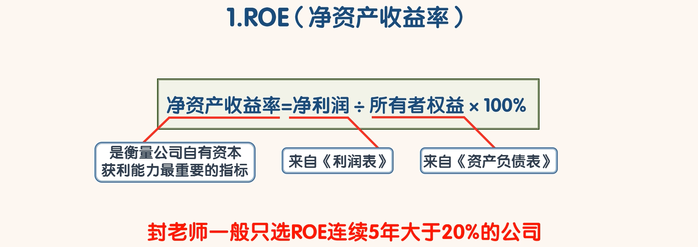

## 关键财务指标

- 财务指标有很多个，各有各的用处。
- 财务指标的数据都是来自三大报表的各个科目。财务指标可以让分析变的简单。
- 但是有一个前提，那就是各科目数据的真实性。如果财务报表中的某些数据是假的，那么财务指标反而会起到负面作用。
- 所以在我们使用财务指标的时候，一定要在我们确认过三大报表中的数据没有问题的前提下才能用。
- 像股票行情软件中的“F10”中显示的财务指标，我们是不能直接拿来用的。因为数据的真实性我们还没有验证

- 封老师一般会用财务指标去验证财务指标：
- 也就是用一组有明确标准的财务指标去筛选公司，如果一家公司这一组的财务指标都达标了，这家公司财务造假的概率就很小了。
- 一般有财务造假的公司只能满足这一组指标中的其中一小部分。
- 封老师在股票投资中，一般会先用这一组财务指标去筛选，经过筛选，99%以上的公司都被淘汰掉了。
- 在剩下的不到 1%的公司中，封老师会再仔细的看它们的财务报表，然后再淘汰掉一部分。
- 剩下的几只或十几只股票，就是以后买入的目标股票。

### 1、ROE

- 如果在所有的财务指标中只能选一个，封老师会选“ROE”,也就是“净资产收益率”。
- 计算公式：净资产收益率=净利润/所有者权益*100%
- 净资产收益率是衡量公司自有资本获利能力最重要的指标。它表示股东投进公司的每一块钱一年下来赚了多少净利润。作为投资者，我们当然首选盈利能力强的公司。封老师一般只选 ROE 连续 5 年大于 20%的公司。
- 根据 ROE 的计算公式我们发现，这个指标由利润表中的“净利润”和资产负债表中的“所有者权益”两组数据计算得出。通过之前的学习，我们知道“净利润”会受到很多因素的影响，在一定范围内，“净利润”可以想要多少就有多少。
- 如果因为“净利润”造假导致 ROE 大于 20%怎么办呢？所以就需要第二个财务指标了。如果只能选两个财务指标，封老师第二个指标选“净利润现金比率”

### 2、净利润现金比率

- 计算公式：净利润现金比率=经营活动产生的现金流量净额 /净利润*100%
- 净利润现金比率是衡量公司净利润中含金量的重要指标。封老师一般只选净利润现金比率连续 5 年大于100%的公司。
- 只有净利润现金比率大于 100%的时候，ROE 的可靠性才更高。净利润现金比率持续小于 100%的公司，即使 ROE 比较高，我们也要淘汰掉。
- 通过“ROE”和“净利润现金比率”两个财务指标我们能够知道一家公司的盈利能力，以及盈利能力的真实性。
- 但是获得同样的 ROE，风险可能却不一样。比如 A 和 B 两家公司，两家公司的 ROE 都是 30%，净利润现金比率都是 120%，A 公司只用了 1 倍的财务杠杆，而 B 公司用了 3 倍的财务杠杆，那应该选哪家公司呢？
- 显然应该选择 A 公司，因为获得同样的收益率，A 公司承担的风险要小很多。
- 所以就需要第三个财务指标了。

### 3、资产负债率

- 计算公式：资产负债率=总负债/总资产*100%
- 一般认为“资产负债率”大于 70%的公司面临较大的债务风险。在实践中，封老师一般只会选资产负债率小于 50%的公司。资产负债率小于 50%的公司，债务风险更小，经营风险也更小。
- 一家公司的主要风险除了债务风险以外还有经营风险。ROE 都是 30%，净利润现金比率都是 120%，资产负债率都是 30%的两家公司，经营风险很可能也不同。所以我们还需要看第四个指标

### 4、毛利率

- 计算公式：毛利率=（营业收入-营业成本）/营业收入*100%
-  ROE、净利润现金比率、资产负债率都一样的甲乙两家公司，甲公司的毛利润为 50%，乙公司的毛利
  率为 10%。
- 那么该如何选择呢？这种情况下，封老师会选择甲公司。
- 乙的毛利率低，所以乙的周转率就会比甲高很多。也就是甲乙两家公司赚同样多的钱，乙公司对管理人员的能力要求会更高。这样乙的运营风险就会高于甲。甲公司属于傻子也能赚钱的类型，乙公司属于聪明人才能赚钱的公司。
- 从历史的角度来看，公司都会遇到傻子管理层的。
- 在获得同样收益的情况下，我们当然选择风险更小的公司。在实践中，封老师只选毛利率大于 40%的公司
- 如果 ROE、净利润现金比率、资产负债率、毛利率都一样的两家公司放在一起，那该如何选择呢？虽然这两家公司 4 个关键指标一样，但是很可能营业利润率不一样。营业利润率高的公司盈利能力更强，利润质量更高

### 5、营业利润率

- 计算公式：营业利润率=营业利润/营业收入*100%
- 在实践中，封老师一般只选营业利润率连续 5 年大于 20%的公司。
- 我们做投资不但要看公司的盈利能力、安全性、还要看它的成长能力。所以我们还要看营业收入增长率。

### 6、营业收入增长率

- 计算公式：营业收入增长率=（本期营业收入-上期营业收入）/上期营业收入*100%
- 在实践中，封老师一般会选营业收入增长率大于 10%的公司。
- 符合以上 6 个财务指标的公司就很优秀了。不过在优秀的公司中，我们尽量还是选择维持竞争优势成本较低的公司。
- 所以我们还要看一下公司属于轻资产型公司还是重资产型公司。相同的情况下，轻资产公司的维持成本更低，风险更小

### 7、固定资产比率

- 计算公式：固定资产比率=（固定资产+在建工程+工程物资）/总资产*100%
- 在实践中，封老师一般会选固定资产比率小于 40%的公司。

- 符合以上 7 个财务指标的公司不但盈利能力强、风险小、成长性好而且维持成本还低。
- 应该说符合以上 7 个财务指标的公司已经是非常优秀的公司了。
- 但是作为投资者，我们还要关心另一件重要的事情，那就是我能从这个优秀的公司获得什么？除了不确定性的股票价格上涨，最好还要有确定性的现金分红。
- 所以我们还需要看一个财务指标，那就是分红率

### 8、分红率

- 计算公式：分红率=现金分红金额/净利润*100%
- 分红见品质。在实践中，封老师一般只会选择每年分红率大于 30%的公司

- 以上是封老师自己常用的 8 个财务指标，这 8 个财务指标必须连续 5 年以上的时间同时符合才行。用这 8 个财务指标去海选公司，会极大的提高效率。
- 这里再强调一下，财务指标只是帮助我们选择好公司的辅助工具，同学们一定要了解财务指标背后的内涵，才能用好这些财务指标