## 学习财务报表附注

- 财务报表附注是财务报表的重要组成部分，三大报表中所有重要的科目都会在财务报表附注中有更详细的说明。
- 同学们在看三大报表遇到问题时，搜索关键词，在财务报表附注中基本都能找到答案。
- 所以财务报表附注是我们阅读财报的必看内容

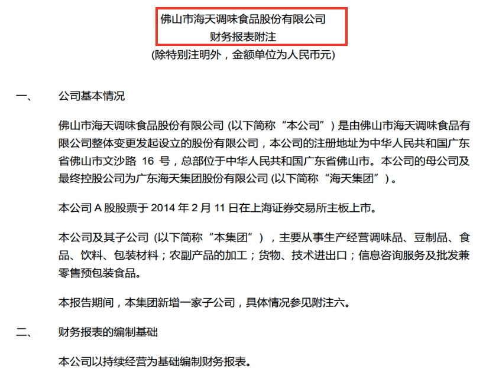

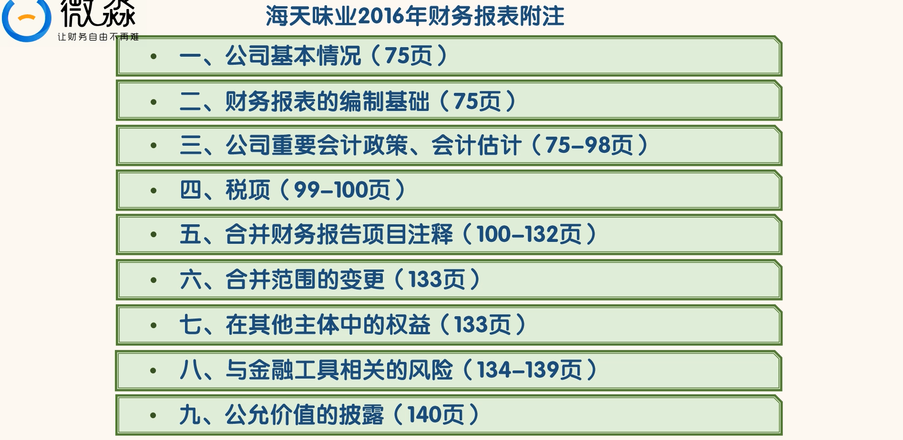

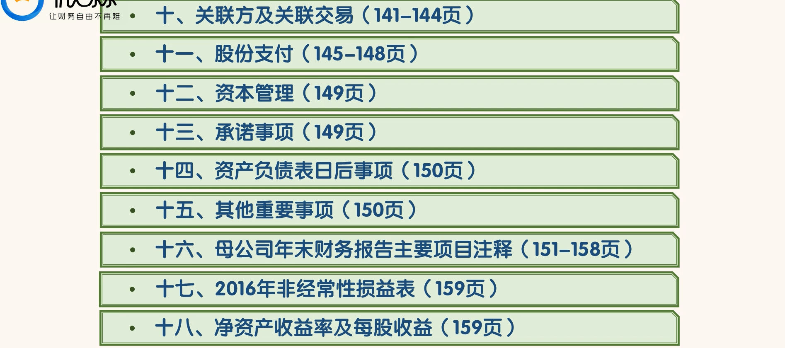

- 我们可以看到光财务报表附注这部分内容，就有 85 页，占了整个年报内容的一半以上，可见这部分内容的信息量还是非常巨大的。
- 不过同学们也不用担心，这部分内容不需要单独看。这部分内容虽然多，但毕竟只是 3 大报表的补充资料。
- 我们在阅读 3 大报表时，遇到问题直接搜索就可以。问题的答案基本就是出自这部分内容
- 就这样遇到问题就搜索，等 3 大报表读完了，财务报表附注里的很多内容也已经看过了。
- 当然如果有的同学有时间，又想对目标公司尽可能的了解。
- 那也可以把财务报表附注中的十八项从头到尾好好看一遍。
- 到这里年报中最重要的一节，财务报告，我们就学完了

### 学习公司业务概要、经营情况讨论与分析、重要事项

### 1、我们先来看第三节，公司业务概要

- 这部分内容很简单，但是也很重要。
- 它能让我们快速了解公司是做什么的？有哪些优势？行业地位如何？这些信息对于我们做投资判断很重要

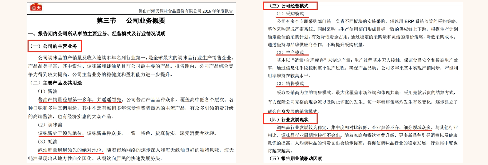

- 从“公司的主营业务”这部分内容可以知道：
  - 公司是生产调味品的，公司的销量和收入连续多年名列行业第一，是全球最大的调味品行业生产销售企业。
  - 短短几句，就让我们对公司是做什么的？行业地位怎么样？有了一个初步认识。
  - 如果我们回忆一下海天味业的三大财务报表的数据及特点，我们可以说海天味业的这几点自我介绍并没有吹牛。
  - 一般情况下公司是不敢乱写的，行业第二名的公司一般不敢在年报里说自己公司销量收入是行业第一名的。私下里吹吹牛倒是可能的
- 从“主要产品及其用途”我们知道：
  - 海天味业最主要的产品是/酱油、调味酱和耗油。而且这三个主要产品的销量在行业中都处于绝对优势地位。
- 从公司的“营业模式”我们可以简单了解：
  - 海天味业的“采购模式”、“生产模式”、“销售模式”采购、生产、销售可以说是制造型公司最重要的三块内容。
- 从“行业发展现状”我们可以了解到：
  - 调味品行业目前的特点是：稳定发展，集中度较低，企业众多但参差不齐，行业集中度会越来越高。
  - 这样在未来作为行业第一名的公司，受益会更大。
  - 另外调味品行业周期特征不突出。这点也很重要。行业周期特征不突出的公司，受经济周期的影响较小。行业风险相对也较小

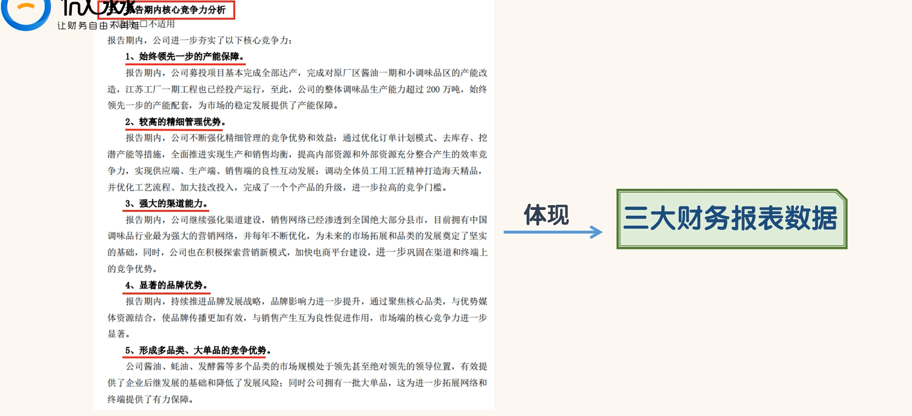

- 从公司业务概要的第三部分内容“报告期内核心竞争力分析”中我们可以看到：
  - 海天味业认为自己的核心竞争力有 5 个方面。这个 5 个方面我们可以好好看一下，一家公司的核心竞争力可以理解成相对于同行业其他公司的竞争优势。
  - 只要公司的核心竞争力一直能保持住，那么公司的行业地位就会加强。反之，公司的行业地位就会衰落。
  - 这 5 个方面的核心竞争力产生的结果一定会体现在 3 大财务报表的数据中。如果后期我们发现海天味业的这 5 个方面的核心竞争力有 1 个或几个开始丧失，我们就可以推断出未来 3 大财务报表中的数据就会变差。
  - 同理如果我们发现海天味业 3 大财务报表中的数据变差了，也可以反过来看一下这 5 个方面的核心竞争力是否有哪些出了问题

### 2、我们来看一下第四节，经营情况讨论与分析

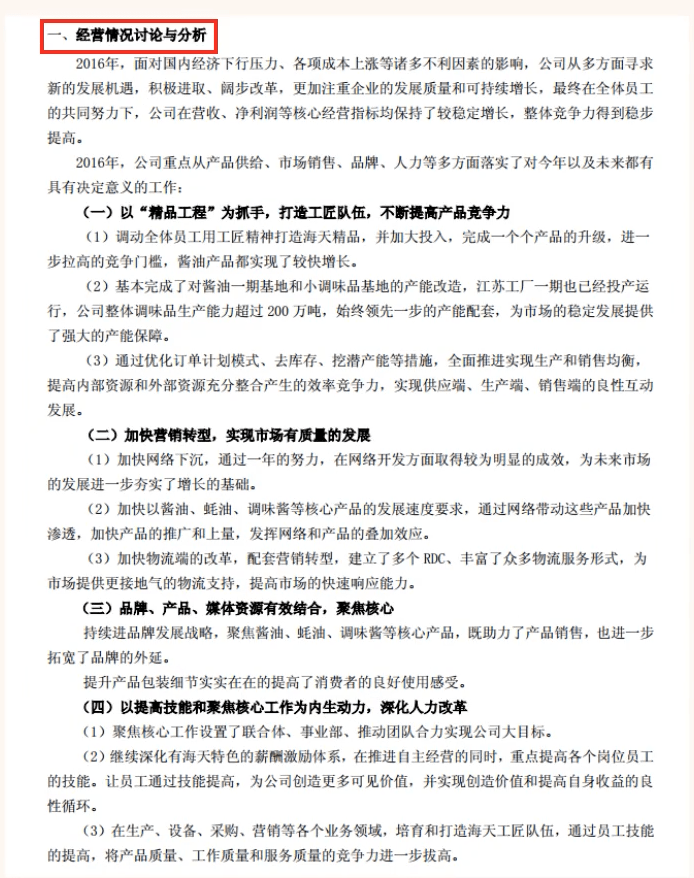

- 经营情况讨论与分析可以分为两大块：
  - 一块是总结过去一年的工作情况，包括经营情况讨论与分析和报告期内主要经营情况；
  - 另一块是展望未来，主要是“公司关于公司未来发展的讨论与分析”。
  - 经营情况讨论与分析这部分内容主要总结过去一年做了哪些重要的事情。这个看一遍，了解一下就行了

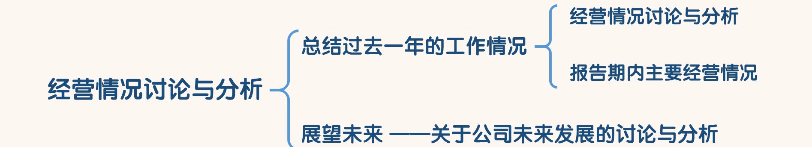

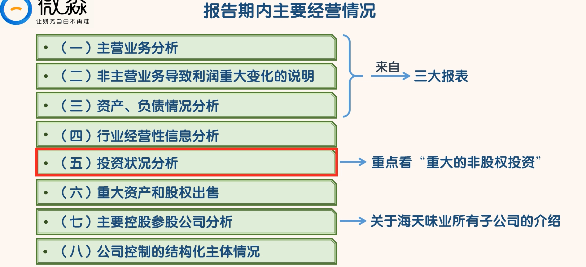

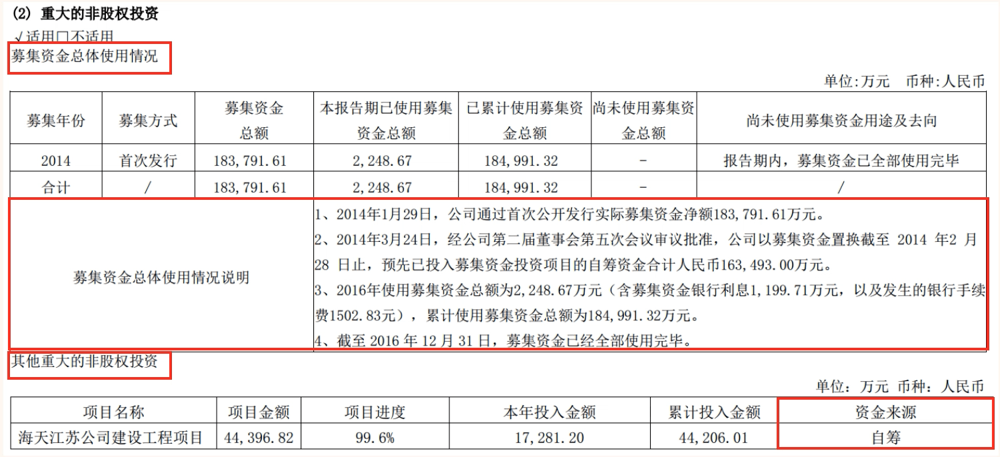

- “重大的非股权投资”包括“募集资金使用情况”和“其他重大的非股权投资”两部分：
  - 从“募集资金使用情况”我们可以看到公司 IPO 融到的钱的使用情况。
  - 公司是在按计划进行项目建设还是融了钱去干了其他的事情。对于拿到了钱没有按计划去干事的公司，我们可以认为其管理层的人品有问题。我们可以认为公司是在“圈钱”而不是融资干事情。
  - “其他重大的非股权投资”指的是公司自筹资金进行的项目。我们可以把这部内容与“在建工程”结合起来看

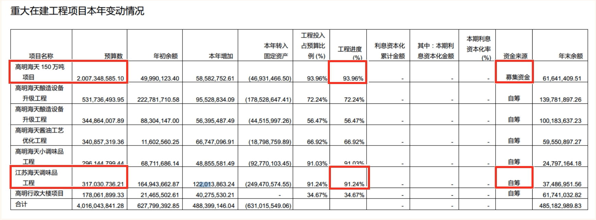

- 海天味业通过 IPO 募集的资金是用于“高明海天 150 万吨项目”的建设，该项目到 2016 年底已经完工 93.96%。
- 可见海天味业完全按募集资金的计划使用了募集资金。另外我们可以看到江苏海天调味品工程的情况。
- 在建工程一旦建成将会转为固定资产，这就意味着产能的增加

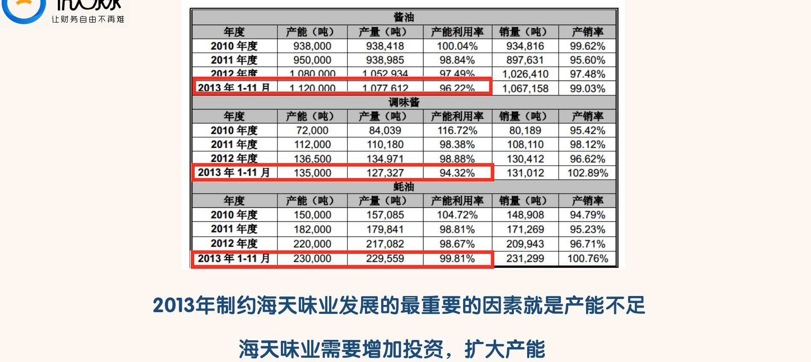

- 从海天味业的招股说明书，我们可以知道：
  - 海天味业 2013 年的产能大概为 150 多万吨，并且产能利用率都达到了 94%以上。我们可以说制约海天味业发展的最重要的因素就是产能不足。海天味业需要增加投资，扩大产能。
  - 到了 2016 年，海天味业的产能已经达到了 200 多万吨。这都是不断投资的结果

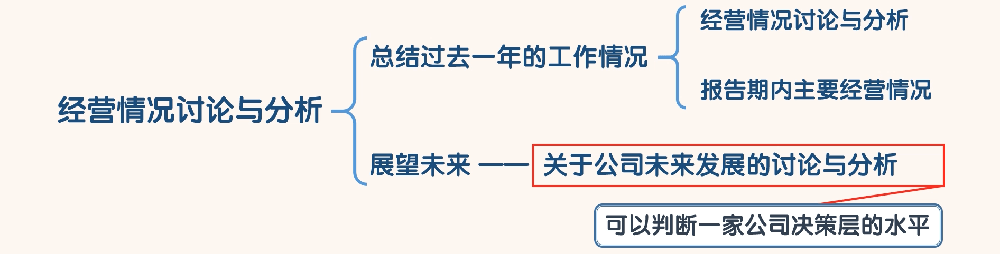

### 3、下面我们来看一下“公司关于公司未来发展的讨论与分析”

- 这部分内容是董事会对于行业现状以及未来趋势的看法以及应对方式。公司决策层对于未来的判断直接决定了公司的战略计划和经营计划。
- 从这部分内容我们还是能判断出一家公司决策层的水平的。我们可以把同行业不同公司的这部分内容进行比较。
- 这样我们就能对于行业有更深的认识，通过对比我们也能发现哪家的决策层更专业

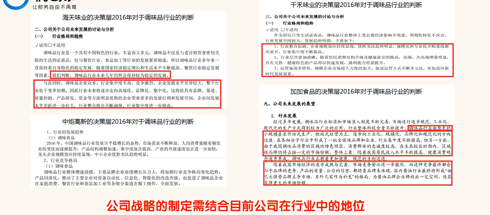

- 结论：
  - 通过以上对比，我们发现四家上市公司的决策层对于调味品行业的发展趋势的看法总体是一致的。
  - 既然行业内主要上市公司对于行业的格局和趋势的看法一致，那就说明目前行业的情况基本就是这个样子。
  - 基于相似的看法，就会产生相似的战略。当然战略的制定还会和目前公司在行业中的地位有很大的关系。

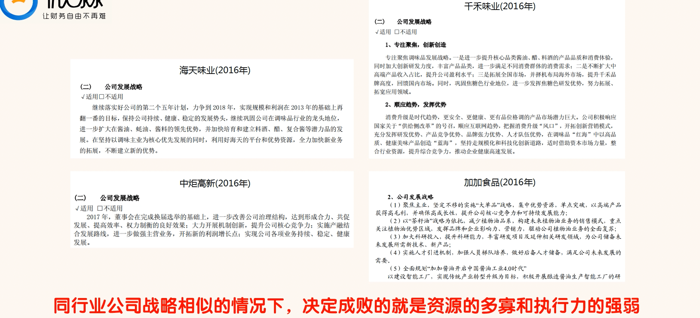

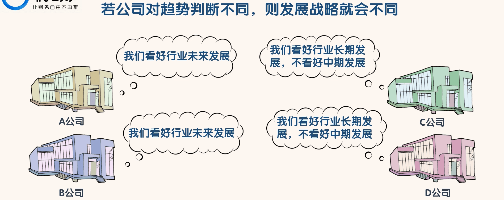

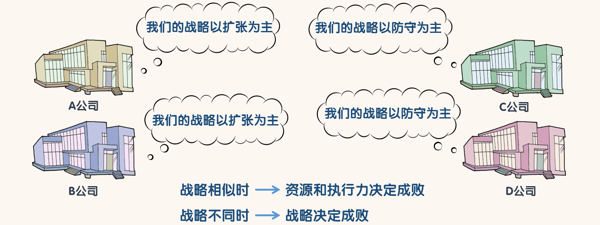

- 我们发现四家公司的“发展战略”还是有某些相似之处的。
- 在战略相似的情况下，决定成败的就是资源的多寡和执行力的强弱。从这两点上来看，海天味业有着明显的优势
- 如果我们发现不同公司对于行业未来发展趋势的判断不一样，那不同公司的战略就可能出现巨大的不同。
- 这个时候我们就要好好研究一下哪家公司的判断更可能是正确的。比如同行业中有 A、B、C、D 四家上市公司，A、B 两家公司看好行业未来的发展，C、D 两家公司长期看好行业的发展，但是中期看衰行业的发展。
- 这个时候 AB 和 CD 公司的战略一定会出现很大的不同。A、B 公司的战略应该还是以扩张为主，C、D
  公司就会变成以防守为主。
- 这个时候的战略选择不同会对以后公司的发展和行业地位造成巨大的影响。选择对的会变的更强大，选择错的可能会衰落。所以当大家战略相似的时候，资源和执行力决定成败；当大家战略不一样的时候，战略决定成败

### 4、看下第五节内容：重要事项

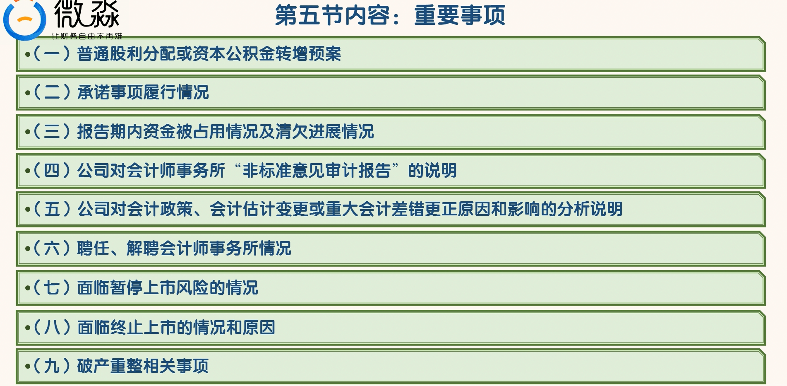

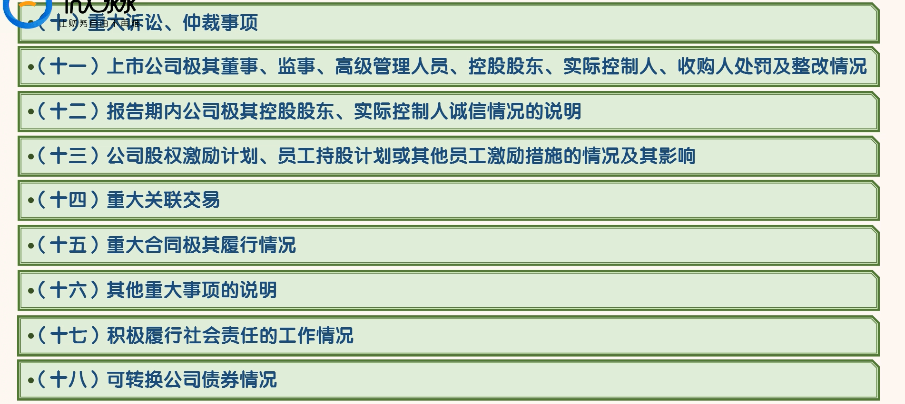

- 这十八项内容只需要从头到尾好好看一遍，看看有无异常情况即可。
- 如果发现异常情况就要找到合理原因，否则就可以把公司淘汰掉。
- 这里封老师再提醒一下同学们，如果第五项和第六项中，公司有关于会计政策、会计估计的变更或重新聘任了会计师事务所。
- 这里我们就要特别注意了。这往往是公司财报出问题的先兆。

### 学习年报中第六节的普通股股份变动及股东情况

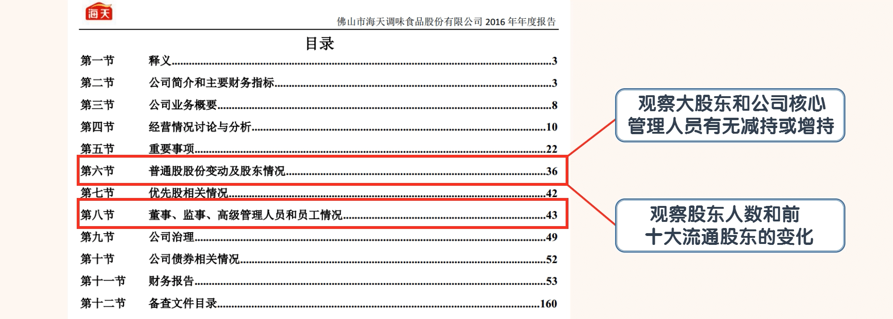

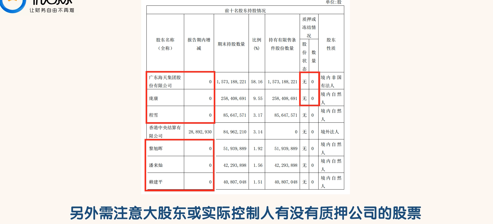

- 如果有质押说明大股东或实际控制人缺钱，那么大股东或实际控制人挪用.上市公司资金的风险就会加大
- 我们先来看第六节的普通股股份变动及股东情况：
  - 对于股份变动及股东情况，首先要观察大股东和公司核心管理人员有无减持或增持，其次观察股东人数和前十大流通股东的变化。
  - 如果大股东和公司核心管理人员减持或增持股票，他们就是用行动来告诉我们他们自己是看衰还是看好公司的未来。春江水暖鸭先知。大股东和核心管理层的行为值得我们重视
  - 海天味业的大股东、实际控制人、核心管理人员的股份都没有变化。不过目前这些股份都还没有解禁。等解禁以后我们要特别注意这部分人员的增减持情况。另外我们还要注意大股东或实际控制人有没有质押公司的股票，如果有质押说明大股东或实际控制人缺钱，那么大股东或实际控制人挪用上市公司资金的风险就会加大。
  - 通过股东人数和前十大流通股东的变化，我们可以了解到流通股集中程度和主要投资者的变化情况。
  - 一般而言，在股本不变的情况下，股东人数增减变化与股价中期涨跌幅呈现负相关。
  - 即股东人数越增加，人均持股越少，未来股票股价下跌的可能更大；股东人数越减少，人均持股越多，流通股更集中在少数人手里，股价上涨的概率越大。

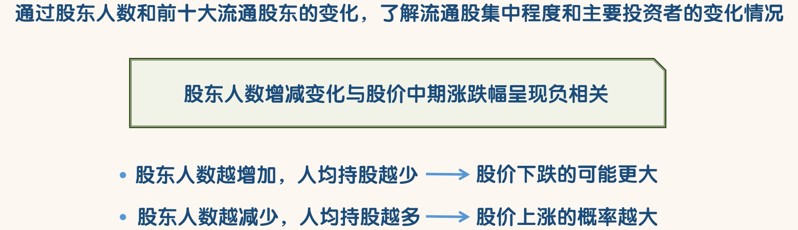

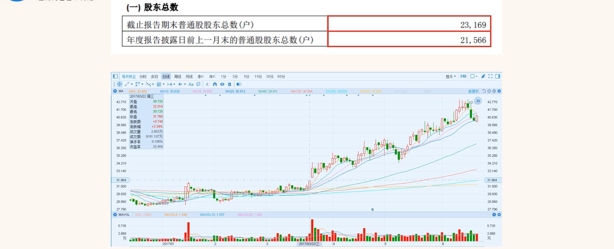

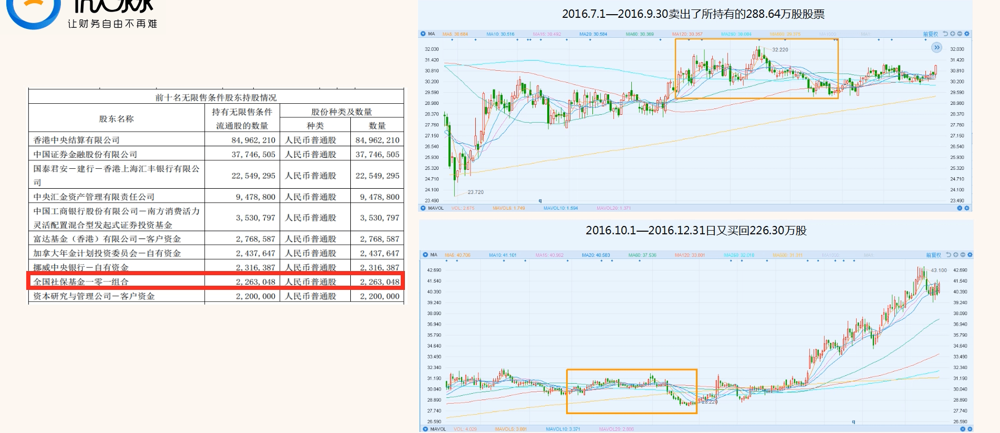

- 通过年报第 39 页前十大流通股东的变化，我们可以估算出主要投资机构的持股成本以及对股票的看法：
  - 比如第九大流通股股东：全国社保基金一零一组合，其在 2016 年 7 月 1 日到 2016 年 9 月 30 日之间全部卖出了所持有的 288.64 万股股票。
  - 根据行情走势图我们可以估算出其卖出价大概在 31-32 元之间。黄色方框内为 2016 年 7 月 1 日到 2016年 9 月 30 日之间的成交价格
  - 但是奇怪是的全国社保基金一零一组合在 2016 年 10 月 1 日到 2016 年 12 月 31 日之间，又买回了226.30 万股。根据历史走势，我们可以估算出其买入价格大概在 29-30 元之间。
  - 我们不知道该基金为何卖出后又再次买进，但是我们可以得出结论
  - 该基金认为海天味业在 30 元左右时有投资价值。不然它就不会再次买进了。
  - 另外同学们需要注意的是，因为全国社保基金关系社会稳定，这个基金是不能亏钱的。社保基金持有的股票特别是社保基金重仓持有的股票，是值得我们好好研究的

### 看一下第八节的董事、监事、高级管理人员和员工情况

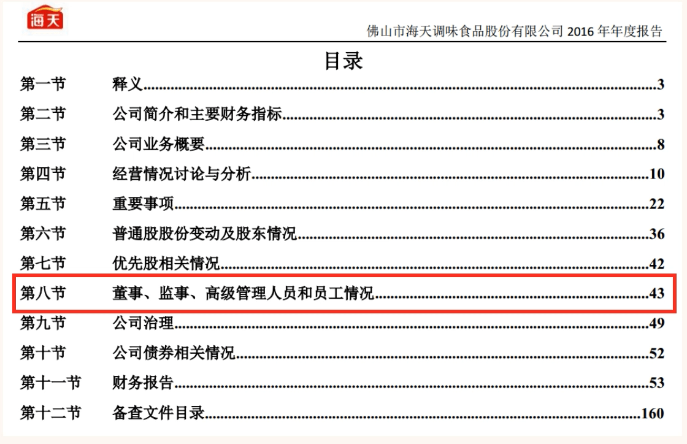

- 从这部分内容我们可以了解公司的决策层和高级管理人员的职位、薪酬、工作经历，以及离职情况。
- 这里特别要注意有核心高管人员离职的情况。
- 核心高管离职要么是不看好公司的发展，要么是内部矛盾，当然也可能有其他特别的原因，比如身体原因。但是最重要的还是前两个原因

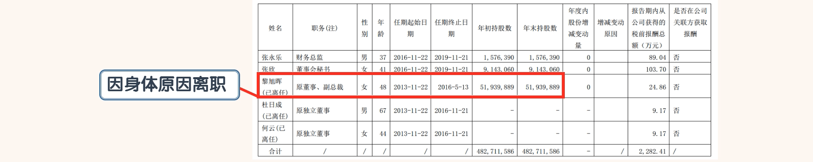

- 我们可以看到：
  - 海天味业的核心管理人员黎旭晖在 2016 年 5 月份已经离职。
  - 从黎旭晖的持股情况来看，她持股 5000 多万股，市值近 20 亿，是仅次于庞康和程雪的核心管理人员。
  - 海天味业对外声称黎旭晖是因为身体原因而离职。如果因为身体原因而离职可以理解，如果是因为内部矛盾，那么海天味业的投资价值就要下降。

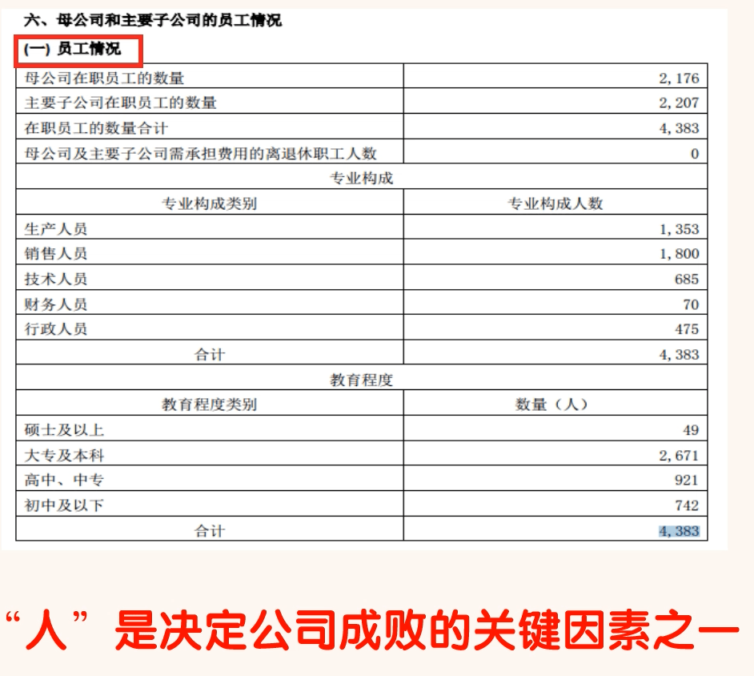

- “员工情况”这个表格里的信息还是很重要的
  -  我们知道“人”是决定公司成败的关键因素之一。
  - 我们从公司人员数量的变化，在某种程度上可以看出公司是在扩张还是在收缩。
  - 从人员构成的变化，在某种程度上可以看出公司在某个阶段的工作重心

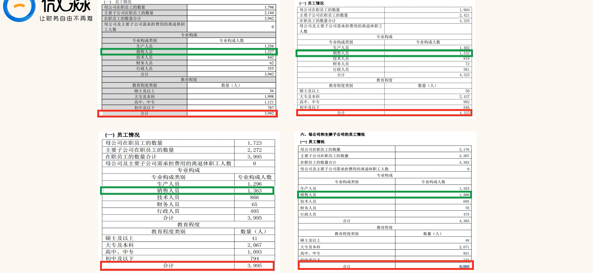

- 下面我们来看一下海天味业从 2013 年到 2016 年的“员工情况”：
  - 从 2013 年到 2016 年海天味业员工的总人数分别是：3942、3995、4325、4383。我们可以看到总人数逐年增长，这说明海天味业这几年一直在扩张。
  - 我们发现在海天味业的总人数增长的同时，销售人员以更快的速度在增长。我们可以看到从 2013 年到2016 年，海天味业的销售人员人数分别是：1327、1363、1532、1800。
  - 通过比较我们发现，海天味业这几年人员的增长主要来自销售人员，生产人员和行政人员的人生这几年相对比较稳定，技术人员的人数在逐年减少。
  - 这说明海天味业最近几年在销售方面的投入力度在加大。这是比较容易理解的，因为有销售才有营业收入，而有销售的前提是有销售人员。
  - 另外通过人员总数，我们还可以求出公司的人均薪酬。用合并资产负债表中的“应付职工薪酬”科目的期末金额减去期初金额，加上合并现金流量表中的“支付给职工以及为职工支付的现金”科目中的金额，就可以得出当年员工的薪酬总额

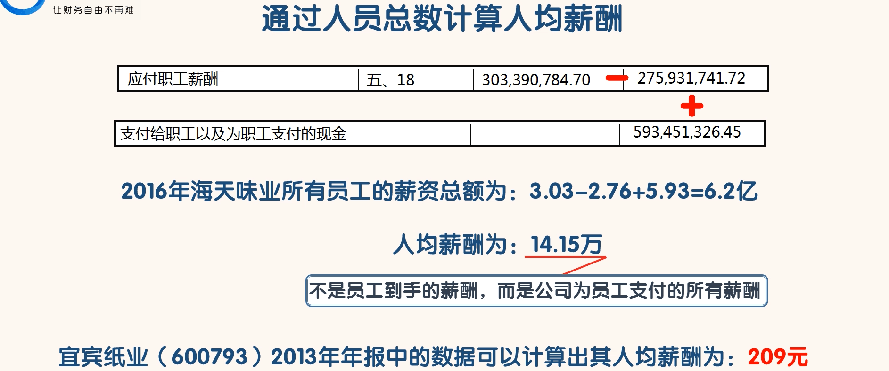

- 我们可以计算出：
  - 2016 年海天味业所有员工的薪资总额为：3.03-2.76+5.93=6.2 亿。
  - 用薪酬总额除以总人数，我们可以得出人均薪酬为：14.15 万。这里需要注意的是，这 14.15 万不是员工到手的薪酬，而是公司为员工支付的所有薪酬，包括工资、社保等所有开支。员工到手的金额大概有 7000 多元。
  - 通过网上查询我们可以知道，海天味业的人均薪酬在佛山 30 家上市公司中排名第 3 位。还是比较合理的。
  - 如果有公司人均薪酬是几百元，毫无疑问，这家公司的财报造假了。比如，根据宜宾纸业（600793）2013 年年报中的数据可以计算出 2013 年宜宾纸业的人均薪酬为 209 元。
  - 当时宜宾纸业的名字还叫 ST 宜纸。我们不说这家公司一定造假了，我们也理解这家公司的处境，因为再不扭亏为盈，公司就要被退市了。
  - 但是这水平也太拙劣了吧。你就真的不在乎股民的智商和感受吗？
  - 同学们对于人均薪酬大幅低于或高于同行业的公司要注意，异常往往意味着风险