# 不知道在哪儿看估值？超强工具合集送上

之前文章提到过估值，不少小伙伴都私信问我估值在哪里可以查看？

好，乐姐这篇文章专门来汇总下适合我们普通人的估值工具。学会利用工具，会大大提升我们的效率。直接上干货

## 1、中证指数官网

做指数基金定投的，不能不知道这个网站。

它由上海证券交易所和深圳证券交易所共同出资发起设立的一家专业从事证券指数及指数衍生产品开发服务的公司。

基本A股所有的指数都在其中，[官网网址](http://www.csindex.com.cn)

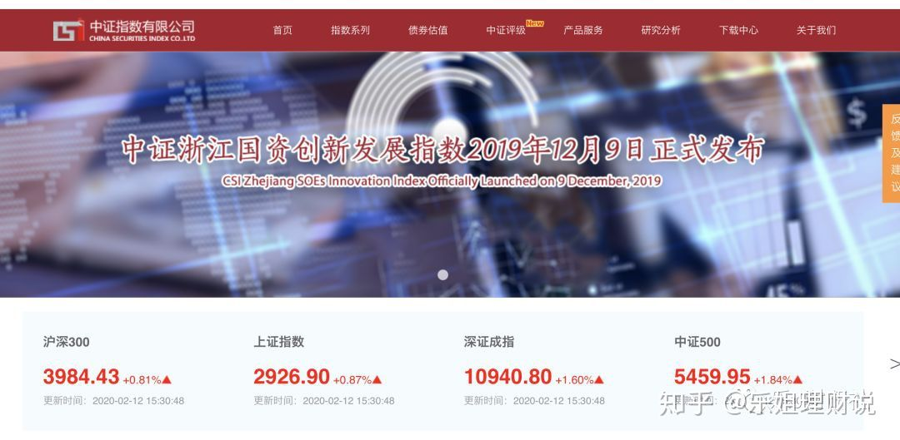

在首页——下载中心——每日板块中可以查看到11个主流的板块估值信息。

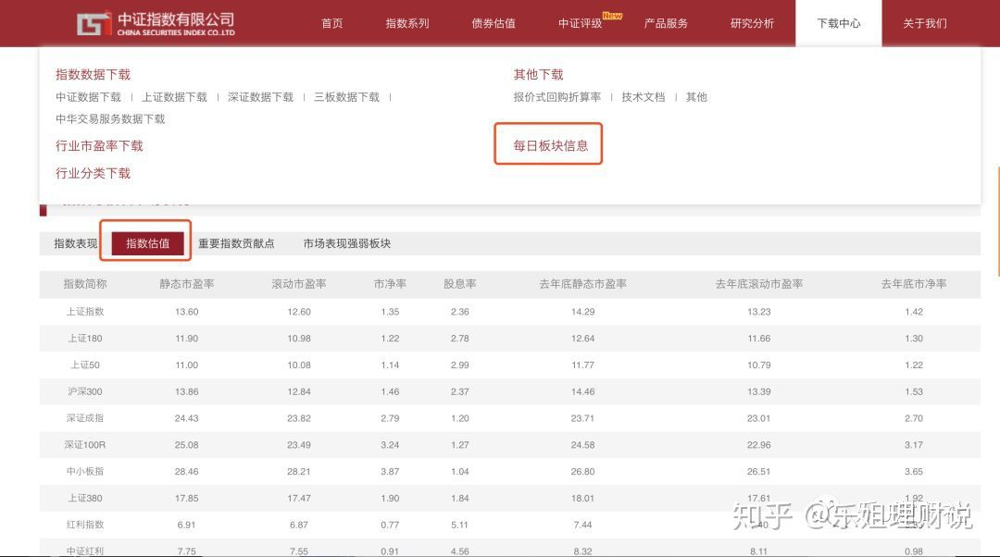

如果说你要找的指数并没在每日板块中，比如300价值指数，那我们可以直接首页搜索框中来搜索。

能够查看到关于300价值指数的详细信息，不仅仅包含指数估值。

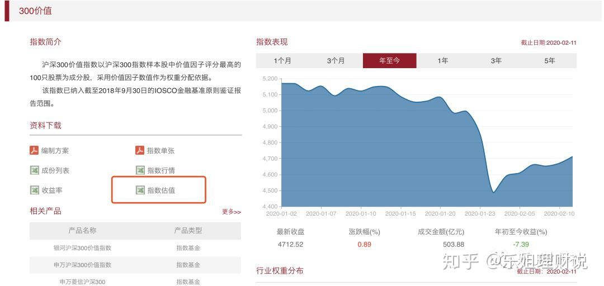

## **2、且慢估值**

这个是知乎粉丝问的最多的，也主要是因为我文章里面的估值表截取的这个。

在且慢管家公众号或者且慢指数估值小程序可以直接获取估值信息，如下：

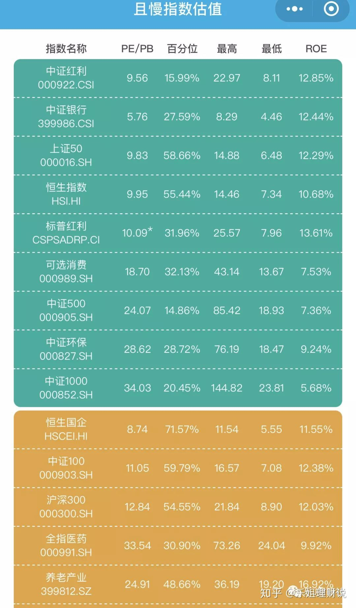

## **3、天天基金APP**

首页直接搜索“指数估值”，就能看到关于指数估值的详细内容。

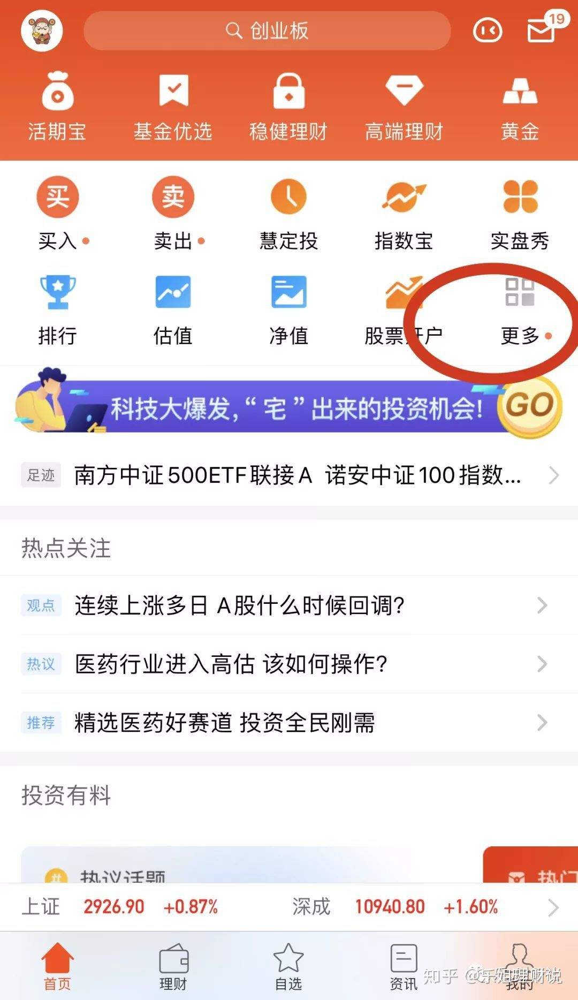

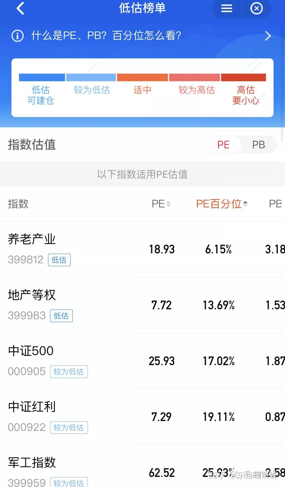

## **4、蛋卷基金APP**

蛋卷是雪球旗下的基金投资平台首页直接就能看到有“估值”这个栏目，直接点击进去就能看到详细的估值信息

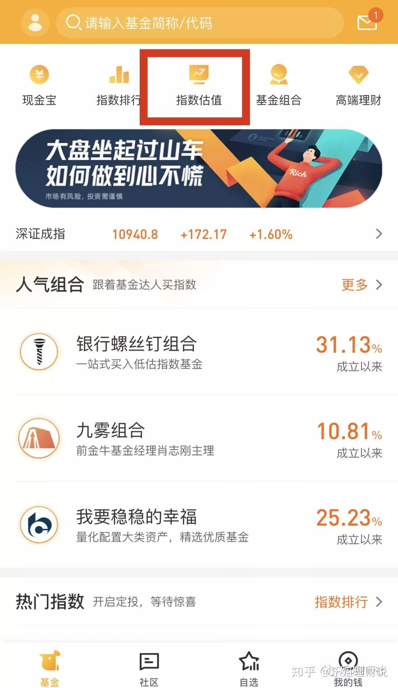

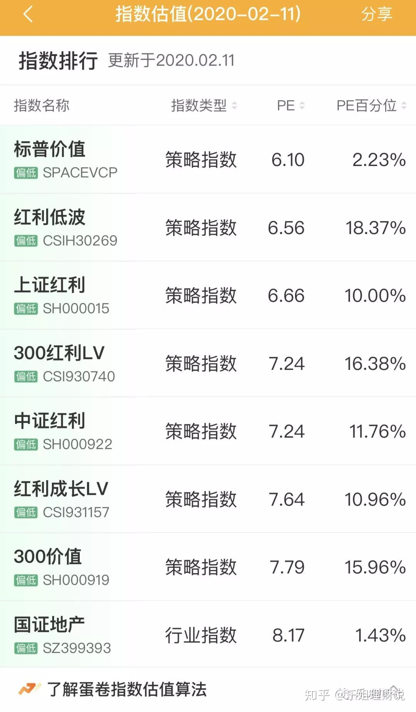
**5、蚂蚁财富指数红绿灯**

天天基金、蛋卷都提了，不能不提下蚂蚁财富。

其实不需要单独下载蚂蚁财富，在支付宝——财富——基金里面就能看到有【指数红绿灯】。即可看到指数的估值

缺点就是指数估值数据较少。

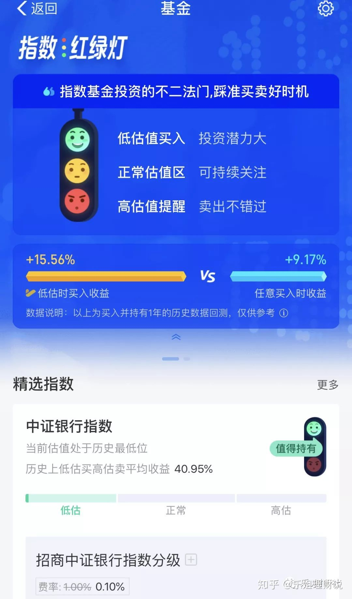

## **6、集思录**

集思录网址： [https://www.jisilu.cn](https://link.zhihu.com/?target=https%3A//www.jisilu.cn)

之前还有关于指数的估值数据，后面下架了。不过如果有做场内ETF基金的，可以参考ETF基金的估值数据。

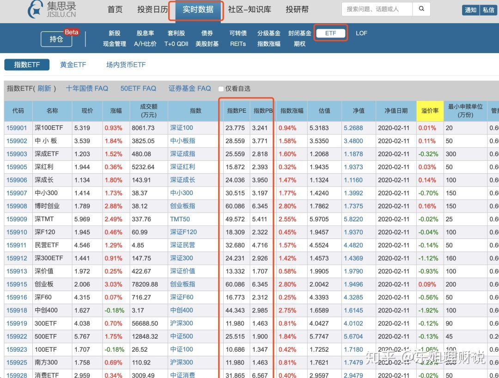
## **7、恒生指数官网**

前面说的都是我们国内A股指数的估值平台，那关于港股的估值，在哪里可以查看呢？

跟我们平时相关的主要是——恒生指数和恒生中国企业指数（也就是常说的H股指数）

前面部分平台其实有涉及到恒生指数和H股指数的估值

这里也给介绍下恒生指数官网 [https://www.hsi.com.hk/schi](https://link.zhihu.com/?target=https%3A//www.hsi.com.hk/schi)

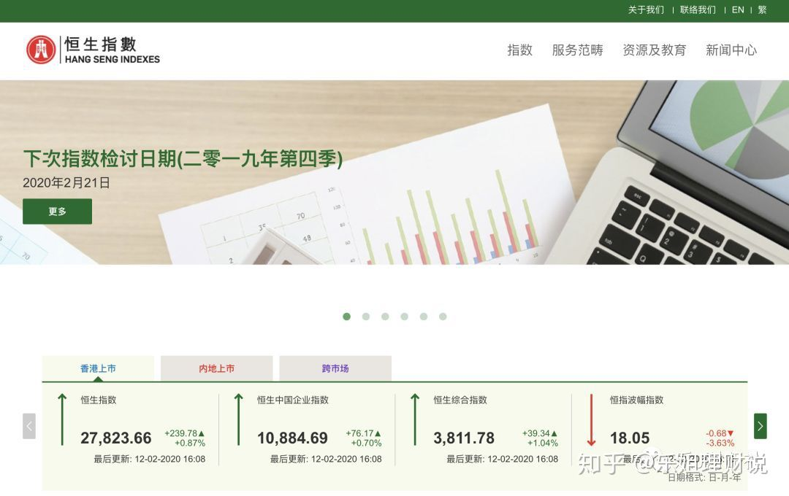

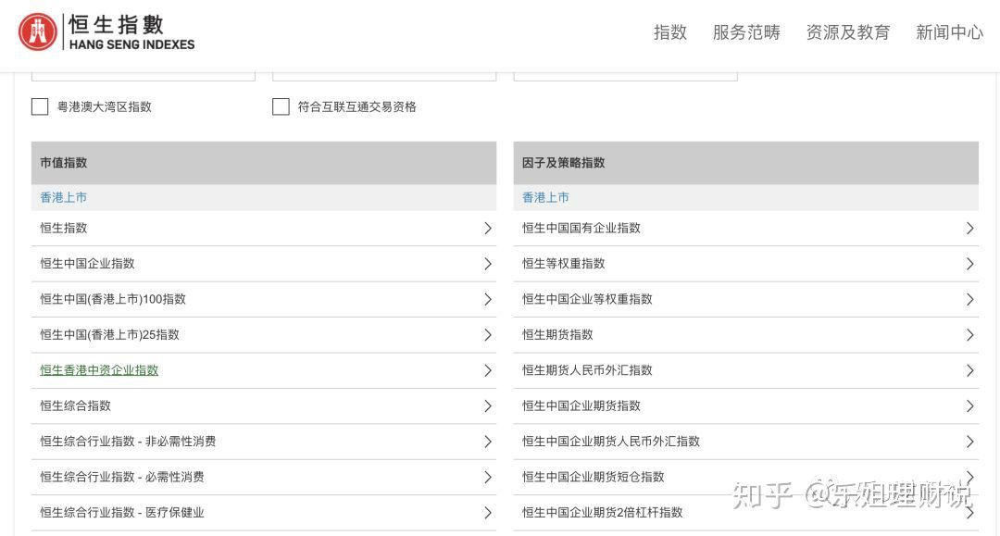
**8、理杏仁**

上面都是免费的平台，如果大家有更进一步的研究需要话，再介绍一个我们普通投资者还能承受的了的付费平台——理杏仁。

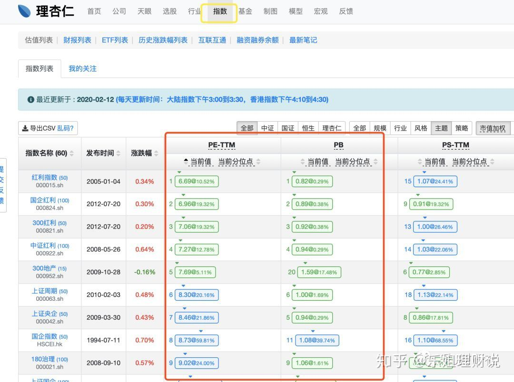

**最后说一句，估值平台很多，大家不要纠结于各个平台给出的指标值会不同。**

**估值本身就是一个区间，选择自己适合的一个平台参考即可！**

[不知道在哪儿看估值？超强工具合集送上](https://zhuanlan.zhihu.com/p/106541762)