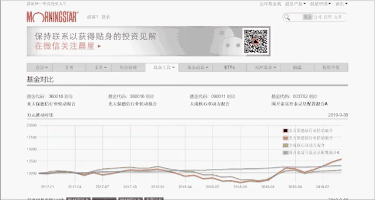
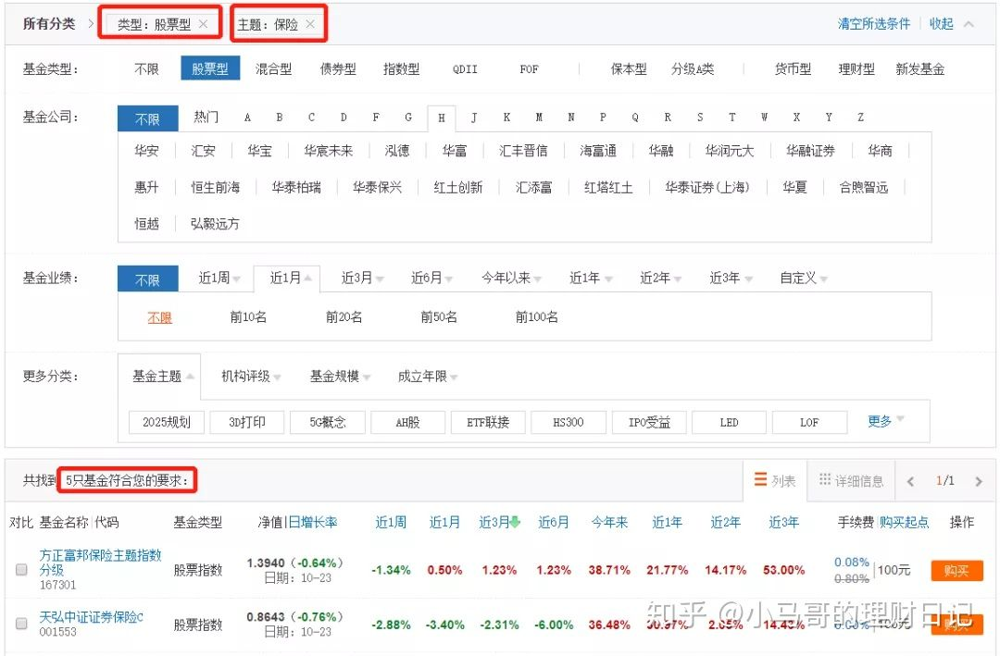
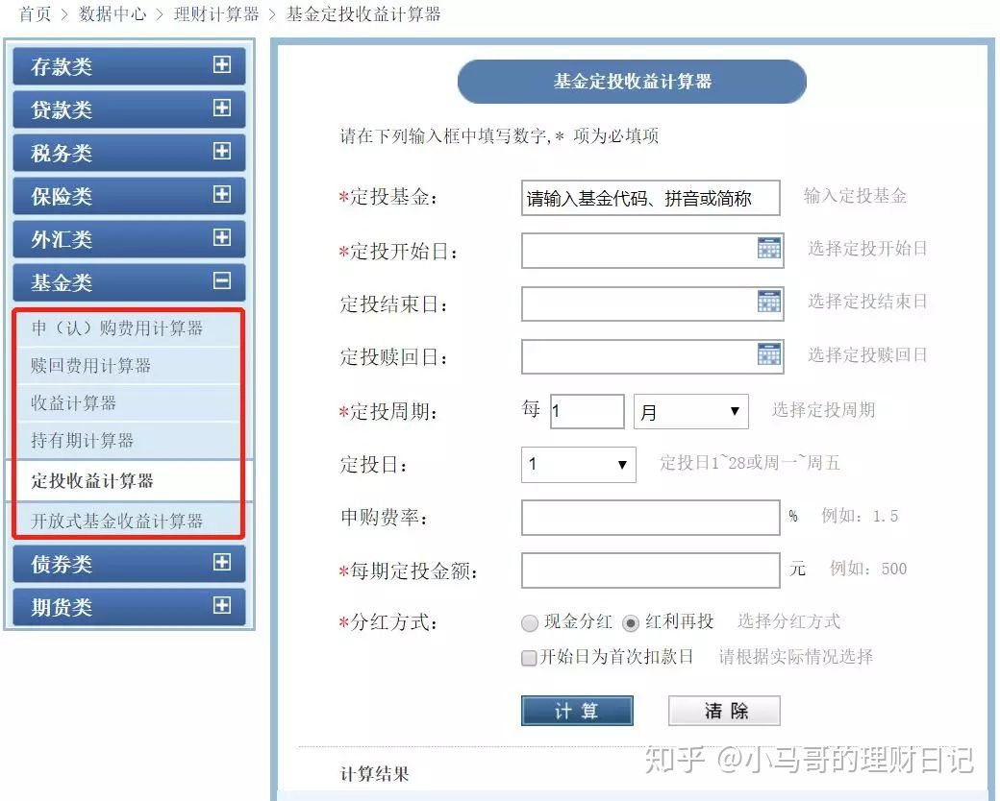

# 好用的4个基金投资工具，拿走不谢

**合适的工具能大大提升效率。**

所以，接下来我要做的就是推荐4类基金投资中常用的工具（认真看哈），为了节省你挑选的时间，每个类别仅推荐一个，都是我亲自使用并对比多家精心筛选出来的。

## 1、指数估值类-且慢

指数估值主要用于了解目前指数的估值水平。且慢的每日估值我会经常去看，估值表中几乎涵盖所有常见的指数。红黄绿三色标示估值情况，一眼看去，清晰明了，而且每一项指标，在底部都有详细的注解。作为编制基础，数据来源于wind，权威可靠。

## 2、基金对比类-晨星网

基金对比用于将多只基金进行各项数据比对，进而选出最优的一只。晨星的基金对比工具是这方面的行家。在写这篇文时反复看了好几家的该项功能，最后还是觉得晨星比较全面，数据非常详实。走势图、月度回报率、资产分布、费率、基金经理情况等一应俱全。美中不足的是最多只能同时对比4只基金。不过免费版做到这个程度也实属良心之作了。

## 3、**基金筛选类-天天基金**

基金筛选主要用于在数千只基金中选择适合我们需求的那只。

天天基金网多年积累，可以看出在基金筛选器功能上是下了功夫的。丰富的标签为各种不同的筛选需求提供了解决之道，它现有的标签有基金类型、基金公司、基金业绩以及其它更多的分类。

**举个例子：** 我要筛选指数型保险主题基金，选择指数型基金和保险主题两个标签，点击确定，结果直接弹出，省去我们大量的挑选时间。

## 4、**基金计算器类-天天基金**

基金收益/费率计算器主要用于计算买卖基金中的各项费用和最终收益。

选择天天基金是因为它功能设置更为合理，以计算定投收益这个来说，好买基金网只能计算月定投的收益，而天天同时具有周和月两种周期选择。此外，它还有申购赎回费用计算、收益计算、持有期计算等功能。基本涵盖了我们日常基金投资所需。帮助我们以一种更直观的视角看到基金费用和收益回报的情况。

最后，读过文章，建议大家一定要使用一下，手机识别二维码就可以到相应的页面，古人云：“孰能生巧”，希望这4个工具能帮助到大家，从而不断提升自己选基鉴基的能力。

最后的最后，关于基金投资，如果你有什么其他的需求，欢迎来找我玩~

发布于 2019-11-19

[好用的4个基金投资工具，拿走不谢](https://zhuanlan.zhihu.com/p/92628716)