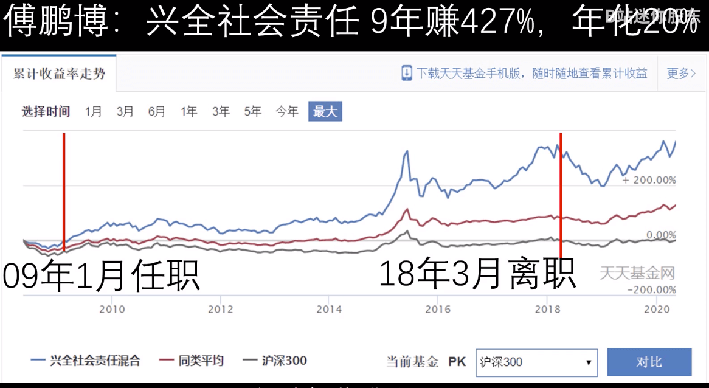
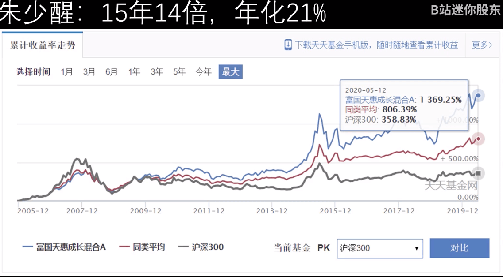
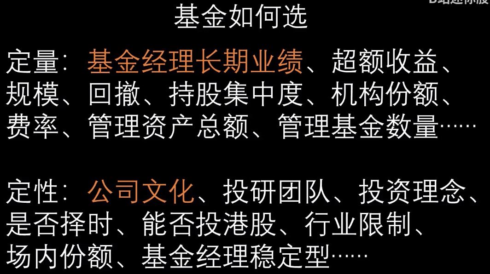
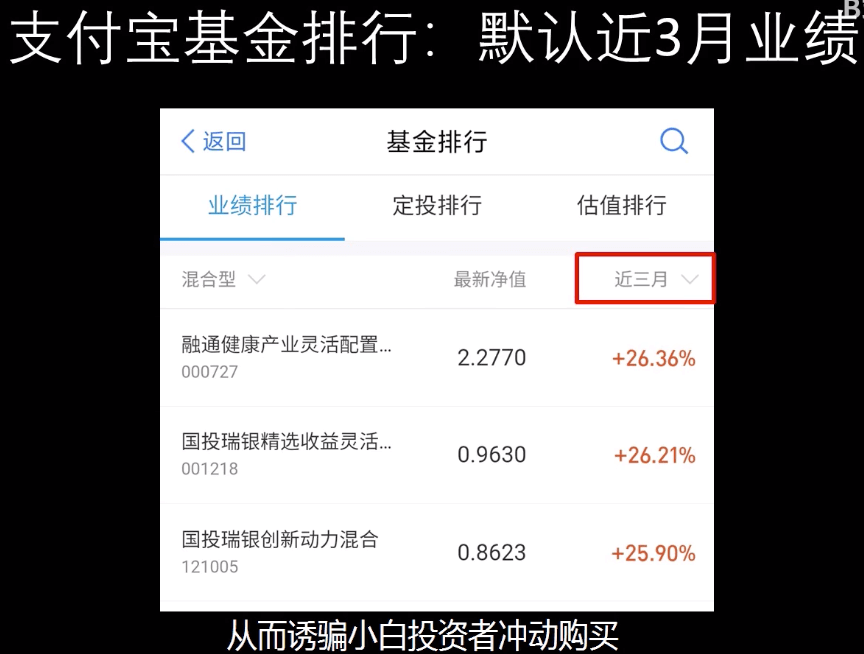
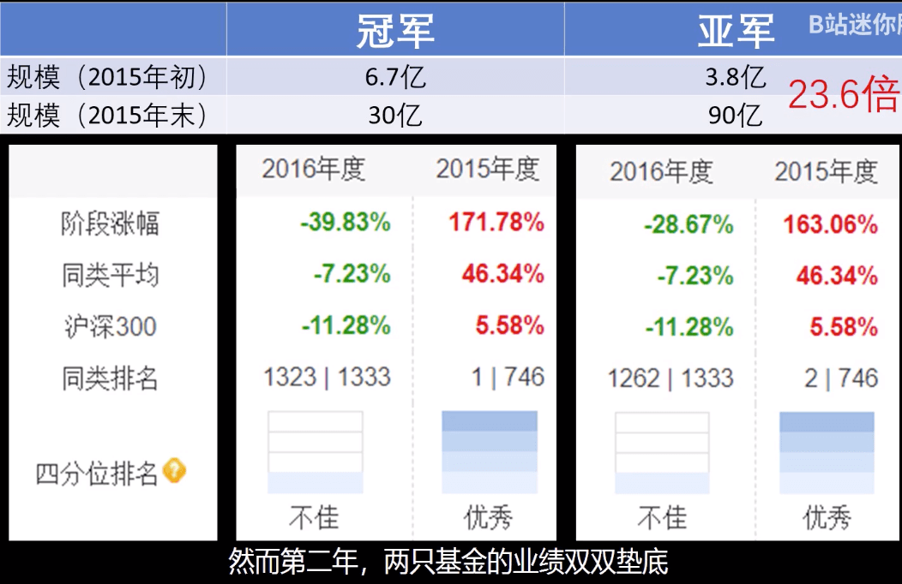
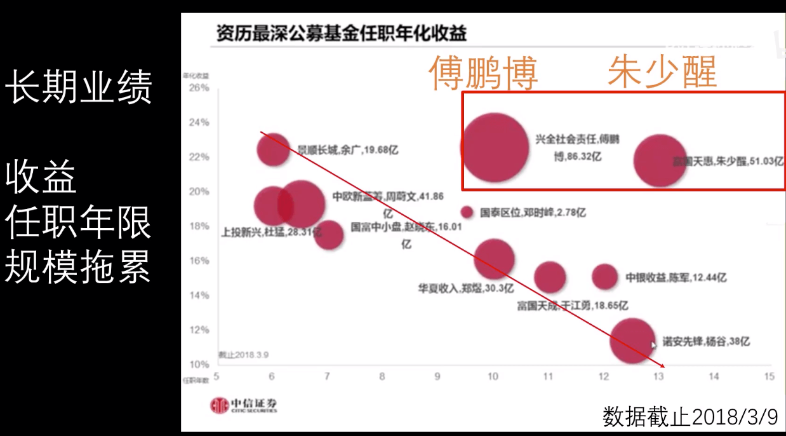
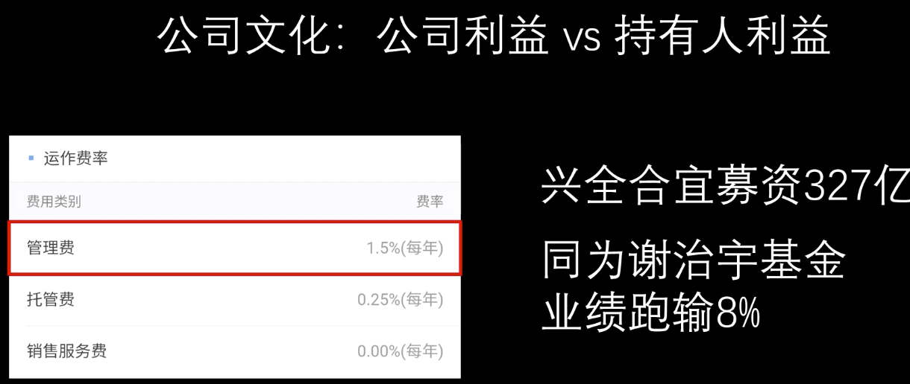
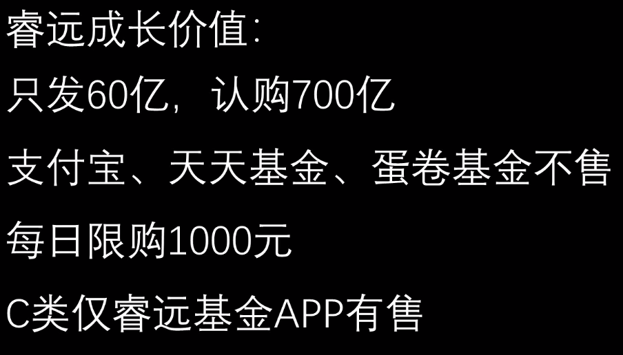
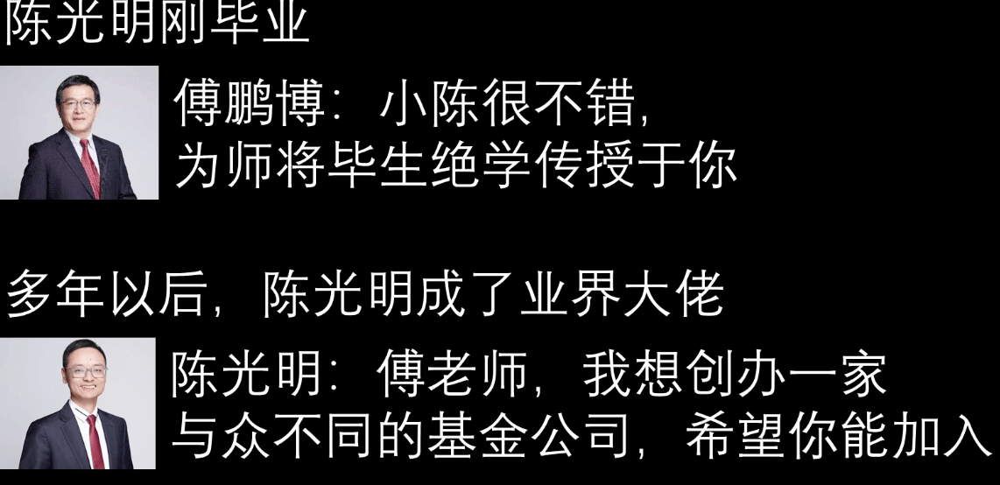

# 买错80w基金，终于明白基金投资如何做了

十年年化收益超过20%的基金

- 睿远成长价值混合C(007120) 傅鹏博 基金规模118亿

- 国富天惠（场内）(161005) 朱少醒 基金规模109亿

如何选基金？

支付宝基金默认显示短期收益

冠亚军基金，次年双双垫底。

基金经理任职不超过五年的，一律不考虑

公司文化

睿远把股东的利益看的比公司短期利益重。

网友评选基金

- 兴全趋势 董承非（13年 20%）基金规模330亿，略大
- 中欧新蓝筹  周蔚文（13年 20%）

## 参考

- [视频](https://www.bilibili.com/video/BV15k4y167MM)
- [朱少醒访谈](https://mp.weixin.qq.com/s/X3gdB5EQm82lZM_TwzIxJA) 
- [睿远陈光明访谈](https://mp.weixin.qq.com/s/ZzyGe8Z4tWmFXAbOTY7eVg) 
- [基金科普](https://mp.weixin.qq.com/s/t37ld61FvauBcT4YiS4lUA)
