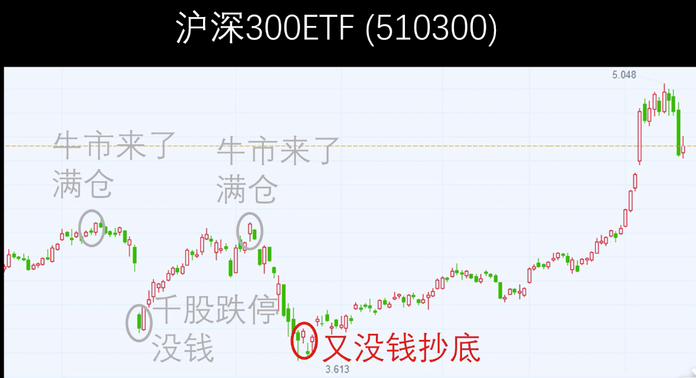
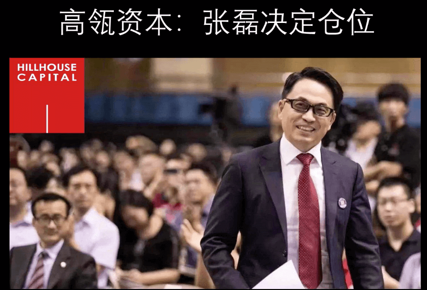
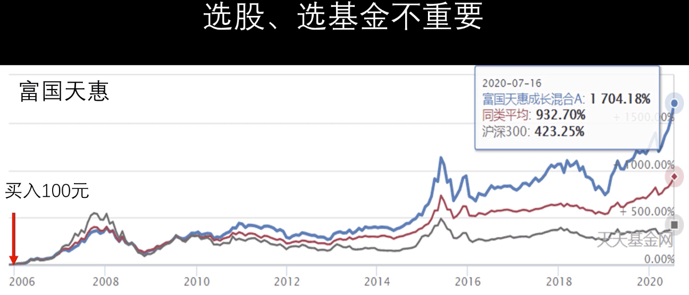
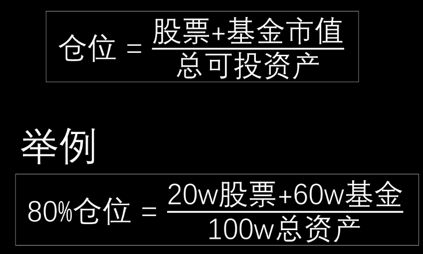
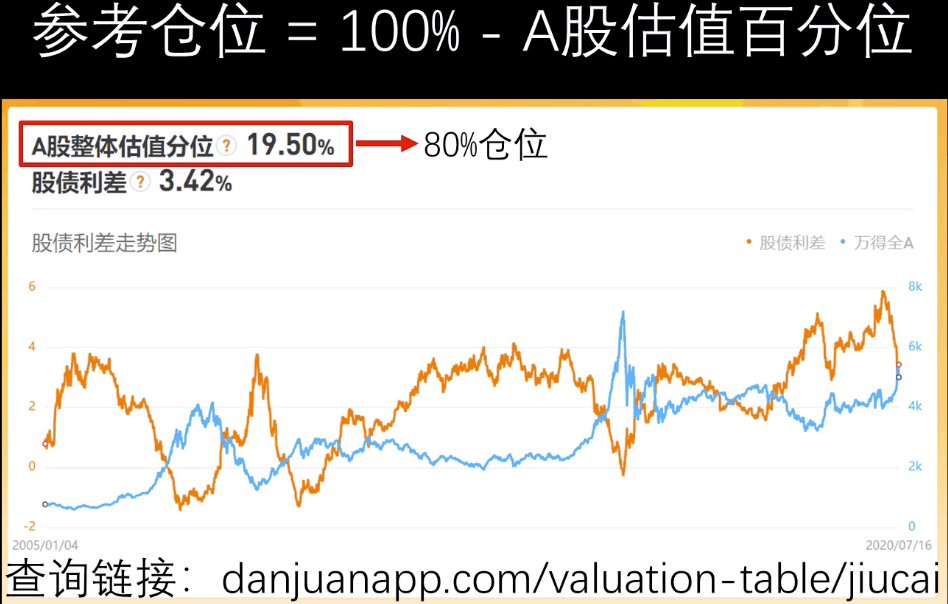
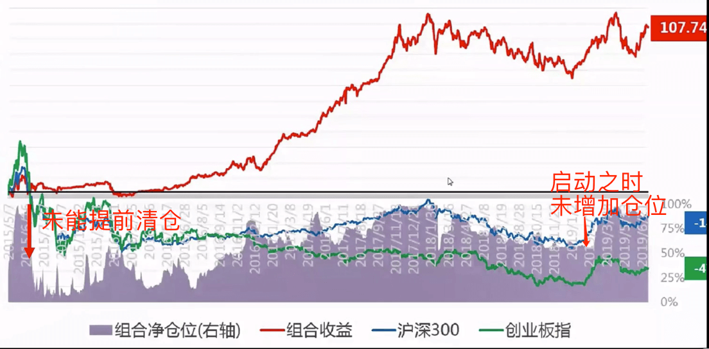

# 仓位管理：投资最重要的事

总是在市场比较火热的时候认为牛市来了满仓， 等回调的时候没有子弹加仓。

选股、选基金仓位管理最重要，如果买的少，就算翻倍收益也低。

做好仓位管理，就算只投资沪深300业绩也能超过90%的人

仓位可参考如下设置，可根据自身情况调整

顶级投资人都无法吃到一个波段的所有行情，我等凡人就不要想着买在最低点，卖在最高点。

## 参考

- [估值查询](danjuanapp.com/valuation-table/jiucai)