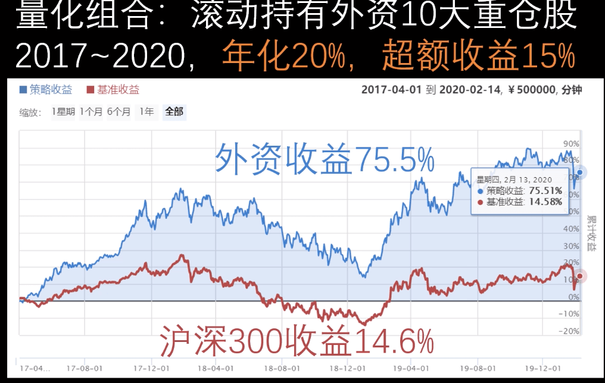
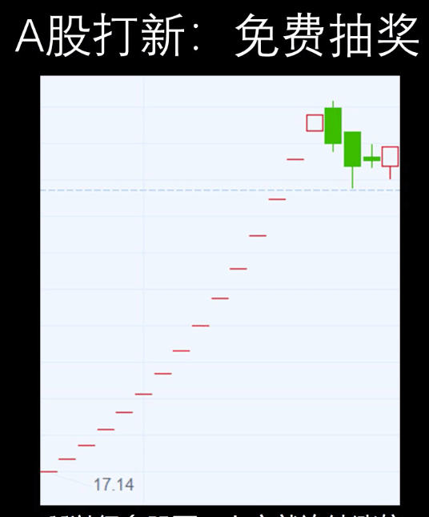
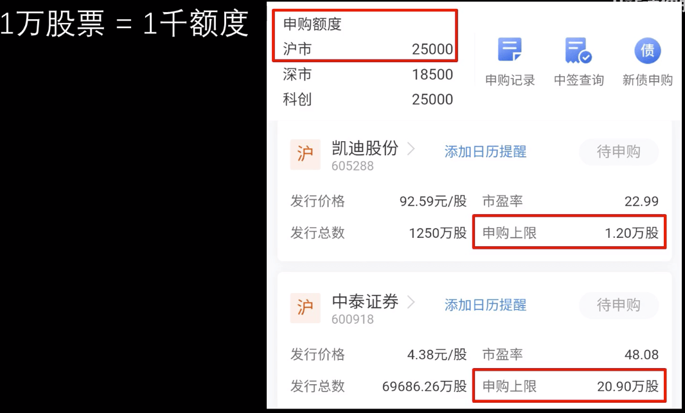
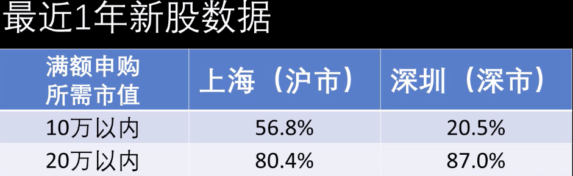

# 别让外资把好公司抢光了

某大佬跟踪北上资金量化组合

自己可以搞个组合，仓位比重跟外资大致相同

持有股票的好处是可以打新

沪深持有股票市值超过一万可申购一千股，深市持有市值超过五千，可以申购五百股。多出的市值，等比增加申购新股股数

能不能满额申购和总市值有关

保证沪深市值各20万，80%以上的股票可以满额申购

门票股收益预期 8%
打新收益预期 4%

长期平均年化 12%+

以后外资持股比例会越来越高

## 参考
- [视频](https://www.bilibili.com/video/BV1JT4y1u7LS)
- [外资历史收益](https://www.joinquant.com/view/community/detail/1fe0f985bef3d3ef51ae948c04883d63?type=1)  
- [外资重仓股（今日持股按市值排序）](http://data.eastmoney.com/hsgtcg/list.html)  
- [千股跌停那天外资买入情况](http://data.eastmoney.com/hsgt/top10/2020-02-03.html)