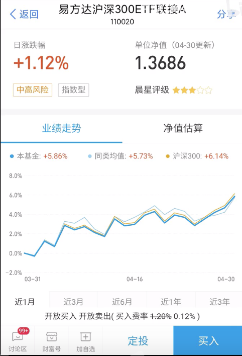
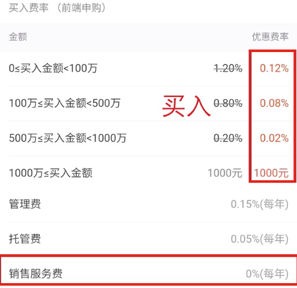
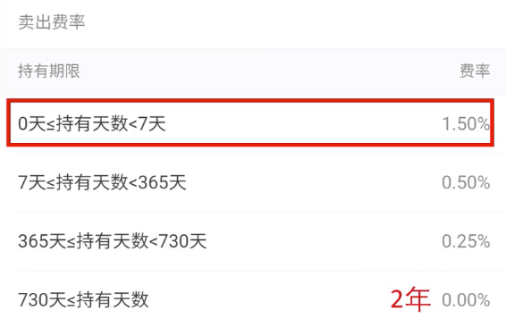
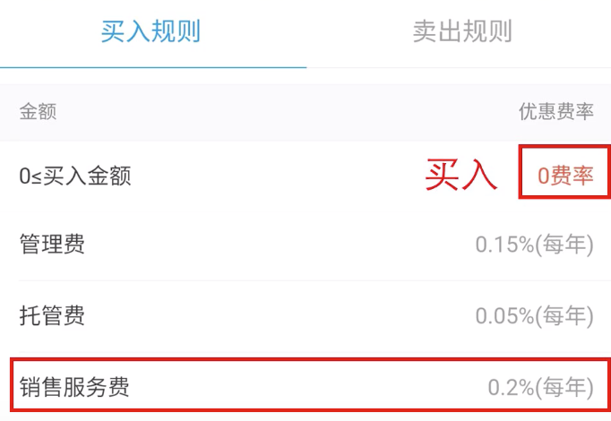
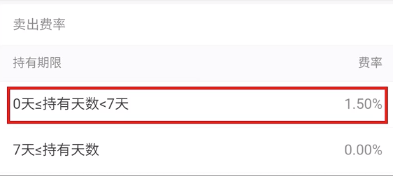

# 基金投资误区：忽视交易费用

为什么大部分up主操作基金的方式错误？

答：交易费用

## 基金分类

### 场内基金

交易方式：证券账户交易，类似买卖股票，100份为单位，价格实时变化

费率：万分之0.5~2（5元最低佣金？）

买入100元基金，免5：100*0.02% = 0.02元；不免5：5元

### 场外基金

支付宝、蛋卷基金购买，10元起购，收盘价成交

#### A类

买入收费

长期持有（>2年），如果持有时间不到一周，卖出费用高达1.5%

#### C类

买入不收费，多一个按天收的销售服务费

短期持有，超过一周不收取费用。

