# 抄底的秘密武器，如何把握买入时机

**秘密武器**：沪深港通 - 北向资金

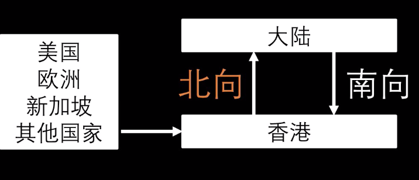

复盘疫情千股跌停

春节a股闭市，外国仍然开市。春节期间外盘跌8%

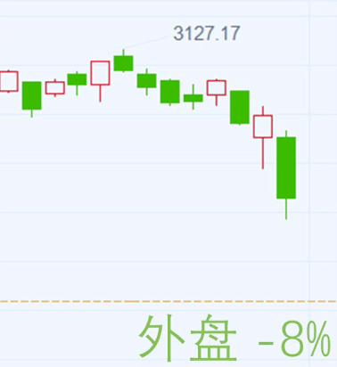

春节后开盘第一天。

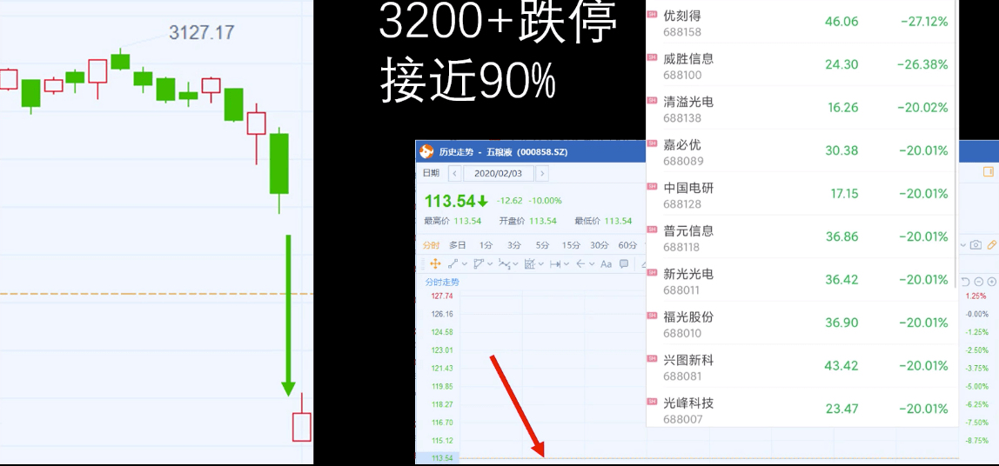

第二个交易日，很多股票继续下跌

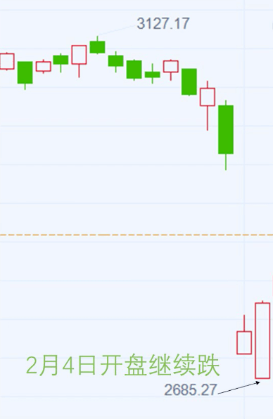

之后连续上涨了2周

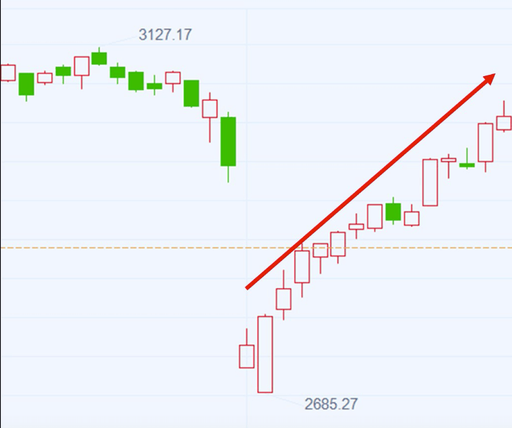

2020年2月3日A股暴跌的时候，A股通流入199亿 = 沪股通 150亿 + 深股通 49亿

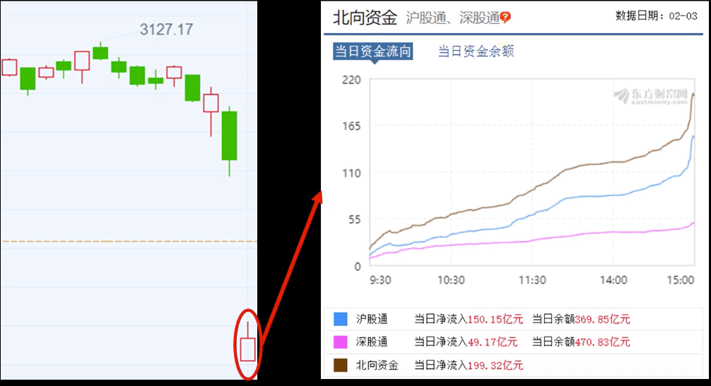

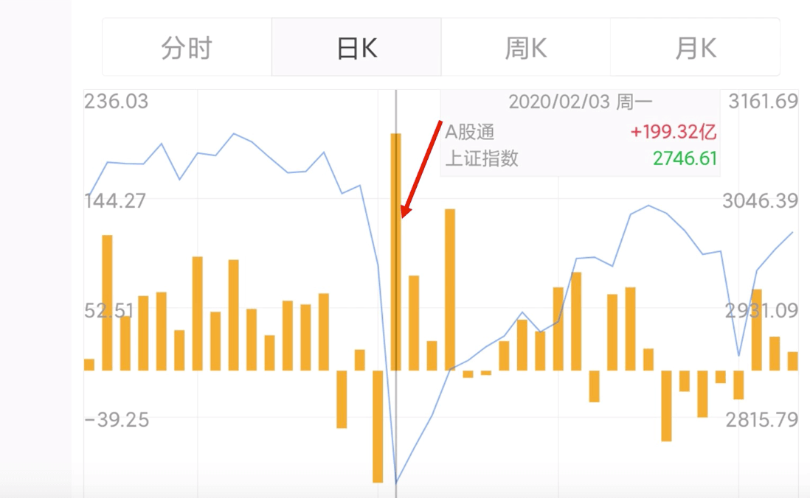

**数据是通过附图牛牛app查的**

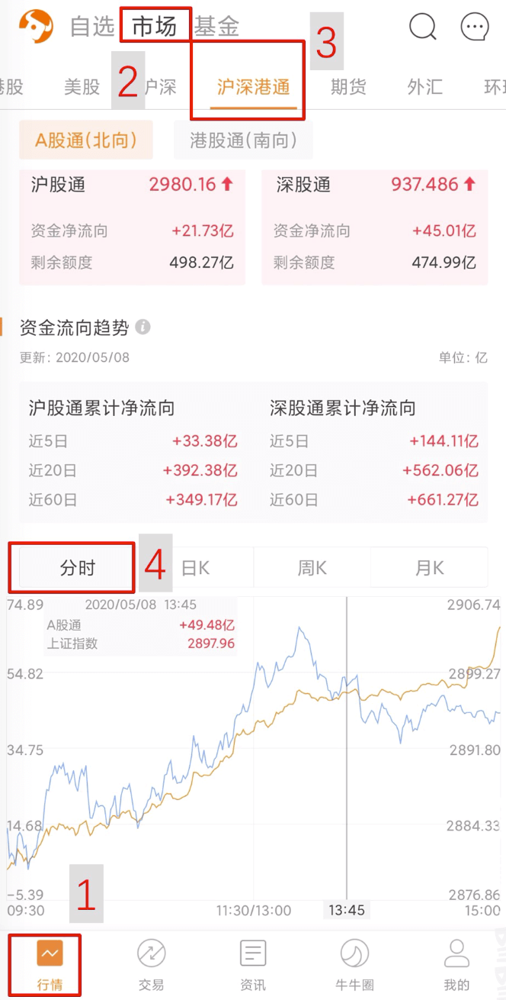

外资买，我就买；外资卖，我就卖？

不是！

前提是：A股估值低

以为

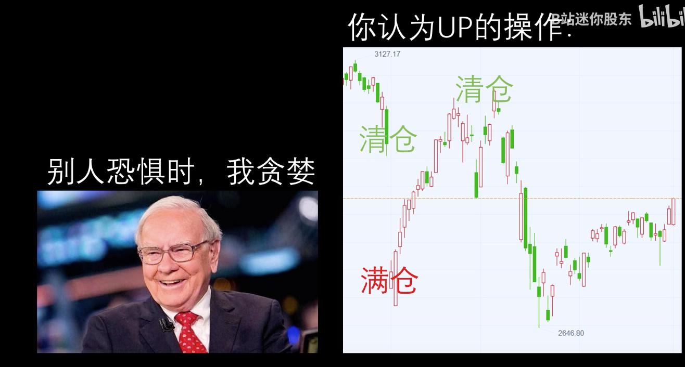

其实

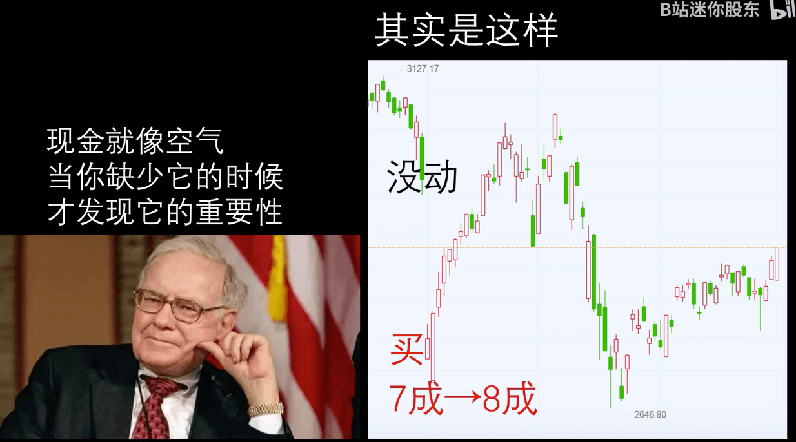

上涨之后将仓位由8成变成7成

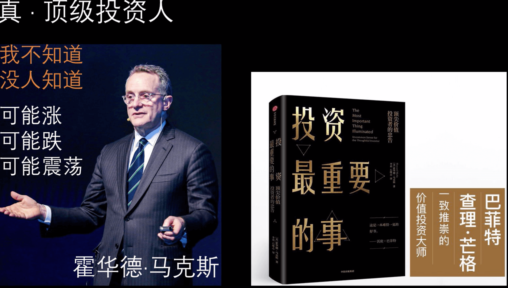
