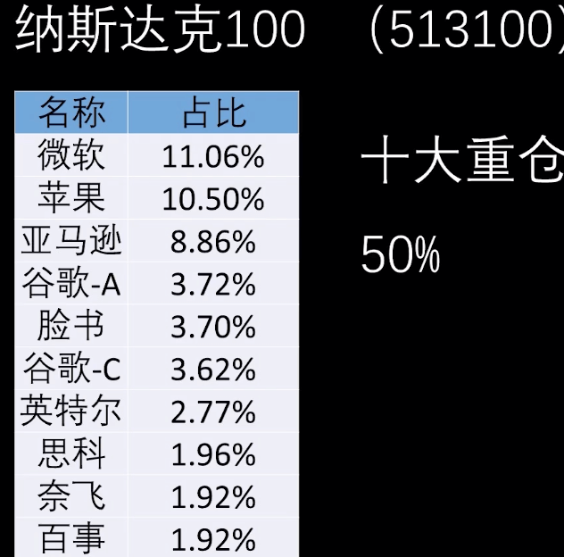
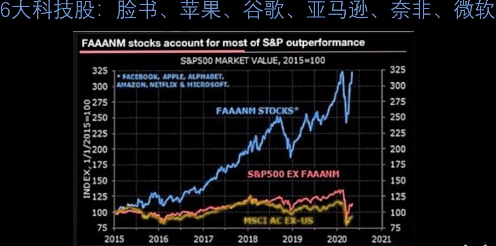
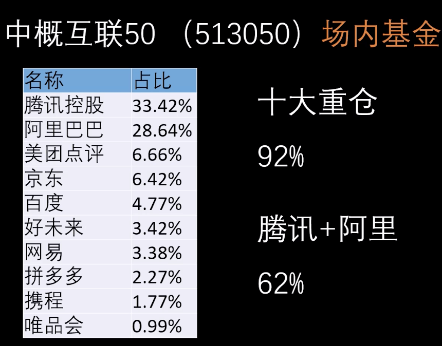
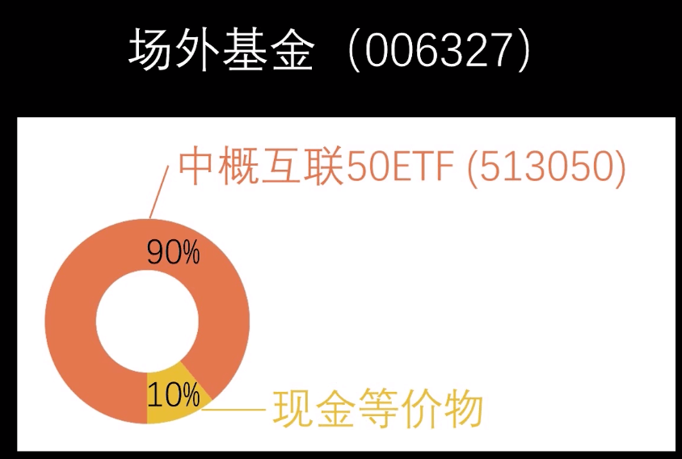
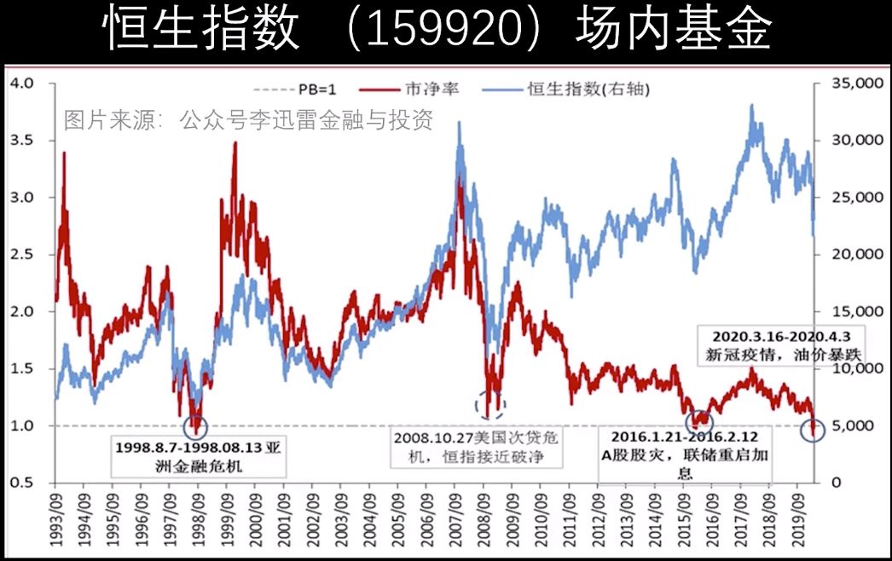

# 指数基金投资，4只就够了

- 纳斯达克100(513100) 高估

为什么不选择持仓更加分散的标普500？

红线表示去掉6大科技股的标普500，基本没有涨幅，所以选择集中度更高的纳斯达克100。

标普信息科技(161128) 没有google、facebook、amazon，不考虑

国外基金经理很难跑赢指数，无需买增强基金

- 中概互联50(513050) 正常偏高

场外基金会留10%的现金用以赎回，收益没有场内基本100%持股的基金高

- 中证500增强(002510) 低估 只有场外基金

跟踪中证500指数，量化增强收入，a股不完善，买a股指数增强基金可以取得超额收益。

不选沪深300，应该股票基本都是，各种北上资金和高瓴资本重仓中国。

不买概念基金，不好择时买卖，可以少买一丢丢。

- 恒生指数(159920) 超级低估（政治风险）

香港由于政治因素，基本处于破净状态，上次破净回升涨了80%

