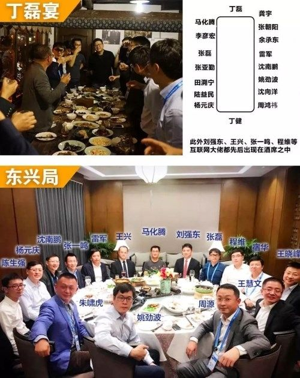
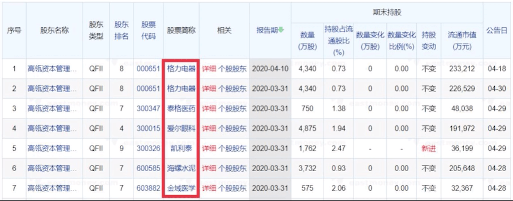
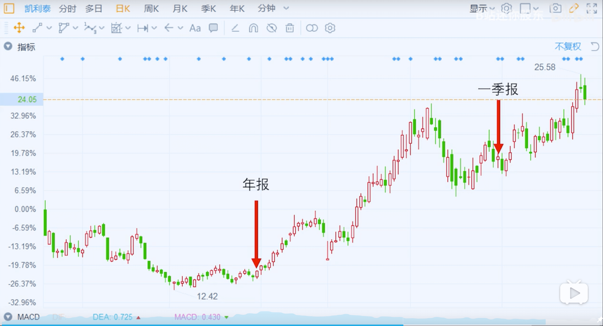

**马化腾的朋友圈**

张磊首秀：2005年买腾讯，市值不到20亿美元，现在4837亿美元

投资京东、美团、滴滴、百度、携程、去哪儿、Airbnb、Uber......

### 资料1：卓越长青基金业绩

从2006年9月开始做A股，至2019年12月31日，15年45倍回报，年复合回报率30%+

### 资料2：深度研究并帮助企业

业绩来源：深度研究，像伯克希尔

举例：良品铺子创始人

高领是有出人、又出钱。

### 重仓股票

- 工业
  - 宁德时代
- 原材料
  - 海螺水泥
- 日常消费
  - 古井贡B
  - 水井坊
  - 公牛集团
  - 良品铺子
- 可选消费
  - 美的集团
  - 格力电器
- 医药卫生
  - 恒瑞医药
  - 金域医学
  - 凯莱英
  - 药明康德
  - 泰格医药
  - 爱尔眼科
  - 凯利泰

### 资料3

经常下载股市财报看高领资本是否套现走人

### 资料4：如何抄

高瓴资本管理有限公司-HCM中国基金

比如凯利泰，2019年年报还有没有高领资本，2020年一季报有了，则其成本在这个区间内。

## 参考

1. [高瓴资本历史业绩](https://mp.weixin.qq.com/s/SpDAw1rCJM3UfPpAXqTePQ) 
2. [良品铺子创始人访谈](https://mp.weixin.qq.com/s/YBggOLFSy4pNYwwbRYZU-A) 
3. [财报下载](http://www.cninfo.com.cn/new/index) 
4. [高瓴资本HCM中国基金持仓](http://suo.im/5Jljkp)