# 通过季报，判断基金好坏

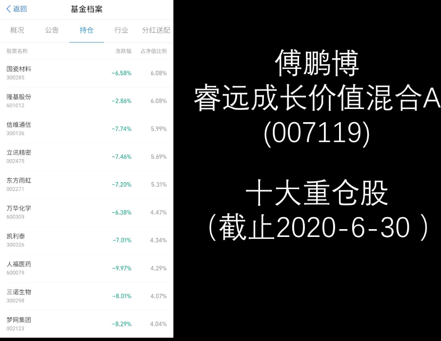

7月21日，基金季报公布完毕，支付宝里面所有基金的十大持仓股票也都更新了，大多数人只关心基金持仓变化，而忽略了基金季报中很多有用的信息。

下面以傅鹏博老师的睿远成长价值二季报为例，分享一下值得关注的信息，以及如果通过这些信息选基金

天天基金网，搜索相关基金

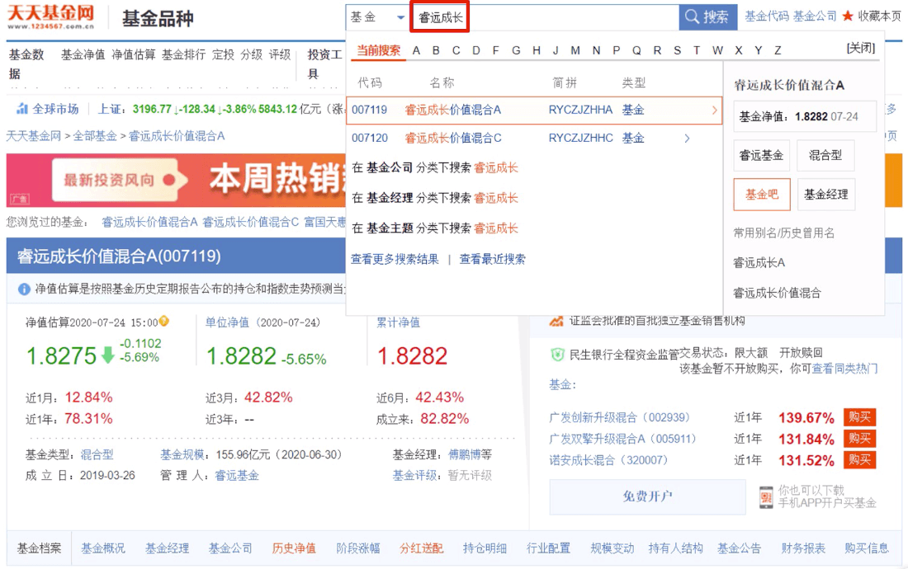

点击基金公告

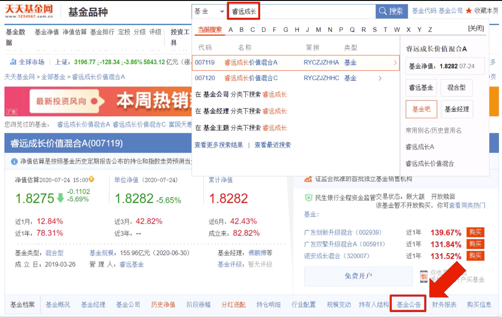

在定期报告中找到基金季报

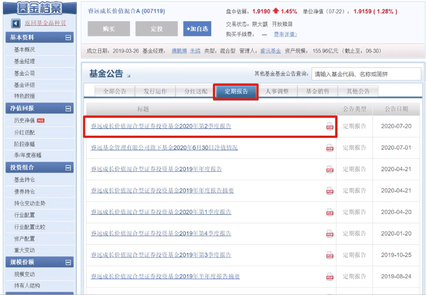

按照监管要求，基金必须在每个季度结束后的15个工作日内公布季报，算上双休，7月21日是公布季报的截止日期。

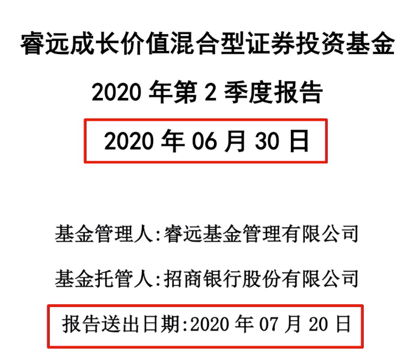

大多数基金都是在截止日期当天或者前几天公布。

报告里最值得看的内容：

**一、投资策略和运作分析**

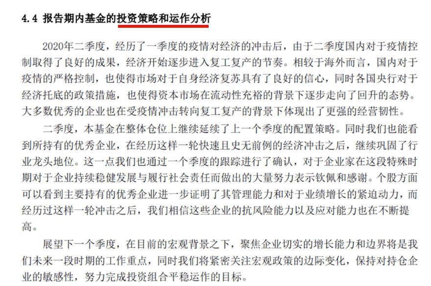

反面教材

一季报觉得市场应该跌一跌降低仓位。

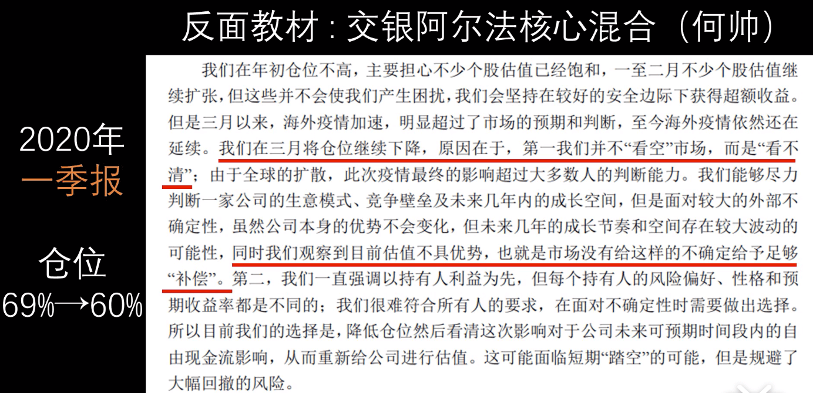

二季报比确定性并未消失，反而增加仓位。

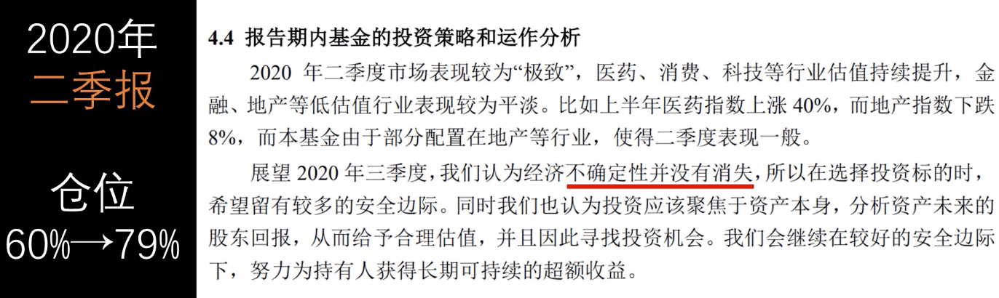

仓位与当前估值不匹配

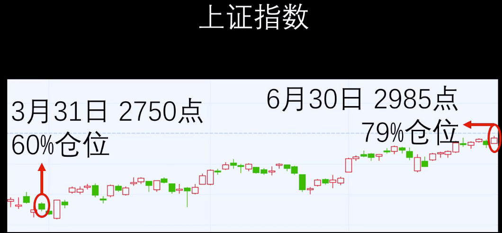

傅鹏博老师投资思路清晰的多

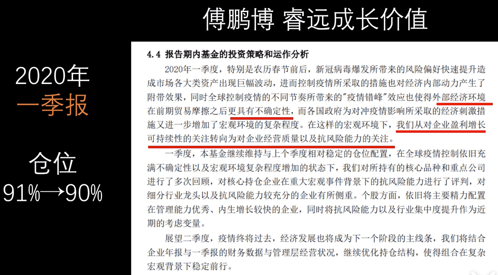

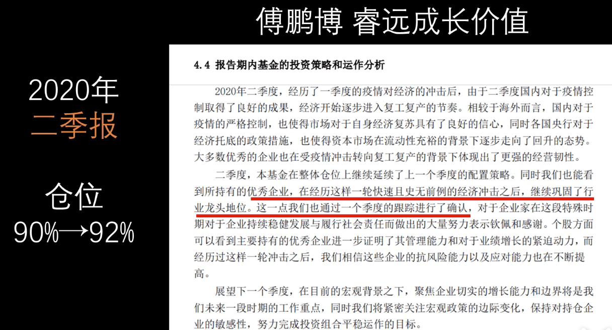

**二、股票仓位**

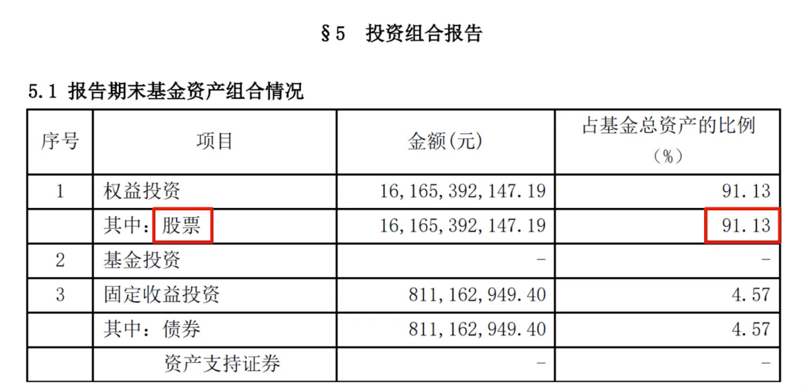

傅老师之前管理的基金的仓位

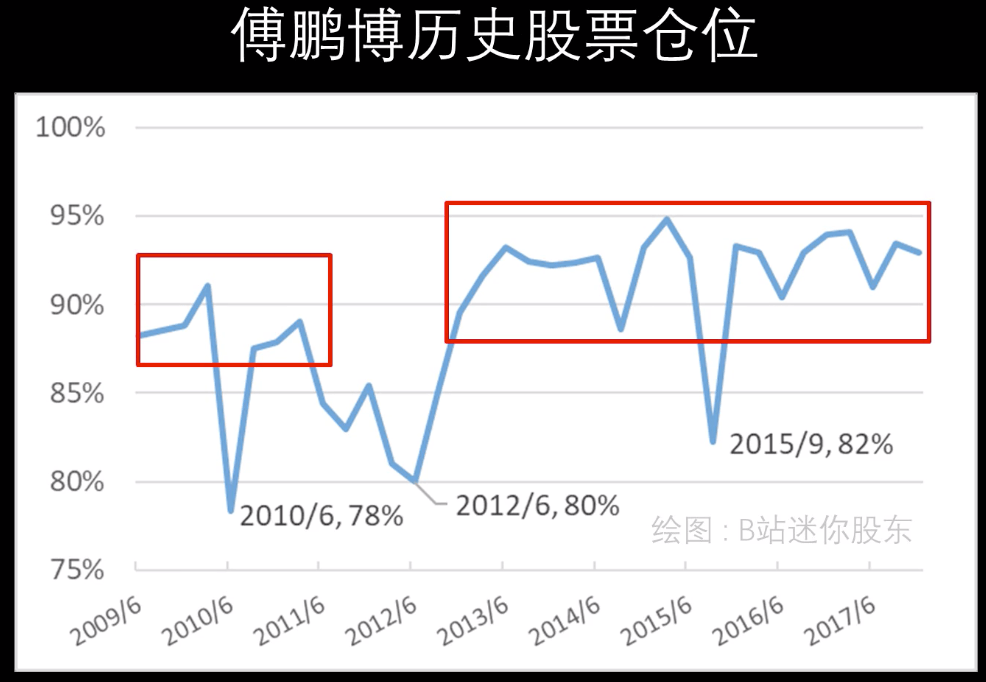

何帅在估值低的时候仓位低，现金等价物还有收取管理费，很不划算。 

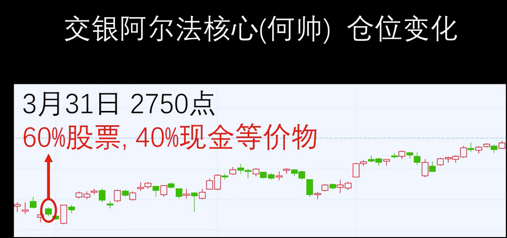

**三、管理总规模、基金规模**

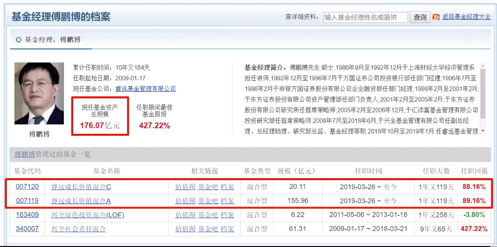

张坤作为对比，他管理了5只基金，总规模522亿，其中规模最大的是易方达中小盘，191亿

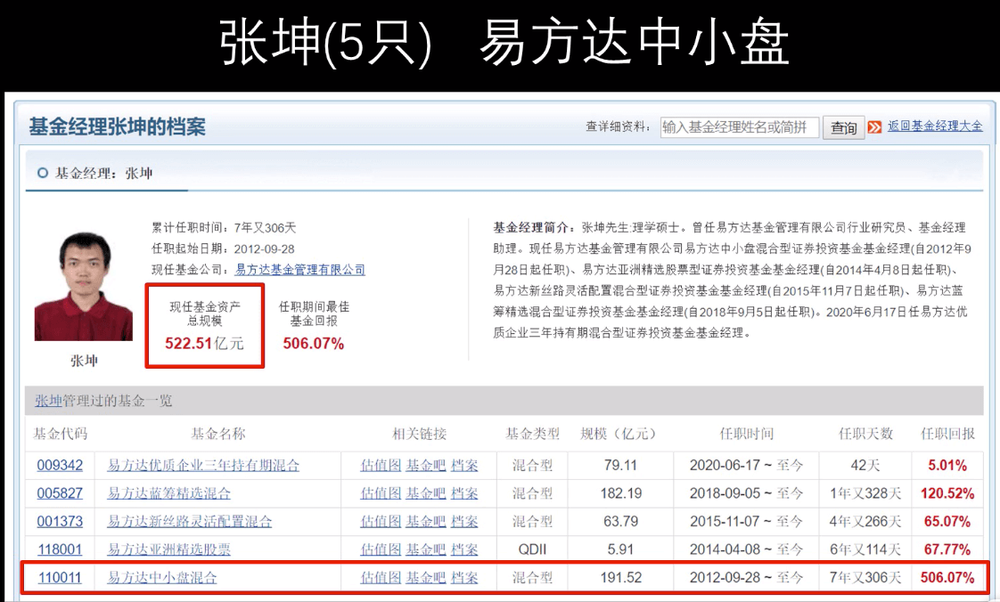

**四、十大重仓股**

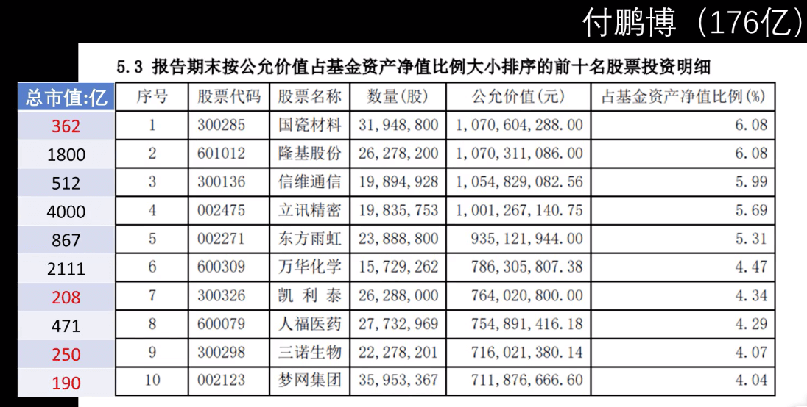

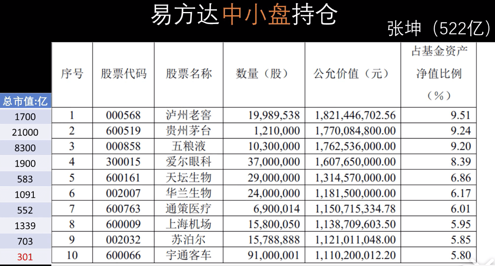

张坤中小盘，也只能买大盘的股票，400亿一下的前十中就一家。

管理规模太大影响业绩，稍微买一点小盘就涨上去了。（造成短期炒作，股价波动大）

十大重仓股还需注意：

- 行业分布
- 持股集中度
- 与投资策略对照：逻辑是否合理
- 与上期对比：买卖原因
- 与历史对比：投资思路是否稳定
  